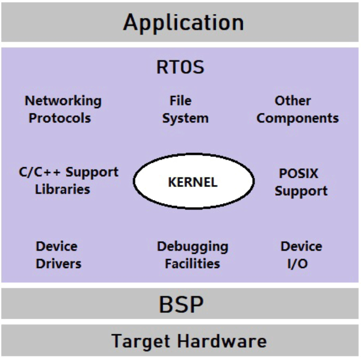

# BLuEMan A Stateful Simulation-based Fuzzing
Framework for Open-Source RTOS Bluetooth
Low Energy Protocol Stacks

[GitHub - seemoo-lab/VirtFuzz: VirtFuzz is a Linux Kernel Fuzzer that uses VirtIO to provide inputs into the kernels subsystem. It is built with LibAFL.](https://github.com/seemoo-lab/VirtFuzz)

[GitHub - zoolab-org/blueman.artifact](https://github.com/zoolab-org/blueman.artifact)

## 1. 초록

Bluetooth Low Energy(BLE)는 저전력·단거리 통신 환경에서 널리 사용되는 지배적인 무선 통신 기술이다

BLE는 광범위하게 채택되고 있으며, 일부 구현체에 내재된 보안 취약점으로 인해 BLE 프로토콜 스택의 결함을 식별하기 위한 다양한 연구가 진행되어 왔다. 그러나 기존의 많은 퍼징(fuzz testing) 기법들은 확장성과 적용성 측면에서 상당한 한계를 지닌다.

BLuEMan은 실시간 운영체제(RTOS)와 소프트웨어 기반 물리 계층 시뮬레이터를 통합하여 실제 BLE 프로토콜 스택을 실행하면서 BLE 대상 간의 상호작용을 모사한다.

다양한 대상에 대해 빠른 테스트가 가능하도록 높은 확장성을 확보하는 동시에, 여러 플랫폼에 적용 가능한 높은 실용성을 유지한다.
평가 결과, BLuEMan은 기존의 시뮬레이션 기반 접근법 대비 최대 **18.0배**, 실제 플랫폼 기반 접근법 대비 최대 **162.3배** 빠른 퍼징 속도를 달성하였다. 또한 BLuEMan을 통해 BLE 프로토콜 스택에서 **새로운 취약점 4건**을 발견하였으며, 이들 모두는 보고되어 **CVE가 할당**되었다. 본 연구는 BLE 프로토콜 스택 개발자들에게 효율적인 취약점 탐지 방법에 대한 중요한 통찰을 제공한다.

### [RTOS에 대한 배경지식]

- RTOS (Real Time Opereating System)
    
    
    
    - 실시간 검사 중, 어떤 이벤트가 발생했을 때 정해진 시간 내에 그에 해당하는 응답이 이루어져야 하는 시스템
    - 스케줄링, HW/SW 인터럽트 관리, 공유 자원 동기화
    - 세마포어, 뮤텍스, 메시지 큐 등의 동기화 및 통신 메커니즘 지원
    - RTOS 기반 블루투스 구조
        
        ```cpp
        +---------------------+
        | Application Task    |  ← 사용자 코드
        +---------------------+
        | BLE Host Task       |  ← GATT / GAP / L2CAP
        +---------------------+
        | HCI Task            |  ← Host ↔ Controller
        +---------------------+
        | Controller (HW)     |  ← Link Layer / PHY
        ```
        
        - 만약 BLE인터럽트가 발생한다면
            1. ISR에서 Event Queue 메시지 push
            2. Blue Task가 wake up 후 처리
            3. 필요시 Application Task로 callback 전달 
    - 대표적인 RTOS로는 FreeRTOS, Zephyr, ThreadX, VxWorks, QNX, NuttX 가 있다.

## 2. 소개

IoT 및 웨어러블 기기의 급속한 확산 ⇒ 무선 통신 기술에 대한 수요 크게 증가

대부분 Bluetooth Low Energy(BLE)에 의존하고 있다. 

Bluetooth 기기 출하량은 수십억 대 규모에 이르며, 이 중 80% 이상이 BLE 프로토콜을 지원하고 있다.

 BLE 기기의 대중적 확산에 더불어 보안 취약점 또한 증가하였따.

기존 연구들은 다양한 버전의 Bluetooth 프로토콜 스택에서 취약점을 발생했으며, 그 중 일부는 DoS 공격이나 임의 코드 실행을 가능하게 하는 심각한 결함으로 이어졌다. 

[취약점 연구]

- BlueBorne
    - Armis. BlueBorne: The dangers of Bluetooth implementations: Unveiling zero day vulnerabilities and security flaws in modern Bluetooth stacks.
- BlueFrag
    - Jan Ruge. BlueFrag: CVE-2020-0022 an Android 8.0-9.0 Bluetooth Zero-Click RCE
- BleedingBit
    - Armis. Bleedingbit: Exposes Enterprise Access Points and Unmanaged Devices to Undetectable Chip Level Attack

[BLE 기기 대상 퍼징 연구]

- BrakTooth: Causing havoc on bluetooth link manager via directed fuzzing
- SweynTooth: Unleashing mayhem over bluetooth low energy
- ToothPicker: Apple picking in the iOS bluetooth stack
- Toboldly go where no fuzzer has gone before: Finding bugs in Linux’ wireless stacks through VirtIO devices
- BTFuzz: Accurately fuzzing bluetooth host with a simulated noncompliant controller
- L2Fuzz: Discovering bluetooth l2cap vulnerabilities using stateful fuzz testing

[기존 퍼징 방식 한계와 분류]

- 플랫폼 기반
    - 특정 하드웨어나 전용 운영체제에 의존하여 퍼징을 수행
    - 실제 플랫폼과 직접 상호작용하기 때문에 높은 충실도를 제공
    - 하지만 다양한 대상 플랫폼으로 확장하기에는 한계
- 에뮬레이션 기반
    - 하드웨어 또는 시스템 환경을 모사함으로써 높은 확장성
    - 실제 대상을 완전히 재현하는 데에는 부족하며, 특정 시스템이나 칩셋에만 제한적으로 적용

[BLueMan의 차별점]

오픈소스 BLE 스택 구현체를 대상으로 하는 **stateful 시뮬레이션 기반 풀스택 퍼저다.**

**Real-Time Operating System(RTOS)** 상에서 실제 BLE 프로토콜 스택을 실행함으로써 높은 충실도와 확장성을 동시에 확보한다. 또한 소프트웨어 기반 물리 계층 시뮬레이터를 통합하여 BLE 대상 간의 상호작용을 모사한다.

프레임 워크는 **Zephyr, NimBLE, BTstack**을 포함한 다양한 RTOS 플랫폼을 지원하며, 해당 환경으로 포팅된 모든 BLE 스택에 적용 가능한 높은 범용성을 제공한다.

- 호환성
    - 본 프레임워크는 단일 ELF 실행 파일로 컴파일되며, 기존의 디버깅, 계측(instrumentation), 상태 모니터링 도구들과의 원활한 통합을 지원
- 유연성
    - 스택형(stackable) 변이 아키텍처를 도입함으로써, BLuEMan은 서로 다른 프로토콜 계층을 대상으로 퍼징을 수행할 수 있으며, 사용자 정의 프로토콜 또한 지원할 수 있어 높은 적응성을 제공
- 추적성
    - 새로운 Man-In-The-Middle(MITM) 아키텍처를 활용하여 패킷 인터셉터를 배치함으로써, 포괄적인 퍼징 수행이 가능하며 세밀한 수준의 실행 추적을 가능
- 이식성
    - Linux Foundation의 지원을 받는 오픈소스 프레임워크를 기반으로 하며, BLE 하드웨어를 갖춘 Nordic NRF52/53/54 시리즈의 시뮬레이션 보드로 포팅 가능한 BLE 프로토콜 스택을 지원

BLuEMan은 **물리 계층 시뮬레이터에 기반한 설계** 덕분에 퍼징 속도와 유연성 측면에서 우수한 성능을 보임.

대표적인 시뮬레이션 기반 퍼저인 **BTFuzz**  대비 최대 **18.0배**, 플랫폼 기반 퍼저인 **SweynTooth** 대비 최대 **162.3배** 빠른 퍼징 속도를 달성
또한 BLuEMan의 **필드 인지(field-aware) 변이 기법**은 기존 AFL 기반 변이 방식 대비 엣지 커버리지 측면에서 더 우수한 성능을 보였으며, 표준 BLE 스택을 대상으로 6.14%에서 최대 256.49%에 이르는 향상을 기록
4개의 신규 취약점 발견.

## 3. 배경지식

BLE : 블루투스 4.0 코어 규격의 일부로 도입된 저전력,단거리 무선 통신 기술이다. BLE는 4가지 주요 디바이스 동작 모드를 지원한다.

- Broadcaster
    - 정식 연결을 수립하지 않고 주기적으로 데이터 패킷을 주변의 BLE 옵저버에게 브로드캐스트
- Observer
    - 다른 BLE 디바이스로부터 전송되는 브로드캐스트 메시지를 수신하고 청취
- Peripheral
    - 광고(advertising) 패킷을 전송하고 중앙 장치로부터의 연결 요청을 대기하며, 주기적인 데이터 교환을 통해 상호작용형 애플리케이션을 가능하게
- Central
    - 주요 제어 주체로서 주변 장치를 탐색(discovery)하고, 연결(connect) 및 관리(management)를 수행하며, GATT(Generic Attribute Protocol)을 이용해 퍼리퍼럴과의 데이터 교환 구조를 정의

Broadcaster, Observer : 위치 기반 서비스, 자산 추적, 이벤트 관리와 같은 응용 분야에서 주로 활용

Peripheral, Central : 웨어러블 기기, 의료 기기, 스마트 홈 기술 등과 같은 다양한 상호작용형 애플리케이션의 핵심 구성 요소로 사용


위 그림은 BLE 프로토콜 스택을 나타낸다.

애플리케이션 → 호스트 → 컨트롤러 

- 애플리케이션
    - HID
    - 심박수 모니터링
    - 배터리 상태 보고
- 호스트
    - 고수준 프로토콜
    - 데이터 교환
    - 애플리케이션 로직
- 컨트롤러
    - 무선 및 링크 계층에서 요구하는 저수준의 시간 민감한 연산

호스트와 컨트롤러는 HCI로 소통한다. 

- UART나 USB와 같은 물리적 인터페이스로 연결된 서로 다른 칩에 위치 or
- 공유메모리를 사용하여 상호작용하는 단일 칩에 통합

[호스트 계층 구성 요소]

- GAP(Generic Access Profile)
    - 디바이스 동작 모드 정의
    - 디바이스 탐색 관리, 연결과정 처리
- GATT(Generic Attribute Profile)
    - GATT는 ATT를 이용하여 속성 단위 연산을 수행
    
    ⇒ 구조화된 데이터 교환
    
- ATT(Attribute Protocol)
- L2CAP(Logical Link Control and Adaptation Layer Protocol)
    - 상위 계층을 위한 데이터 다중화 기능
    - BLE 링크 상에서 효율적인 데이터 전송 보장
- SM(Security Manager)
    - 인증, 암호화, 데이터 무결성 관리
    - BLE 통신의 보안 담당


BLE 패킷은 2가지로 분류된다

- 광고(advertising) 패킷
    - BLE 통신의 광고 및 스캐닝 단계에서 사용
    - 디바이스의 존재 및 기능을 알리고, 정보를 브로드캐스트하며, 연결을 정하는데 사용
    - 그림 2는 BLE 광고 패킷의 포맷이다.
        - 고정된 엑세스 주소 **0x8E89BED6**
        - LL 헤더의 PDU type 필드에 의해 지정되는 광고 타입
        - LL 페이로드 길이 필드를 포함
- 데이터(data) 패킷
    - 연결이 수립된 이후 센트롤 장치와 퍼리퍼럴 장치 간의 통신을 담당
    - 그림 3은 ATT 데이터 패킷의 포맷이다.
        - LL 헤더의 LLD는 패킷 유형을 나타냄
        - length 필드는 LL 페이로드와 MIC를 합한 전체 길이 지정
        - LL 페이로드는 L2CAP 헤더와 정보 페이로드
        - L2CAP 헤더의 CID는 정보 페이로드가 따르는 프로토콜 식별
        - 정보 페이로드에는 요청과 응답 같은 연산 유형과 관련된 파라미터를 정의하는 ATT opcode

[기존 연구와 비교대조]

- BLE 스택 퍼징에 관한 연구
    - 플랫폼 기반 접근 ⇒ 특정 하드웨어나 전용 운영체제 환경을 기반으로 퍼징
        
        ex) FPGA나 특정 IoT 활용, 운영체제 퍼징은 주로 RTOS 대상 ⇒ 실제 환경을 밀접하게 반영하고 실 플랫폼과 직접 상호작용하기에 높은 충실도(fidelity) 
        
        - BrakTooth: Causing havoc on bluetooth link manager via directed fuzzing
        - SweynTooth: Unleashing mayhem over bluetooth low energy
        - L2Fuzz: Discovering bluetooth l2cap vulnerabilities using stateful fuzz testing
    - 한계점
        - 각 대상 플랫폼을 개별적으로 확보하고 설정한 뒤 테스트 환경에서 통합해야하므로 많은 자원가 복잡한 절차가 요구
        - 대상 플랫폼으로부터 핵심적인 런타임 상태 정보를 추출하기 위해 **광범위한 리버싱과 internalblue**와 같은 정교한 도구 개발이 필요
    - 애플리케이션 기반 접근
        - To boldly go where no fuzzer has gone before: Finding bugs in Linux’ wireless stacks through VirtIO devices
        - BTFuzz: Accurately fuzzing bluetooth host with a simulated noncompliant controller
        - Frankenstein: Advanced wireless fuzzing to exploit new bluetooth escalation targets
    - 플랫폼 기반 접근에 비한 애플리케이션 기반 접근의 장점
        - 실제 하드웨어 없이도 제어 가능하고 유연, 종종 더 빠른 테스트 환경을 제공
        
        ex) QEMU 에뮬레이션
        
        - 높은 확장성을 제공, 다수의 대상에 대한 신속한 테스트 가능하며 에뮬레이터 내부에서 다양한 설정을 자동 탐색하는 유연성
    - 한계점
        - 에뮬레이션이기 떄문에 대상 실제 프로토콜 구현의 동작을 완벽히 재현 X 가능성
        - 적용 가능한 범위가 특정 시스템이나 하드웨어 칩셋으로 제한
            - Huster 등 “To boldly go where no fuzzer has gone before: Finding bugs in Linux’ wireless stacks through VirtIO devices.“ 은 리눅스 운영체제만 테스트 가능
            - “Frankenstein: Advanced wireless fuzzing to exploit new bluetooth escalation targets”는 Cypress 및 Broadcom Bluetooth 칩셋과 같은특정 하드웨어에 국한
            
            ⇒ 런타임 상태 정보를 재구성하기 위한 상당한 추가 노력이 필요함 
            

[기존 연구와 차별점] 

- 시뮬레이션 기반 퍼징 프레임워크 제안. 플랫폼 기반과 에뮬레이션 기반 접근의 장점을 결합하고 아래 3가지 Challenge 해결
    1. 효과적인 퍼징을 위한 고품질 시드 생성
    2. 환경 비용, 커버리지 측정, 퍼징 속도, 크래시 측면에서 런타임 확장성 보장
    3. Bluetooth 개발 환경에 대응하기 위한 정교하고 자원 집약적인 퍼징 전략 수용 

[본 연구가 제안한 기술]

1. MITM 아키텍처를 활용하여 실제 BLE 애플리케이션으로부터 고품질 시드 생성
2. RTOS 환경에서 단일 ELF 실행 모델을 활용하여 초고속 퍼징 가능
3. 복잡한 BLE 상태 머신을 애뮬레이션할 필요 없이 패킷 시퀀스에 대한 확률적 변이를 통해 프로토콜 공간 탐색

BLuEMan은 오픈소스 BLE 프로토콜 스택 테스트를 목표로 설계되었다. 

- 타겟
    - Zephyr, NimBLE, BTstack
    - 다양한 RTOS 플랫폼과 이들에 통합된 BLE 스택을 지원, RTOS 환경을 포팅가능한 모든 오픈소스 BLE 프로토콜 스택에 적용 가능

| 계층 | CVE | 취약점 유형 | 탐지 소요 시간 |
| --- | --- | --- | --- |
| LL | CVE-2023-4424 | 버퍼 오버플로우 | 5분 24초 |
| ATT | CVE-2024-3077 | 정수 언더플로우 | 3372분 15초 |
| SM | CVE-2024-3332 | 경쟁 조건 | 1분 10초 |
| LL | CVE-2024-4785 | 0으로 나누기 | 1943분 44초 |

⇒ 모드 DoS, 3건의 페이링 없이도 악용 가능 

[장점]

- 효율성
    - 실제 플랫폼과의 상호작용이나 복잡한 시뮬레이션 환경 처리에서 발생하는 오버헤드 없이 실제 BLE 프로토콜 스택 실행 ⇒ 더 빠른 퍼징 가능
- 호환성
    - ROTS, BLE 스택, PHY 시뮬레이터 전체를 단일ELF 실행 파일로 컴파일  ⇒ 디버깅, 계측, 상태 모니터링과 같은기존 개발 도구들과의 호환성 단순화
- 유연성
    - packet mutator 내부에 스택형 변이 아키텍처 도입, 프로토콜 계측 식별, 사용자 정의 가능한 퍼징 가중치에 따라 계층별 변이 수행함으로써 다양한 계층을 대상으로 퍼징 가능
    - 플러그인 형태로 프로토콜 구현할 수 있어 사용자 정의 프로토콜 까지 지원
- 추적성
    - PHY 시뮬레이터의 브리징 인터페이스를 패치하여 패킷 인터셉터를 배치하는 새로운 MITM 아키텍처 사용
    - 포괄적인 퍼징과 모니터링 분석, 세밀한 수준의 실행 추적 가능
- 이식성
    - 오픈소스 프레임워크 기반, BLE 하드웨어를 갖춘 Nordic NRF52/53/54 시리즈 시뮬레이션 보드 사용함으로써 해당 하드웨어로 포팅 가능한 모든 BLE 스택 평가 가능

## 4. BLuEMan 설계


BLuEMan 프레임워크와 그 설계 구성 요소를 소개 

그림4는 BLuEMan 아키텍처의 개요다. 

퍼징 성능 향상을 위해 BLE 디바이스 간 패킷 전달을 담당하는 PHY 계층 시뮬레이터 사용 

⇒ 모든 BLE 애플레케이션, 프로토콜 스택, PHY 계층 브리징 인터페이스는 단일 ELF 실행 파일로 컴파일 

회색으로 표시된 부분이 본 프레임워크에서 새로 들어온 것  

- 패킷 인터셉터
    - 상호작용 애플리케이션가 대상 애플리케이션 사이에 위치
    - 대상 애플리케이션으로 전송되는 패킷 intercept, 대상 애플리케이션으로부터의 응답 패킷을 다시 상호작용 애플리케이션으로 전달
- 상태 수집기
    - 대상 애플리케이션으로부터 런타임 정보 수집
- 코퍼스 큐
    - 효과적인 테스트 케이스 저장
- 패킷 변이기
    - 수신된 패킷을 변이하여 퍼징 테스트 케이스를 생성

두 개의 BLE 디바이스 ELF 사용 

1. 패킷 인터셉터 : 상호작용 애플리케이션에서 대상 애플리케이션으로 전송되는 패킷을 가로채어 변이 
2. 변이된 패킷은 대상 애플리케이션에 입력되어 퍼징 작업 수행
3. 변이는 패킷의 페이로드에 직접 적용되나 코퍼스 큐에서 선택된 테스트 케이스를 기반으로 수행
4. 대상 애플리케이션이 변이된 패킷을 처리한 후 상태 수집기는 코드 커버리지와 같은 런타임 정보를 수집하고 해당 테스트 케이스가 효과적인지 여부를 판단, 이 판단 결과에 따라 코퍼스 큐 갱신 

⇒ 애플리케이션 간 상호작용에서 캡쳐된 페이로드에 변이를 적용하는 새로운 설계 

1. 고품질의 시드 생성
    - 상호작용 애플리케이션과 대상 애플리케이션 간 통신 과정에서 캡쳐된 BLE 패킷 시퀀스로 구성
        
        ex) 심박수 측정 애플리케이션의 경우 퍼리퍼럴과 센트럴 간의 상호작용을 통해 L2CAP, ATT 등 다양한 계층의 프로토콜 메시지가 생성되며 이를 퍼징 입력으로 활용
        
    - 프로토콜 명세에 기반하여 구현, BLE 상태 전반에 대한 포괄적인 커버리지 보장 .
    - 프로토콜 교환에서 생성된 상태기반 페이로드와 상태 비의존 퍼저를 결합하여 구현체의 임의의 상태를 대상으로 퍼징 가능한 stateful 퍼징 프레임 워크
    - 견고성과 취약성 탐지 단순화를 위해 퍼징 대상 ELF 실행 파일은 퍼징 라운드마다 재시작, 오류 누적화 방지
2. 프로토콜 상태에 대한 심층 탐색 

### 4.1 Packet Interceptor


- PHY 시뮬레이터와 본 접근 방식을 통합하여 애플리케이션 간에 교환되는 패킷을 캡쳐한다.
- 시뮬레이터를 활용함으로써, 무선 구간(over-the-air) 패킷 캡처에서 발생하는 복잡성을 회피할 수 있으며, 패킷을 가로채고 조작하기 위한 간결하고 효율적인 메커니즘
- 패킷 인터셉터는 PHY 시뮬레이터가 제공하는 브리징 인터페이스를 패치하는 방식으로 구현
    - 패킷 수신 루틴을 수정하여 패킷이 반환되기전에 인터셉터가 호출되도록 함.

 

[인터셉터 루틴]

- 블로킹 방식
    - 가로챈 패킷을 패킷 변이기로 전달한 뒤, 변인된 페이로드가 반환될 때까지 대기
    - 패킷 인터셉터는 PHY 시뮬레이터에서 변이기로 전달되는 데이터 흐름을 완전히 제어
- a : 기본 설정 상호작용 애플리케이션에서 대상 애플리케이션으로 전송된 패킷이 PHY 시뮬레이터 미들웨어를 거쳐 전송된 후, 1~4까지 송신자에게 직접 반환
    
    ```cpp
    Interacting BLE ──▶ BabbleSim ──▶ Target BLE
            ◀──────── FIFO ◀────────
    ```
    
- b : 패킷 인터셉터 활성화
    - (패킷이 전송된 직후 1~3) 가로채어 패킷 변이기로 전달
    - (4~5) 대상 애플리케이션으로 반환되어 처리
        
        ```cpp
        Interacting BLE
              │
              ▼
        BabbleSim
              │
              ▼
        Packet Interceptor ──▶ Packet Mutator
              ▲                      │
              └──────── mutated ◀────┘
        
        ```
        
- BLE Device (target)
    - 퍼징의 타깃, 취약점을 찾고 싶은 BLE 프로토콜 스택 (LL / ATT /SM 등)
- BabbleSim
    
    
    
    [[“BabbleSim”]](https://babblesim.github.io/)
    
    - 실제 RF 하드웨어 대신 BabbleSim PHY 시뮬레이션 사용
    - BabbleSim은 네트워크 프로토콜 및 네트워크 장치 개발을 지원하고, 통제된 환경에서 대상 코드 개발, 디버깅 및 회귀 테스트할 수 있도록 함
    - 완전히 다른 유형의 장치들이 물리계층을 통해 시뮬레이션에서 함께 통신
    - BLE 라디오는 2.4GHz 물리계층을 사용

### 4.2 State Collector


State Collector : 퍼징 과정에서 코퍼스 큐로부터 보다 효과적인 테스트 케이스를 정확하게 선택 

- BLE 스택으로부터 런타임 상태 정보 수집
- RTOS, 블루투스 스택, 시뮬레이터 전체를 단일 ELF 실행 파일로 컴파일 가능하므로 디버거, 계측도구, 상태 모니터와 같은 기존 개발도구들과 통합 가능
- AFL의 edge 코드 커버리지 메커니즘을 상태 수집기에 포팅, afl-gcc를 통해 대상 프로그램 계측하여 edge 커버리지 수집
- ASAN, UBSAN, MSAN, 활성화

### 4.3 Corpus Queue

퍼징의 후보 테스트 케이스를 저장한다. Packet interceptor 덕분에, 퍼징 초기 단계에서 interacting app과 target app 사이에 실제로 교환된 유효환 BLE 패킷이 조기에 캡쳐될 수 있으며, 이 패킷 시퀀스들은 초기 corpus 후보로 추가된다. Corpus queue에는 target app에 크래시를 유발하지 않은 테스트 케이스만 유지된다. 

### 4.4 Packet Mutator


모듈화된 패킷 기반 워크플로우 + 스택형 변이 아키텍처 결합 

입력 패킷을 수신하는 시점(①)에서 시작

Corpus 비어있는지 여부에 따라

mutator는 초기 시드 수집(②) or 패킷 변이 과정(③) 수행 

Mutator가 처리한 모든 패킷은 복제되어 packet collector에 저장되어, 이후  퍼징 corpus를 유지관리하는데 사용 한다. 

변이된 출력 패킷(⑤)은 target application(⑥)으로 전달되어 BLE 스택을 퍼징한다. 

패킷 처리가 완료된 이후에는 state collector가 target application의 런타임 상태를 기록한다.  


- 크래시가 발생한 경우 로그로 기록되거나(⑧)
- 새커버리지 갱신에 사용되거나(⑩)
- 효과가 없는 경우 폐기된다(⑫)


- 입력
    - `pkt`: 원본 입력 패킷
    - `w_x`: 변이를 수행하지 않을 확률을 나타내는 가중치
    - `L`: 사용 가능한 프로토콜 목록. 각 프로토콜은 `{R, w, M}` 형태로 표현되며,
        - `R`은 프로토콜 인식 함수,
        - `w`는 변이 가중치,
        - `M`은 변이 함수이다.
- 출력
    - `pkt′`: 변이된 출력 패킷

입력 패킷에 포함된 프로토콜을 식별하기 위해, 감지된 프로토콜을 저장할 배열 L`을 초기화

모든 프로토콜에 대해 해당 프로토콜의 인식함수 p.R(pkt) 가 참인 경우, 해당 프로토콜의 변이 가중치를

**UpdateWeight 함수** 를 통해 갱신하고, 이를 L′에 추가

감지된 프로토콜의 개수를 계산한 뒤 구현 단순화를 위해 프로토콜 L`에 추가한다. 이후 L`에 포함된 모든 프로토콜 가중치의 합 W를 계산한다. 

다음으로, [0,1] 범위에서 확률 값을 하나 샘플링, 가중치 비율에 따라 변이를 적용할 프로토콜을 선택하여 인덱스 변수 m에 저장한다. 
각 프로토콜이 선택될 실제 확률은 **UpdateWeight 함수에 의해 조정된 가중치**에 의해 결정되며, 이는 각 프로토콜 계층의 런타임 커버리지 정보를 반영한다. 
최종적으로 선택된 프로토콜이 존재할 경우, 해당 프로토콜의 변이 함수 L′[m].M이 입력 패킷에 적용되어 변이된 패킷이 생성된다. 만약 어떤 프로토콜도선택되지 않은 경우에는, 입력 패킷이 변이 없이 그대로 반환 

 

본 연구에서는 **LL, L2CAP, SMP, ATT 프로토콜**에 대한 구현을 제공한다.
각 프로토콜 퍼저는 프로토콜 헤더, 페이로드 또는 둘 모두를 대상으로 설정할 수 있다. 변이된 패킷이 프로토콜 명세에 정의된 기본적인 유효성 검사를 통과할 수 있도록 field-aware 변이를 적용한다. 

BLuEMan은 AFL의 **havoc 연산**과 같은 기존 퍼저의 변이 기법을 통합. 아래 3가지 경량 변이 제약 조건을 추가

(1) 비트 단위 변이는 **Link Layer로 제한**

(2) 상위 계층 프로토콜의 필드는 **변경하지 않음**

(3) 페이로드 크기가 변경될 경우 이에 맞추어 **길이 필드를 자동으로 조정.** 기존의 변이 기법은 테스트 다양성을 확보하는 데 기여하는 반면, 이러한 추가 제약 조건은 프로토콜 정합성을 유지하는 데 도움을 준다.

- 상태수집기(A) : packet collector에 저장된 각 패킷에 대해 커버리지 정보를 지속적으로 갱신
- 새로운 커버리지가 관측되는 경우, 해당 패킷은 흥미로운 입력(B)
- 최근 n개의 패킷에서 더이상 새로운 커버리지가 관측되지 않으면 초기 수집은 종료
- 초기 시드 수집이 종료되거나하나의 퍼징 라운드가 끝나면, packet collector에저장된 패킷 시퀀스는 하나의 완전한 테스트케이스로 간주되어 corpus queue에 추가

  

### 4.5 Packet-driven State Machine Traversal


BLE 상태 머신을 직접 에뮬레이션하지 않고도 프로토콜 상태 공간을 탐색할 수 있다

패킷 시퀀스를 상태 전이와 연관시키는 패킷 기반 접근 방식을 통해 상태 머신을 간접적 탐색한다.

- Figure 7a : LE Secure Connections Pairing 패킷 시퀀스
    - Central 애플리케이션과 peripheral 애플리케이션 간의 상호작용 과정에서 sm_pairing 애플리케이션에 의해 자연스럽게 생성된 패킷 흐름

- Figure 7b :  동일한 방식으 ㅣLE 페어링을 위한 단순화된 peripheral 상태 머신
    - idle 상태에서 시작하여, peripheral은 BLuEMan 환경에서 생성된 1~6에 의해 유도
    - 상태 (a), (f)–(h), 그리고 (d)–(e)를 순차적으로 거쳐 전이

실제 상호작용 중에서 서로 다른 패킷과 프로토콜 계층을 확률적으로 선택적 변이 ⇒ 테스트 대상 BLE 애플리케이션이 모든 가능한 모든 상태를 탐색

 

- CVE-2024-3332
    - HCI 계층과 SM 페어링 프로토콜 구현 간의 race condition
    - SM 프로토콜이 Key Distribution 상태에 도달했을 때만 트리거
    - BLuEMan의 패킷 기반 상태 탐색 변이가 복잡한 프로토콜 상태 의존 취약점을 효과적으로 탐지

## 5. Implementation

Zephyr RTOS사용. 750개 이상의 보드를 지원. 
사용 가능한 오픈소스 PHY 시뮬레이터 중에서는 **BabbleSim**과 **RootCanal**이 널리 사용되고 있다. 
BLuEMan 프레임워크를 지원하기 위해 **BabbleSim과 Zephyr 모두에 패치가 적용**되었으며 또한 BLuEMan은 **AFL 퍼저에서 차용한 계측(instrumentation), 커버리지 수집, 변이 연산자**를 함께 통합

### BabbleSim


- BabbleSim
    - 물리 계층에서 공유 매체(shared medium) 네트워크를 시뮬레이션하기 위해 설계된 시뮬레이터
    - 공유 매체는 2.4 GHz ISM 대역의 무선 통신 환경
    - BabbleSim 라이브러리 함수를 사용하는 시뮬레이션된 모델

- 시뮬레이션된 모델을 포함한 프로그램 = simulated device
    - BabbleSim 라이브러리 통해 시뮬레이션된 디바이스들은 공유 매체를 통해 무선 방식으로 상호 통신
    - 여러 개의 시율레이션된 디바이스가 하나의 공유 매체에 동시에 연결
    - 디바이스 및 애플리케이션 코드를 ELF 실행 파일 형태로 컴파일 Linux 시스템에서 실행할 수 있도록 지원
    - Linux 환경에서 무선 통신 프로토콜을 직접 시뮬레이션하고 테스트할 수 있도록 함.
    - BabbleSim의 **모듈화된 라이브러리 구조**를 통해, 개발자는 Bluetooth Low Energy, Thread, 6LoWPAN과 같은 **2.4 GHz ISM 대역 통신 프로토콜**을 구현
    - **BabbleSim 시뮬레이터의 라디오 스택에 패킷 인터셉터를 통합**
    - `start_Rx` 루틴이 패킷을 반환하기 직전에, 해당 루틴 내부에서 패킷 인터셉터 함수를 호출하는 방식으로 구현

### Integration

퍼징 대상 RTOS 및 BLE 프로토콜 스택 구현에 PHY 시뮬레이터를 결합하는 방식으로 통합

ZephyR와 Mynewt 2가지 플랫폼과 여기에 내장된 BLE 프로토콜 스택을 사용하여 평가 

BTstack과 같이  Zephyr 또는 Mynewt 환경에서 실행 가능하도록 적응할 수 있는 다른 BLE 프로토콜 스택 역시 본 프레임워크로 평가

- **Zephyr 아키텍처 + PHY 시뮬레이터(BabbleSim)**
    
    
    
    - **아키텍처 및 SoC 의존 계층과 CPU/SoC 하드웨어를 대체하기 위한 POSIX 호환 구현**을 제공
    - BabbleSim 프로젝트에서 제공하는 API와 연동 가능
    - 하드웨어 주변 장치를 소프트웨어로 시뮬레이션된 라디오로 대체, 블루투스 디바이스 또는 애플리케이션은 일반적인 운영체제 환경에서 실행되는 독립적인 애플리케이션 취급
    - 이를 애플리케이션 퍼징으로 치환

## Evaluation


### Setting

- BLuEMan의 각 스택 소스코드는 각각 Zephyr 프로젝트의 samples/bluetooth 디렉토리, BimBLE 프로젝트의 babblesim/targets 디렉터리, BTstack 프로젝트의 example 디렉터리에서 확인
- BLE 애플리케이션은 특정 기능을 활성화하기 위해 물리적 하드웨어를 필요로 함. 해당 애플리케이션을 패치하여 하드웨어 의존적인 함수들을 mock 함수로 대체하고 물리적 구성 요소 없이도 프로그램적으로 기능을 활성화

### Comparison with Existing Bluetooth Fuzzers

- 플랫폼 기반 접근법
    - SweynTooth, BrakTooth, L2FUZZ
        - SweynTooth : PoC만 공개됨
        - BrakTooth : **ESP32-WROVER-KIT 플랫폼**을 사용해 실행
        - L2FUZZ는 :본 연구와 호환X
    - dongle을 사용하여 디바이스와 상호작용
    - 수신된 메시지를 프로토콜 상태에 매핑하는 커스텀 상태 머신을 개발하여 하드웨어 상태 추적

- 에뮬레이션 기반 퍼저
    - Frankenstein, VirtFuzz
        - Frankenstein : QEMU로 Broadcom 및 Cypress Bluetooth 펌웨어를 대상 퍼징
        - VirtFuzz : **VirtIO**를 사용하여 **HCI 계층 상위의 Bluetooth 프로토콜을 퍼징** ⇒ BLuEMan의 entry point와 다름
            
            ⇒ VirtIO는 상호작용을 위해 게스트 OS에 특수 드라이버 구현을 요구. 하지만 RTOS환경에서 제공되지 않음 
            
    - BTFuzz는 BLuEMan과 유사한 시뮬레이션 기반 접근법

BTFuzz는 시뮬레이션 기반 접근법. 대상 프로토콜 스택의 퍼징 상태를 상태 머신을 통해 모니터링 

HCI 기반 인터페이스를 사용. 퍼징 범위가 호스트 프로토콜로 제한 


패킷 전송률과 그에 대응되는 타임아웃 비율을 산점도로 표현 

### CVE

**LL, ATT, SM** 등 서로 다른 프로토콜 계층에 걸쳐 분포 

본 프레임워크가 **상태 기반(stateful) 탐색 설계**를 통해 다양한 계층 전반에서 취약점을 효과적으로 발견
BLE 프로토콜 스택에 대해 DoS유발. 페어링 없이도 악용 가능함.

- CVE-2023-4424
    - **Zephyr의 LL 구현**에서 BLE 광고 패킷을 처리하는 과정에서 트리거
    - integer underflow
- CVE-2024-3077
    - **Zephyr의 ATT 계층 구현**
    - 메모리 경계 밖 접근(out-of-bounds access)
    - ATT 응답 처리를 담당하는 **총 다섯 개의 함수**에 영향
- CVE-2024-3332
    - **Zephyr의 SM계층 구현**에서 HCI 드라이버 내의 부적절한 동기화 문제  ****
    - 해제된 공유 자원에 접근 시도 가능
    - **SM 계층에만 국한되지 않으며**, 공유 자원에 의존하는 다른 코드 영역 역시 영향
- CVE-2024-4785
    - Zephyr의 LL구현
    - divide-by-zero