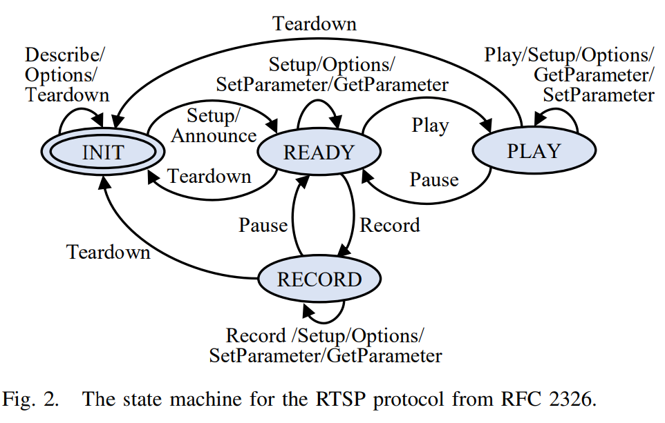

# ChatAFL Large Language Model guided Protocol Fuzzing

[GitHub - ChatAFLndss/ChatAFL: Large Language Model guided Protocol Fuzzing (NDSS'24)](https://github.com/ChatAFLndss/ChatAFL)

퍼징에 LLM을 사용한다고 했을 때 Context-aware 부분에서 큰 이점을 갖을 수 있다. 파일 시스템, 프로토콜 처럼 명세가 없고 자료가 부족할 때 LLM을 활용한다면 큰 이점을 얻을 수 있다. 

 

## 초록

프로토콜 구현체는 입력이 특정한 구조와 순설르 따라야 하는 매우 민감한 소프트웨어 시스템이다. 이러한 구조와 순서는 보통 수백 페이지에 달하는 자연어 문서에 비공식적으로 기술되어 있다. 기계가 읽으 룻 있는 형태의 프로토콜 명세가 없는 경우, 요구되는 구조와 순서를 만족하는 유효한 테스트 입력을 자동으로 생성하는 것은 매우 어렵다.

이러한 문제는 기록된 메시지 시퀀스를 시드 입력으로 사용하는 변이 기반 퍼징을 통해 부분적으로 완화할 수 있다. 그러나 사용 가능한 시드의 수는 매우 제한적이며, , 프로토콜 상태와 입력 구조의 다양한 경우를 충분히 포괄하기는 어렵다.

본 논문에서는, 수백만 페이지에 달하는 인간이 읽을 수 있는 프로토콜 명세를 학습한 사전 학습 대규모 언어 모델(LLM)과의 체계적인 상호작용을 통해, 프로토콜 퍼징에 활용 가능한 기계 판독 정보를 추출할 수 있는 가능성을 탐구한다. 우리는 잘 알려진 프로토콜들에 대해 LLM이 보유한 프로토콜 메시지 타입 관련 지식을 활용하였다. 또한 메시지 시퀀스를 생성하고 응답 코드를 예측함으로써, 상태 기반(stateful) 프로토콜 구현에서 LLM이 “상태(state)”를 식별할 수 있는 능력도 평가하였다.

⇒ 긴 프로토콜 명세를 LLM이 학습하고 이를 기반으로 시퀀스 생성, 응답코드 예측까지 하여 state 기반 퍼징?

이러한 관찰을 바탕으로, 우리는 LLM 가이드 프로토콜 구현 퍼징 엔진을 개발하였다. 우리의 프로토콜 퍼저 **CHATAFL**은 프로토콜 내 각 메시지 타입에 대해 문법(grammar)을 구성하고, LLM과의 상호작용을 통해 메시지를 변이하거나 메시지 시퀀스에서 다음 메시지를 예측한다.

PROFUZZBENCH에 포함된 다양한 실제 프로토콜을 대상으로 한 실험 결과, 상태 커버리지와 코드 커버리지 측면에서 유의미한 효과를 보였다. LLM 가이드 상태 기반 퍼저인 CHATAFL은 최신 퍼저인 AFLNET 및 NSFUZZ와 비교되었으며, 상태 전이 수는 각각 47.60%와 42.69% 더 많이 커버했고, 상태 수는 29.55%와 25.75% 더 많이, 코드 커버리지는 5.81%와 6.74% 더 많이 달성하였다.

커버리지 향상뿐만 아니라, CHATAFL은 널리 사용되고 광범위하게 테스트된 프로토콜 구현체에서 **이전에 알려지지 않았던 9개의 서로 다른 취약점**을 발견한 반면, AFLNET과 NSFUZZ는 각각 3개와 4개의 취약점만을 발견하였다.

⇒ 기존 연구인 AFLNET과 NSFUZZ보다 더 커버리지가 높고 취약점 또한 새로 발견

## 서론

프로토콜 구현체 : 인터넷에 직접 또는 간접적으로 연결된 모든 소프트웨어 시스템에서 가장 외부에 노출된 구성요소. ⇒ Attack Surface 중요하고 넓다. 

중요성 : 프로토콜 구현체에서 발생하는 RCE하나라도 원격의 악의적 공격에 취약해질 수 있다.

P : 연구적 관점에서 프로토콜 구현체가 테스트 어려운 이유는 **“stateful”** 이라는 것이다. 동일한 입력을 2번 실행하더라도 매번 서로 다른 출력을 보일 수 있다. 특정 프로토콜 상태에서 취약점을 발견하려면, 올바른 순서로 전송해야한다.

ex) 일부 프로토콜은 다른 유형의 메시지를 교환하기 전에 초기화 또는 핸드셰이크 메시지를 요구한다. 수신 측이 해당 메시지를 올바르게 파싱하고 다음 상태로 진행하기 위해서는, 메시지가 특정한 형식을 반드시 따라야 한다. 그러나 일반적으로 우리는 이러한 메시지의 정확한 구조나 순서를 알지 못한다고 가정할 수밖에 없다.

[기존연구] : 변이 기반 프로토콜 퍼징(mutation-based protocol fuzzing)

- 기록된 메시지 시퀀스를 퍼징함으로써, 요구되는 메시지 구조나 순서에 대한 기계 판독 가능한 명세에 대한 의존도를 줄인다.

ex) 

- Aflnet: A greybox fuzzer for network protocols
- Nsfuzz: Towards efficient and state-aware network service fuzzing
- Stateful greybox fuzzing
- Stateafl: Greybox fuzzing for stateful network servers

[장점] : 이러한 단순한 변이는 프로토콜 자체의 유효성을 유지하면서 메시지 시퀀스를 충분히 손상시켜 오류를 노출시킬 수 있다. 

P : 변이 기반 프로토콜 퍼징은 기록된 시드 메시지 시퀀스의 다양성 크게 제한, 단순 변이만으로는 본질적인 매우 풍부한 입력이나 상태 공간을 효과적으로 커버X

[아이디어 구체화] : 프로토콜은 인터넷 사용자들이 해당 프로토콜 체택을 위해 거의 모든 대중적이고 널리 사용되는 프로토콜들은 공개 문서로 잘 명세되어 있다. 하지만 이 문서들은 종종 수 백페이지에 해당되며 자연어로 작성되어 있다. 그렇다면, 이 자연어 명세를 프로그램적으로 학습하여 질의 할 수 있다면? 기존의 시드 다양성 문제를 해결할 수 있지 않을까?

S : LLM활용. 웹사이트와 문서로부터 수 테라바이트 규모의 데이터를 학습한 LLM은 최근 거의 모든 주제에 대해 정확한 답변을 제공할 수 있음이 입증되었다. ChatGPT 4.0과 같은 LLM은 자연어로 작성된 프로토콜 명세 또한 학습하고 있다. LLM의 최근 폭발적인 성공은, 프로토콜 퍼저가 LLM과 체계적으로 상호작용하며 매우 구체적인 작업을 LLM에 요청할 수 있는 시스템을 개발할 기회를 제공한다. 

⇒ LLM guided protocol Fuzzing의 시대 도래

[구현 방법]

1. 구조 인식 변이를 위해 사용될 프로토콜의 grammar를LLM을 통해 추출 
2. 퍼저는 초기 시드로 사용되는 기록된 메시지 시퀀스의 다양성을 증가시키기 위해 LLM 사용
3. 퍼저는 커버리지가 정체되는 구간을 벗어나기 위해 새로운 상태에 도달할 수 있는 메시지를 생성하도록 LLM에 프롬프트를 제공

Profuzzbench: A benchmark for stateful protocol fuzzing 

에 포함된 모든 텍스트 기반 프로토콜에 대한 실험 결과는 LLM 가이드 접근법의 효과를 이미 입증했다. 기존 AFLNET에 비교했을 떄 우리의 CHATAFL은 상태전이를약 50% 더 많이, 상태수를 약 30% 더 많이, 코드 커버리지를 6% 더 많이 달성한다.  NSFUZZ와 비교했을 때도 유사한 수준의 개선을 보여준다.   

기준 퍼저에서 시작하여 (i) 문법 추출, (ii) 시드 확장, (iii) 포화 처리기(saturation handler)를 단계적으로 활성화

## Background and Motivation

프로토콜은 대부분 IETF에 의해 설계되었으며, RFC 문서 형태로 공개되어 있다.

예를 들어 실시간 스트리밍 프로토콜인 RTSP(Real Time Streaming Protocol) 1.0은 RFC 2326으로 공개되어 있으며, 총 92페이지에 달한다.

프로토콜 퍼저는 2가지로 나뉜다. 

- 생성 기반 : 프로토콜에 대한 기계 판단 가능한 정보를 입력으로 받아 무작위 메시지 시퀀스 생성. 그러나 실제 프로토콜 구현체의 복잡성에 비해 사람이 직접 작성한 생성기는 프로토콜 명세의 극히 일부만을 커버하는 경우가 많으며, 구현자체가 매우 번거롭고 오류에 취약하다.
    - The advantages of block-based protocol analysis for security testing
    - Peach fuzzer platform
    - Boofuzz: A fork and successor of the sulley fuzzing framework
- 변이기반 : 사전에 기록된 메시지 시퀀스를 시드 입력으로 사용하여 이를 변이한다. 기록된 시드 덕분에 메시지의 구조와 순서는 기본적으로 유효하며, 변이 과정에서 이 둘이 부분적으로 훼손된다. AFLNET, NSFUZZ와 같은 최근 제안된 대부분의 프로토콜 퍼저가 여기에 속한다.
    - The advantages of block-based protocol analysis for security testing
    - Aflnet: A greybox fuzzer for network protocols
    - Nsfuzz: Towards efficient and state-aware network service fuzzing

[도전 과제]

최첨단 기법임에도 불구하고 변이 기반 프로토콜 퍼징은 3가지 문제점이 존재.

- 초기 시드에 대한 의존성 : 초기 시드 입력에 심각하게 의존하고 제한된다. 사전에 기록된 메시지 시퀀스는 프로토콜 명세에서 논의되는 방대한 프로토콜 상태와 입력 구조의 다양성을 거의 포괄하지 못한다.
- 메시지 구조의 비가시성 : 메시지 구조에 대한 기계 판독 가능한 정보가 없으면, 퍼저는 시드 메시지에 대해 구조적으로 의미 있는 변이를 수행할 수 없다. ex) 이전에 관찰되지 않은 타입의메시지를 생성하거나, 하나의 일관된 데이터 구조 전체를 제거/대체/추가하는 작업이 불가능하다.
- 상태 공간의 비가시성 : 상태 공간에 대한 기계 판독 가능한 정보가 없으면, 퍼저는 현재 상태를 식별할 수 없고, 이전에 탐색되지 않은 상태를 목표로 탐색을 유도하는 것도 어렵다.

[Motivation]

1. 초기 시드 의존성 문제

⇒ LLM에게 주어진 시드 메시지 시퀀스에 무작위 메시지를 추가하도록 요청하는 방식

1. 메시지 구조를 알 수 없는 문제

⇒ LLM에게 각 메시지 타입에 대한 기계 판독 가능한 메시지 구조 정보(문법)를 제공하도록 요청한다. 

1. 알려지지 않은 상태 공간 문제 

⇒ 퍼저와 프로토콜 구현체 간의 최근 메시지 교환 내역을 LLM에 제공하고 새로운 상태로 전이할 수 있는 메시지를 반환하도록 요청.

### LLM 메시지 추출, 정확도와 다양성

LLM에게 주어진 시드 메시지 시퀀스에 무작위 메시지 하나를 추가하도록 요청하고, 생성된 메시지 시퀀스의 다양성과 유효성을 평가했다.

이전 PROFUZZBENCH에서 LIVE555의 초기 시드 코퍼스는 기준 ground truth에 존재하는 10가지 클라이언트 요청 타입 중 **DESCRIBE, SETUP, PLAY, TEARDOWN의 4가지 타입만**을 포함하고 있다.

나머지 6가지 클라이언트 요청 타입이 부재함으로써, 아래 그림에 나타난 RTSP 상태 머신의 상당 부분이 탐색되지 않은 채로 남겨진다.

나머지 누락된 6가지요청 타입을 생성하는 것이 이론적으로는 가능하지만, 실제 발생 확률은 매우 낮다. 

⇒ 논문에서 AFLNET과 NSFUZZ가 생성한 시드 분석했지만 누락된 메시지 타입이 생성된 사례는 0건.

⇒ 누락된 헤더 거의 없이 안정적으로 LLM이 초기 시드 생성 가능

### 시드 코퍼스 확장 : 다양성과 유효성

LLM에게 메시지 구조에 대한 문법을 제공하도록 요청하고 생산된 문법의 정확도와 커버되는 메시지 타입의 다양성을 ground truth와 비교한다. RFC 2326을 읽고 각자 독립적으로 해당 문법을 수동으로 추출하였으며, 그 결과는 완전히 일치

타겟인 RTSP 프로토콜의  구조는 위와같다.

LLM은 최종적으로 RTSP 프로코콜에 특화된 10가지 클라이언트 요청 타입에 대한 기준 truth grammar를 도출했고, 각 요청은 2~5개의 헤더 필드로 구성된다. 

LLM이 문법에 맞게 잘 생성할 수 있다.

L**LM은 정확한 메시지의 내용을 생성할 뿐만 아니라 클라이언트 요청 시퀀스 내에서 적절한 위치에 메시지를 삽입할 수 있다**. ⇒ 프로토콜의 stateful특성

위 그림에 제시된 RTSP 상태 머신 기준으로 확인했더니, (자세한 실험 설명은 논문보시요)

LLM은 정확한 메시지를 생성하고 초기 시드를 확장할 수 있는 능력을 갖고 있으며 수집된 클라이언트 요청 중 99%가 올바른 위치에 삽입되었으며, 유일한 예외는 SETUP 요청 이후 DESCRIBE 요청이 삽입된 경우다.

추가적인 컨텍스트 정보가 제공될 경우 LLM이 올바른 세션 ID를 반영할 수 있는 2가지 방법

1. 서버의 응답을 프롬프트에 포함한 뒤 동일한 타입의 메시지를 생성하도록 요청
2. 주어진 클라이언트 요청 시퀀스에 세션 ID를 포함시킨 뒤 LLM에 요청하였을 떄, LLM은 해당 값을 메시지에 정확히 삽입하여 올바른 결과 생성.

⇒ **LLM이 정확한 메시지를 생성할 수 있을 뿐만 아니라 초기 시드 코퍼스를 효과적으로 확장가능하다.**

### 상태 전이 유도 (막히면 어캐 탈출함?)

 퍼저와 프로토콜 구현체 간의 교환 내역을 LLM에 제공하고, 새로운 상태로의 전이를 유도할 수 있는  메시지를 반환하도록 요청하였다. 이후 해당 메시지가 실제로 상태 전이를 유발할 가능성을 평가했다. 

⇒ 그래 콜퍼스 생성됐고, 퍼징 초반 부를 넘어 중반부에서 LLM이 만약 퍼징에서 막히면 새로운 상태 전이까지 시켜줄 수 있는가? LLM이 프로토콜 알잘딱하게 잘 추가한다는데 그럼 결국, 탈출도 LLM이 어떻게 하면 잘 시켜주냐? 이것이 관건이다.

구체적으로, 서버가 각각의 상태(즉, INIT, READY, PLAY, RECORD)에 도달하도록 하는 기존 통신 기록을 LLM에 제공한 뒤, 서버의 상태에 영향을 미칠 수 있는 다음 클라이언트 요청을 질의하였다. LLM의 확률적(stochastic) 특성이 결과에 미치는 영향을 완화하기 위해, 각 상태마다 **LLM에 대해 100회씩 프롬프트**를 수행하였다.

각각 81%, 74%, 89%, 69%의 클라이언트 요청이 다른 상태로의 전이를 유도할 수 있었다. 또한 약 17%, 16%, 10%, 30%의 클라이언트 요청은 상태 전이를 발생시키지는 않았지만, 서버에 의해 정상적으로 수용되고 처리되었다. 이러한 메시지들은 새로운 상태를 탐색하는 데에는 실패했지만, 추가적인 코드 분기를 커버하는 데에는 여전히 유용할 수 있다. (자세한 실험 설명은 논문참고)

⇒ LLM이 극히 드문 오류를 제외하고는 프로토콜 상태 추론이 가능하다.  게다가 커버리지 정체 구간을 극복하고 다양한 상태 전이를 폭 넓게 탐색 가능하다.

## LLM-GUIDED PROTOCOL FUZZING

이런 LLM의 인상적인 역량을 바탕으로, 기존 변이 기반 프로토콜 퍼징(EMPF)이 지닌 한계를 해결하기 위해 **LLM 가이드 프로토콜 퍼징(LLMPF)**을 설계한다.

회색으로 표시되지 않은 부분은 기존 EMPF의 접근법이다.

[기존 EMPF 접근법]

테스트 대상 프로토콜 서버 : P_0

해당 프로토콜 : p

초기 시드 코퍼스 : C

총 퍼징 시간 : T

출력은 최종 시드 코퍼스 C와 서버 크래시를 유발한 시드 집합인 C`로 구성된다.

7~34행은 퍼징 반복을 의미한다,

EMPF는 먼저 진행 가능한 상태 s를 선택하고 (7행)

해당 상태를 실행하기 위한 메시지 시퀀스 M을 선택한다. (8행)

선택된 상태 s가 실제로 실행되도록 메시지 시퀀스 M은 세부분으로 분할된다. (9행)

- M1 : 서버를 상태s까지 도달시키는 메시지 시퀀스
- M2 : 변이 대상으로 선택된 메시지 부분
- M3 : 나머지 메시지 시퀀스

이후 EMPF는 M에 대해 변이 횟수를 정하는 값 할당하고 (10행)

구조를 고려하지 않은 변이기를 사용해 M2를 변이하여 새로운 메시지 시퀀스 M’을 생성한다 (16행) 

생성된 시퀀스는 서버로 전송된다 (23행)

EMPF는 서버 크래시를 유발한 시퀀스 (24~25행) 또는 코드 커버리지나 상태 커버리지를 증가시킨 시퀀스(27~28행)을 저장한다. 후자같은 경우 상태머신 상태를 업데이트한다 (29행).

이 과정은 할당된 에너지가 소진될 때까지 반복되며, 이후 다음 상태가 선택된다

---

[LLMPF] ⇒ 기존 EMPF 접근법 유지하면서 회색으로 표시된 3가지 구성요소 추가

- **문법 추출(Grammar Extraction)**
    
    LLM에 프롬프트를 제공하여 메시지 문법을 추출하고(2행), 이를 퍼징 변이를 가이드하는 데 활용한다(12–14행) (Section IV-A).
    
- **초기 시드 확장(Seed Enrichment)**
    
    LLM을 활용해 초기 시드 코퍼스를 확장한다(3행) (Section IV-B).
    
- **커버리지 정체 구간 탈출(Coverage Plateau Handling)**
    
    LLM의 능력을 활용해 퍼징이 정체된 상태에서 새로운 상태 전이를 유도한다(4, 19–21, 26, 30, 32행) (Section IV-C).
    

### 문법 기반 변이 (Grammar-guided Mutation)

1. Grammar Extraction

퍼저가 구조인식 퍼징(context-aware 퍼징)을 하기 위해서는 우선 기계 판독 가능한 메시지 문법이 필요하다.

퍼저는 단일머신에서 실행되며, 사전에 정의된 형식만 파싱 가능

반면, LLM이 생성하는 응답은 일반적으로 매우 유연한 자연어 구조

따라서, 퍼저가 LLM의 응답을 이해하려면, LLM이 항상 미리 정의된 형식으로 응답하도록 유도해야함.

⇒ **in-context few-shot learning** 기법을 사용한 프롬프트 파인튜닝

⇒ 원하는 입력–출력 예시를 몇 개 제공함으로써, LLM이 프롬프트의 문법과 출력 패턴을 학습하도록 유도

서로 다른 두 프로토콜(RTSP, HTTP)에 대한 문법 예제를 제공하며, **변경 불가능한 키워드는 그대로 유지**하고, **변경 가능한 영역은 “⟨Value⟩”로 대체**

두 개의 예시를 사용함으로써, LLM이 특정 문법에 과도하게 고착되어 중요한 요소를 누락하는 문제 방지

⇒ 퍼저는 다양한 프로토콜에 대해 **정확한 문법을 안정적으로 획득**

1. Mutation based on Grammar

LLMPF는 LLM으로 부터 문법을 1번 추출하고 이를 퍼징 전체에 걸쳐 재사용한다.

⇒ LLM과의 반복적인 상호작용으로 인한 오버헤드 최소화를 위함.

LLMPF는 먼저 메시지를 해당 문법과 매칭한다. 이를 효율적으로 수행하기 위해 문법 코퍼스를

G={type→grammar}

형태의 맵 구조로 저장한다. 

이후 정규 표현식을 상용해 메시지의각 헤더 필드를 문법과 매칭하고 <Value>에 해당하는 명역을 변이 가능 영역으로 표시한다.  

파란색으로 표시한 부분이 변이 가능한 영역에 해당한다. 변이는 이런 지정된 곳만 적용되므로, 형식적으로 유효한 상태를 유지한다. 

이후 정규표현식을 사용해 메시지의 각 헤더 필드를 문법과 매칭하고 <Value>에 해당하는 영역을 변이 가능한 영역으로 표시한다. 

corner case를 탐색하기 위해 LLMPF는 기존 EMPF 구조 비인식 변이도 병행하여 사용한다. 다만, 구조 인식 변이를 더 높은 확률로 선택한다.  

### 초기 시드 확장 (Enriching Initial Seeds)

LLM은 새로운 메시지를 생성하고 이를주어진 메시지 시퀀스 내 적절한 위치에 삽입할 수 있는 능력을 보인다.

이에 착안하여, 우리는 퍼징에 사용되는 초기 시드 코퍼스를 확장하는 방법을 제안한다.

알고리즘 1의 3행

그러나 문제점이 3가지 존재한다.

1. 올바른 컨텍스트 정보(RTSP 프로토콜에서의 정확한 세션ID)를 포함하는 새로운 메시지를 어떻게 생성하는가
    
    ⇒  LLM이 **제공된 메시지 시퀀스로부터 필요한 컨텍스트 정보를 자동으로 학습**
    
    ⇒ LLM을 프롬프팅할 때 PROFUZZBENCH의 초기 시드를 함께 제공하여 LLM이 필요한 컨텍스트정보를 획득하도록 유도  
    
2. 생성된 메시지 시퀀스의 다양성을 어떻게 최대화할 것인가?
    
    ⇒ 퍼저가 초기 시드에 어떤 유형의 클라이언트 요청이 누락되었는지 판단한다.
    
    ⇒ 초기 시드를 확장하기 위해 LLM이 생성해야 할 메시지 타입을 결정한다.
    
    
    
    제시된 프롬프트를 보면 프롬프트에는 메시지 타입 이름이 포함되어 있으며, 모델 출력에도 대응하는 메시지 타입 이름이 포함되어 있음을 확인할 수 있다. 
    
    ⇒  기존 초기 시드를 기반으로 하되 이를 확장하는 방식으로 접근한다. LLM에게 누락된 메시지 타입을 생성하여 초기 시드에 삽입하
    
    ⇒ 초기 시드가 과도하게 길어지는 것을 방지하기 위해 하나의 메시지 시퀀스에 대해 매번 2개의 누락된 메시지 타입만을 균등하게 선택하여 추가한다.  
    
3. 주어진 시드 메시지 시퀀스부터 수정된 전체 메시지 시퀀스를 생성하도록 어떻게 LLM을 프롬프팅 할 것인가?
    
    ⇒ 연속 형식의 프롬프트 작성한다. 개행문자 \n를 제거하거나 끝에 누락된 구분자 \r\n을 추가하는 후처리만 하면 곧바로 시드로 활용 가능하다.
    
    
    
     위 그림은 예제다. LLM에게 “SET_PARAMETER”와 “TEARDOWN” 두 가지 메시지 타입을 **적절한 위치에 삽입**하도록 지시하였으며, 오른쪽에 수정된 클라이언트 요청 시퀀스가 제시되어 있다.
    

### 커버리지 정체 구간 극복

상태 기반 퍼저가 이전에 탐색되지 않은 상태를 탐색하는 것은 본질적으로 어려운 문제다.

새로운 커버리지를 더 이상 탐색하지 못하는 상황을 **커버리지 정체구간**에 진입했다고 칭한다.

위 그림은 RTSP 상태 머신이다.서버가 클라이언트의 요청을 수용한 뒤 READY 상태에 있다고 가정하자. 서버가 다른 상태로 전이되기 위해서는 PLAY혹은 RECORD 요청을 보내야한다.

퍼징 설계 관점에서 퍼저는 클라이언트의 역할을 수행한다. 

퍼저가 상태 전이를 유도하는 메시지를 생성할 수 있는 능력을갖추고 있다고하더라도, 이를 위해서 매우 많은 시드를탐색해야한다. 실제로 퍼저가 원하는 상태 전이를 커버할 수 있는 적절한 메시지 순서를 생성하지 못할 가능성이 높으며 그 결과 코드 공간이 상당부분 탐색하지 못하게 된다. 

그럼 커버리지 정체 구간을 극복하기 위해서 LLM을 어떻게 활용할 수 있는가??

일단 흥미로운 시드를 생성하지 못하는 경우를 어떻게 분별한는가 ⇒ 연속적으로 생성한 흥미롭지 않은 시드의 개수를 기준으로 정량화한다. PlateauLen이라는 변수를 선언하고 PlateauLen이 사전에 정의된 최대 MaxPlateau을 초과하면 퍼저가 커버리지 정체 구간에 진입한 것으로 간주한다. 

이 경우, LLMPF는 LLM을 활용하여 커버리지 정체를 극복한다.

그럼 이제 LLM으로 어떻게 극복하는가? LLM에게 다른 상태로의 전이를 유도할 수 있는 다음 클라이언트 요청을 생성하도록 요청한다. 

요청 프롬프트는 위와 같다. LLM에는 서버와 클라이언트 간의 통신 이력, 즉 클라이언트 요청과 이에 대응하는 서버의 응답을 함께 제공한다. 또한 LLM이 단순한 메시지 타입이나 설명이 아닌, 실제 메시지 형식을 생성하도록 유도하기 위해 초기 시드 코퍼스에서 추출한 실제 메시지 하나를 예시 형식으로 함께 제공한다.  

1. 서버가 메시지 시퀀스 M1={SETUP} 수신
2. R1={200-OK} 라는응답을 반환하며 READY상태로 전이. 이후 퍼저가 흥미로운 시드를 못만든다고 가정
위 상황을 감지하면
3.  통신 이력 H={SETUP,200-OK}을 LLM에게 제공. LLM은 PLAY 또는 RECORD 메시지를 생성할 가능성이 높음. 이런 메시지는 서버를 다른 상태로 전이시키며 결과적으로 커버리지 극복 

### 구현

LLM 가이드 프로토콜 퍼징을 AFLNET에 구현, 이를 CHATAFL로 명명

AFLNET은 변이 기반 오픈소스 프로토콜 퍼저 중 하나, 추론된 상태 머신을 유지하고 상태 커버리지와 코드 커버리지 피드백을 활용함. 

**상태 커버리지 또는 코드 커버리지를 증가시키는 경우** 흥미로운 시드(interesting seed)로 간주

## 실험설계

- **RQ1. 상태 커버리지(State Coverage)**
    
    CHATAFL은 기준선(baseline) 대비 얼마나 더 많은 상태 커버리지를 달성하는가?
    
- **RQ2. 코드 커버리지(Code Coverage)**
    
    CHATAFL은 기준선 대비 얼마나 더 많은 코드 커버리지를 달성하는가?
    
- **RQ3. 어블레이션 분석(Ablation)**
    
    CHATAFL을 구성하는 각 구성 요소는 성능에 어떠한 영향을 미치는가?
    
- **RQ4. 신규 버그 발견(New Bugs)**
    
    CHATAFL은 널리 사용되고 충분히 테스트된 프로토콜 구현체에서 **기존에 알려지지 않은 취약점**을 발견하는 데 유용한가?
    

1. 설정 파라미터

커버리지 정체 구간을 판단하기 위해, MaxPlateau 값을 커버리지를 증가시키지 못한 메시지 시퀀스 512개로 선정한다. ⇒ 휴리스틱 기반 

커버리지 정체 구간에 도달하면, LLM을 활용하여 극복할 수 있는 메시지 시퀀스 생성

LLM 질의 비용을 제한하기 위해 MaxPlateau의 1/4를 비효율적인 프롬프트의 최 허용 횟수로 설정한다, 

**gpt-3.5-turbo** 

**문법 추출 및 초기 시드 (temperature) : 0.5**

**커버리지 정체 탈출 시드 (temeprature) : 1.5**

1. 기준선 도구

총 6개의 텍스트 기반 네트워크 프로토콜 구현체 (RTSP, FTP, SIP, SMTP, DAAP 등) 5개의 널리 사용되는 네트워크 프로토콜 포함 

비교대상 : AFLNET, NSFUZZ

1. 측정

코드 커버리지, 상태 공간 커버리지 모두 수집

**PROFUZZBENCH에서 제공하는 자동화 도구를 사용하여 분기 커버리지 측정.**

상태 공간 커버리지를 평가하기 위해서는 state coverage와 transition coverage 측정 

ASAN 사용

## Result

[RQ1. 상태 공간 커버리지]

- **Improv**: 24시간 동안 달성한 상태 전이 커버리지의 개선 비율,
- **Speed-up**: 기준선이 24시간 동안 달성한 상태 전이 커버리지를 CHATAFL이 달성하는 데 걸리는 상대적 속도 향상 배수,
- **Â12**: CHATAFL의 임의 실행이 기준선의 임의 실행보다 우수할 확률을 나타내는 Vargha–Delaney 효과 크기 지표

평균적으로 CHATAFL은 AFLNET보다 **48% 더 많은 상태 전이**를 커버
LIVE555의 경우, CHATAFL은 AFLNET 대비 **91% 더 많은 상태 전이**를 달성
CHATAFL은 AFLNET이 24시간 동안 달성한 상태 전이 수를 평균적으로 **48배 더 빠르게** 달성
NSFUZZ와 비교하였을 때도, CHATAFL은 평균적으로 **43% 더 많은 상태 전이**를 커버했으며, 동일한 전이 수를 **16배 더 빠르게** 달성

CHATAFL은 AFLNET보다 **30%**, NSFUZZ보다 **26%** 더 많은 상태를 커버
CHATAFL은 평균적으로 15개 중 **14.2개 상태**를 커버한 반면, AFLNET과 NSFUZZ는 각각 **10개**, **11.7개 상태**만을 커버
Kamailio의 경우에만 CHATAFL이 전체 도달 가능한 상태 공간 중 상대적으로 적은 비율(평균 17개, 최대 23개 중 20개)을 커버하였으나, 그럼에도 불구하고 CHATAFL은 상태 커버리지 측면에서 기준선들을 상회

[RQ2. 코드 커버리지]

CHATAFL은 AFLNET 대비 평균적으로 **5.8% 더 많은 분기**를 커버.  NSFUZZ 대비로는 **6.7% 더 많은 분기**를 커버

CHATAFL은 AFLNET이 24시간 동안 달성한 분기 수를 **6배 더 빠르게**, NSFUZZ 대비로는 **10배 더 빠르게** 달성

[RQ3. 어블레이션 분석]

LLM전략은 아래와 같음.

- **SA)** 문법 기반 변이(grammar-guided mutation)
- **SB)** 초기 시드 확장(enriching initial seeds)
- **SC)** 커버리지 정체 구간 극복(surpassing coverage plateau)

4개의 도구 정리 

- **CL0**: AFLNET (모든 전략 비활성화)
- **CL1**: AFLNET + SA
- **CL2**: AFLNET + SA + SB
- **CL3**: AFLNET + SA + SB + SC (즉, CHATAFL)

개선 비율과 효과 크기가 **CL0 대비 증가 방향**으로 해석.  ProFTPD의 경우, CL3(CHATAFL)는 CL0(AFLNET) 대비 **8% 더 높은 분기 커버리지**를 달성
**종합적으로**, 모든 전략은 분기 커버리지 향상에 기여하였으며, 어느 전략도 부정적인 영향을 미치지 않았다. 평균적으로 CL1은 CL0 대비 **3.04%**, CL2는 **3.9%**, CL3는 **5.9%**의 분기 커버리지 증가를 보였다. 또한 동일한 분기 커버리지를 달성하는 데 걸리는 시간은 CL1이 **2배**, CL2가 **약 5배**, CL3가 **약 6배** 더 빨랐다. 

[RQ4. 신규 버그 발견]

총 9개의 cve

**취약점 분석 결과 SETUP, PLAY, PAUSE** 요청이 모두 필요
 그러나 기존 연구에서 사용된 초기 시드에는 **PAUSE 요청이 포함되어 있지 않았으며**, AFLNET과 NSFUZZ 역시 실험 전반에 걸쳐 PAUSE 요청을 생성하지 못함.

또한, **INIT → READY → PLAY → READY → PLAY**와 같은 특정 상태 및 상태 전이를 커버해야함.

**구조 인식 변이**의 기여도 역시 중요하다. 이 버그는 최소한의 메시지 시퀀스 **SETUP → PLAY → PAUSE → PLAY**가 필요하며, 이 중 하나라도 누락되면 트리거가 불가능함.
이 퍼징은 1시간의 일회성 작업 말고는 수작업이 따로 필요하지 않았음. ⇒ 와 근데 NDSS.. 부럽다 ㅜ