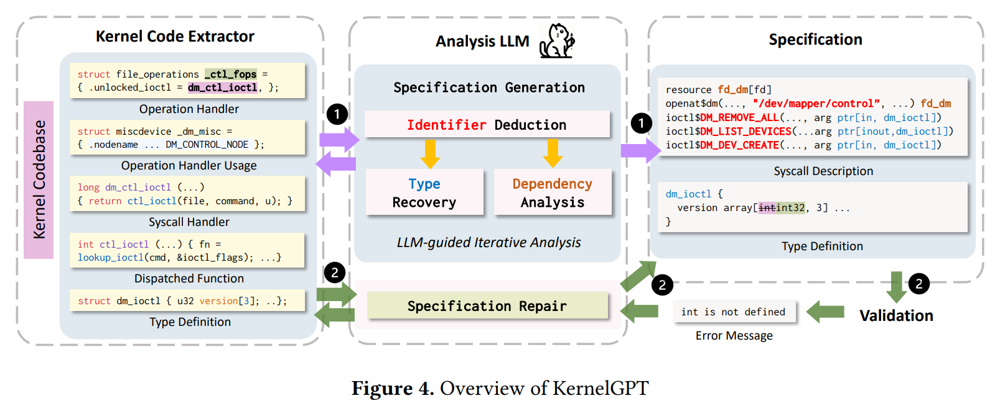

# KernelGPT Enhanced Kernel Fuzzing via LargeLanguage Models

[KernelGPT: Enhanced Kernel Fuzzing via Large Language Models | Proceedings of the 30th ACM International Conference on Architectural Support for Programming Languages and Operating Systems, Volume 2](https://dl.acm.org/doi/10.1145/3676641.3716022)

## Abstract

운영체제 커널 퍼징 기법은 연구가 활발히 되고 있다.

커널 퍼징의 핵심 목표는 시스템 콜의 문법적,의미적 특성을 정의한 시스템 콜 명세를 기반으로 유효한 시스템 콜 시퀀스를 생성하는 것이다.

본 논문은 **LLM을 활용하여 시스템 콜 명세를 자동으로 합성하는 최초의 접근 방식인 KernelGPT**를 소개한다.

LLM은 이미 사전 학습과정에서 방대한 커널 코드, 문서 그리고 사용 사례를 이미 학습했기 때문에 유효한 시스템 콜을 생성하는 데 필요한 정보를 자동으로 추출,정제 가능하다.

KernelGPT는 **반복적인 접근 방식으로 시스템 콜 명세를 자동으로 추론하고 검증 과정에서 얻은 피드백을 바탕으로 해당 명세를 지속적으로 디버깅하고 보안**한다.

KenrelGPT는 기존 연구보다 유효한 시스템 콜 명세를 잘 생성할 수 있으며 높은 coverage를 기록했다.

24개의 커널 버그 중 11개의 CVE를 발급받았다.,

## Introduction

커널은 핵심 적이고 중요하다. 그렇기 위해 퍼징이 수십년 간 활용되어왔다.

그중에서 Syzkaller는 가장 널리 사용된 도구다 .

Syzkaller는 시드 생성, 시드 선택, 가이드변이, 시스템 콜 명세 생성 등 다양한 측면에서 Syzkaller을 개선하기 위한 연구가 활발히 진행되어왔다.

syzlang으로 된 시스템 콜 명세는 Syzkaller의 효율성에 핵심적으로 기여하며 더 많은 커널 모듈을 탐색할 수 있도록 한다. syzlang은 문법적 구조뿐만 아니라 시스템 콜 내부 및 시스템 콜 간 의존성을 정의함으로써, 커널 코드의 논리 깊숙한 부분까지 탐색할 수 있는 보다 유효한 시스템 콜 시퀀스를 생성하게 한다.  

하지만 이런 시스템 콜 명세를 작성하는 부분은 깊은 커널 지식을 요구하기에 매우 어렵다.  

최근 연구자들은 디바이스 드라이버를 대상으로 시스템 콜 명세를 자동화하는 데 초점을 두고 있다.

DIFUSE와 SyzDescribe는 정적 코드분석을 활용하여 디바이스 드라이버의 시스템 콜 핸들러를 식별하고 이에 대응하는 시스템 콜 명세를 수작업으로 추론한다. 

[문제점]

1. 시스템 콜 설명의 정확성 효과는 매핑의 규칙의 완성도에 크게 의존하며, 해당 규칙을 포괄적으로 정의하는 작업은 어렵고 비용이 크다. 
2. 커널 코드가 업데이트 되면서 꾸준한 유지보수가 필요하다. 이를 수작업으로 분석하기에는 힘들다.
3. 사람이 읽을 수 있는 명세를 생성하는 것도 힘들다. 

[SyzDescribe]

현재의 최신 시스템 콜 설명 생성 ⇒ ioctl의 command 값에 대해서도 올바르게 분석하지 못함.

[해결]

그렇다면 최소한의 노력으로 코드베이스로부터 고품질의 시스템 콜 명세를 생성하기 위한 규칙들을 자동으로 학습하고 또 유지보수가 쉬운 것? ⇒ LLM

KernelGPT

1. 시스템 콜 명세로 매핑하기 위한 규칙 추론 과정 자동화 ⇒ 보다 일반적으로 적용 가능하도록 설계
    
    ⇒ 기존 퍼징 프레임워크와 LLM 통합
    
2. 식별된 연산 핸들러를 입력으로 받아 해당 핸들러와 연관된 시스템 콜 식별자 값, 타입 구조, 의존성 복원
    
    ⇒ 기존보다 더 많은 신규이자 유효한 시스템 콜 명세 생성하고 더 높은 커버리지 달성
    

## Background

### Device Driver and Socket

리눅스 커널에서 가장 복잡하면서도 중요한 구성요소. 다양한 디바이스와 네트워크 프로토콜 특성으로 인해 드라이버 및 소켓과 상호작용을 위한 시스템 콜은 매우 복잡하다. 

- 드라이버와 소켓은 특정 시스템 콜이 호출될 때 실행되는 시스템 콜 핸드러 등록. 시스템 콜을 수신하면 HW와 직접 통신
- 드라이버와 소켓은 시스템 콜 핸들러를 등록 가능하지만 등록가능한 시스템 콜 수는 제한적. ioctl이나 setsockopt와 같은 범용 시스템 콜이 광범위하게 사용됨.

### Syzkaller

syzlang은 시스템 콜의 문법과 의미적 정보를 활용하여 깊고 다양한 코드 경로를 탐색하게 정의된 것.

- 문법 : 매개변수 타입 정의, 매개변수에 대해 바이트 단위 구조 인식
- 의미적 유효한 값 : 특정 값만 허용
- 시스템 콜 간 의존성 : 의존성, 순차적 관계표현
- 시스템 콜 내부 의존성 : 매개변수 의미가 다른 매개변수 값에 따라 달라질 수 있음
- 타입 제약 : 의미적 제약조건 포함

### 시스템 콜 명세

[시스템 콜 명세 특징]

1. 커널 개발자에 의해 수작업로 작성. 깊은 전문 지식을 요구
2. 커널 업데이트마다 업데이트 필요 

[문제점]

1. 각 연산에 대해 올바른 식별자 값을 추론, 대응하는 데이터 타입 역시 정확히 식별, 의존성을 찾아내야함
2. 기계 생성, 명세의 가독성 역시 인간 전문가가 검증하고 유지보수 해야함

[해결점]

1. KSG는 커널을 동적으로 탐침하여 명세 생성. 부팅된 환경에서 존재하는 디바이스를 열고 커널을 탐침하여 해당 시스템 콜 핸들러 탐지함. 
2. 심볼릭 실행을 통해 핸들러 매개변수 타입 추론 

[KSG문제점]

1. 기존 로드되어 있는 디바이스 파일에 의존, 커널에 로드되지 않거나 추가적 설정 절차 필요한 드라이버에 대해 명세 생성 X

[KSG해결점 → DIFUZE, SyzDescribe]

1. 정적 분석을 활용. 일반적인 디바이스 등록 함수에서 사용되는 데이터 구조 목록 기반으로 시스템콜 핸들러 식별. 
2. 커널 모듈 초기화 함수를 찾은 후 해당 함수로부터 함수포인터 추적함으로써 시스템 콜 핸들러 발견 

[기존 DIFUZE, SyzDescribe 문제점]

1. 규칙 기반 접근 방식은 커널 코드 패턴의 다양성 충분히 포착 못함 ⇒ 커버리지 제한
2. 정적분석 기법이 생성한 명세는 사람이 이해 어려움 ⇒ 유지보수 어려움
3. 기존 도구들은 주석과 같은 텍스트 정보 기반 명세 추론에는 한계 ⇒ 근본적의미와 의도 반영 X

 [기존 DIFUZE, SyzDescribe 해결점 ⇒ KernelGPT]

1. LLM은 방대한 코드베이스를 포함한 대규모 데이터로 사전 학습됨. 훨씬 폭 넓은 사례를 효과적으로 처리함
2. 코드 맥락을 바탕으로 설명적이며 사람이 읽기 쉬운 이름을 명세에 생성
3. 텍스트 정보를 해석하는 데 뛰어남. 시스템 콜 동작의 근본적인 의미와 의도를 반영한 명세 생성 

## Design

### 설계원칙

Stage Decomposition ⇒ 명세를 한번에 작성하지 않고 3단계로 작성한다.

1. Identifier Deduction : 이 syscall은 정확히 어떤 연산인가  
2. Type Recovery : 인자 구조와 의미는 무엇인가
3. Dependency Analysis : 다른 syscall과 어떻게 연결되는가 

반복적분석 

: 커널 코드는 방대해서 한번에 다 볼 수 없다. 따라서 syscall 핸들러 내부 중 명세에 중요한 코드 일부만, 필요할 때 사용한다. 

LLM 규칙 생성기 사용

: 기존은 사람이 규칙을 작성하거나 정적 분석기가 사용했다면 LLM이 규칙을 암묵적으로 학습하여(코드 패턴, 주석, 관례 반영) 사용한다.

### 단계

[Kernel Code Extractor]

1. Operation Handler 
    - 시스템 콜 ioctl 진입접 확인
2. Operation Handler Usage
    - identificer 확인
3. Syscall Handler
4. **Dispatched Function**
5. Type Definition

⇒ 구현 경로를 따라가면서 코드 수집

[Specification Generation]

1. Identifier Deduction; generic syscall 뒤에 연산 식별
    - device file name
    - ioctl command
    - socket option  ….
    
    LLM이 missing logic을 직접 지적하고 dispatcher 함수까지 따라가며 분석한다. 
    
2. Type Recovery; syscall 인자 구조와 의미 복원 
    - syscall 인자 구조와 의미 복원
3. Dependency Analysis
    - syscall 간 실행 순서 및 자원 의존성 추론

[Specification Validation & Repair]

기존 Syzkaller 검증도구 사용

에러메시지 수집 후 명세매핑 → LLM에게 재질의하여 수정 

이 모든 과정을 syzcaller가 조금씩 질의 후 필요하면 대답해주는 형식. 모두 LLM이 진행해줌.

## Implementation

드라이버 : openat, sys_open_dev, ioctl

소켓 : socket, ioctl, bind, connect, accept, poll, sendto, recvfrom, setsockopt, getsockopt

소스코드 추출기 : LLVM 툴체인 기반

1. 드라이버 및 소켓 Operation Handler 추출
    - 범용적인 패턴 매칭 기법 사용하여 드라이버 및 소켓의 operation handler 식별
    - 식별된 handler들은 해당 handler가 사용되는 위치와 함께 입력으로 제공
2. 커널 정의 추출
    - 커널 코드베이스 전반에 발견되는 모든 함수, 구조체, union, enum 정의 수집

KernelGPT는 **GPT-4기반 구축.**

## Evaulation

