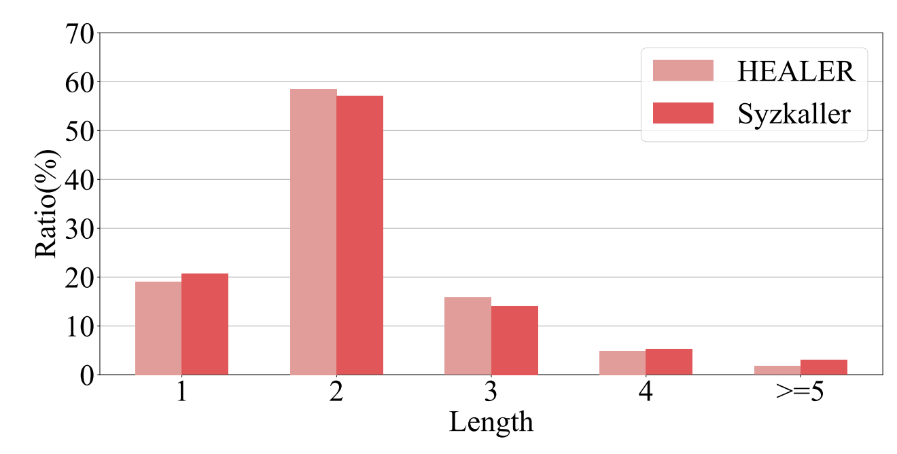

# MOCK Optimizing Kernel Fuzzing Mutation with
Context-aware Dependency

## Abstract

커버리지 기반 퍼징은 유명한 소프트웨어 테스트 기법으로 입증되어 왔다.

커널 퍼징에서 두드러진 특징은 입력이 단일 데이터가 아닌 시스템콜 시퀀스다. 

커널은 복잡하고 상태를 갖는(stateful) 시스템이기 때문에, 커널 내부의 깊은 코드 경로를 트러가하기 위해서는 **특정한 순서의 시스템 콜을 상태를 기반으로 단계적으로 구축**해야한다.

MOCK은 시스템 콜 시퀀스 내의 문맥적 의존 관계를(contextual dependencies)를 학습하고 이를 바탕으로 **문맥 인식(context-aware) 시스템 콜 시퀀스**를 생성할 수 있다. 

<aside>


1. 맞춤형 언어 모델 기반 의존 가관계 학습 알고리즘
2. 문맥 인식 시스템 콜 시퀀스 변이 알고리즘
3. 탐색과 활용의 균형을 맞추기 위한 적응적 작업 스케줄링 전략
</aside>

최신 커널 퍼저 대비 분기 최대 32%증가, 고품질 입력 생성(상호 연관된 시퀀스 50% 증가), 버그 발견 능력(고유 크래시 15%증가)

## Introduction

2022년 한해에만 리눅스 커널 관련 취약점 288건, CVSS점수는 평균 6.5점.

지난 5년간 평균 196개의 취약점이 존재한다. 

커널 퍼징은 커널과의 상태 기반 상호작용으로 인해 지속적인 문제가 존재함. 

암묵적인 상태 의존 관계가 존재하기 때문이다. 

선행 시스템 콜의 실행 결과는 후속 시스템  콜의 실행 문맥을 형성하며, 이는 후속 시스템 콜이 거치니느 실행 경로에 직접적인 영향을 미친다. 

따라서 **실행 경로에 필요한 커널 상태를 구축하기 위해서는 시스템 콜을 특별한 순서로 구성하는** 것이 필수적이다.

[기존연구]

- {MoonShine}: Optimizing {OS} fuzzer seed selection with trace distillation
- {StateFuzz}: System {Call-Based}{State-Aware} linux driver fuzzing
- {SyzVegas}: Beating kernel fuzzing odds with reinforcement learning
- Healer: Relation learning guided kernel fuzzing
- syzkaller

새로운 테스트 케이스를 point-to-point 방식으로 생성하도록 설계됨. ⇒ 다음 선택될 시스템 콜은 오직 직전에 실행된 시스템 콜에만 의존한다. 이렇게 되면 시스템 콜 시퀀스에 내재된 미묘한 의미적 정보나 상태를 고려하지 않는다.  ⇒ 복잡하고 심층적인 시스템 콜 시퀀스를 생성하거나 커널의 깊은 상태 공간을 탐색하는 데에는 한계를 갖는다. 

[문제점]

1. 문맥 인식 의존 관계를 학습하기 위한 코퍼스를 어떻게 준비할 것인가?
2. 학습된 의존 관계를 활용하는 활용과 기존 퍼징 전략을 통한 탐색 사이의 균형 조정

[해결점]

MOCK : 문맥 인식 시스템 콜 의존 관계를 조건부 확률로 모델링하는 새로운 접근 방식

1. 문맥 인식 의존 관계를 학습하기 위한 코퍼스 준비. 
    1. 퍼징 동안 새로운 커버리지를 유발한 시스템 콜 시퀀스들을 수집한 후 최소화하여 밀접하게 연관된 시스템 콜들로 구성된 genuine context 추출
    2. 이렇게 최소화된 시퀀스들은 시스템 콜 간의 영향 의존 관계를 내포하고 있으며, 고품질의 학습 데이터셋으로 활용된다. 
    3. 이런 호출 문맥을 구성하는 의존 관계를 효율적으로 포착하기 위해 신경망 기반 언어모델을 설계
        
        ⇒ 코퍼스가 누적되어 충분한 데이터가 확보되면 MOCK은 정기적으로 모델 학습을 수행하여 문맥 인식 의존 관계를 학습하고, 이를 바탕으로 문맥을 고려한 방식으로 새로운 테스트 케이스 생성
        
2. 시스템 콜 시퀀스 변이 과정을 다중 슬롯 머신 문제로 모델링하여 활용과 탐색 간의 균형 조절
    1. 다양한 변이 연산은 각각 하나의 슬롯 머신으로 간주되며, 커버리지 피드백은 보상으로 사용된다.
    2. 문맥 인식 의존 관계 ⇒ 더 깊은 영역 탐색, 문맥 비인식 또는 무작위 변이 연산은 다양성을 증가

[MOCK 성능 평가]

- 최신 퍼저인 HEALER, Syzkaller, SyzVegas 대비 평균 7%의 분기 커버리지 증가 달성
- 상호 연관성이 높은 고품질의 입력을 50% 더 많이 생성
- 기존 퍼저보다 더 시간을 단축하고 퍼징 캠페인을 가속화하는데 효과적
- 기존보다 15%더 많은 취약점 발견 길고 상호 연관된 시스템 콜 시퀀스가 요구되는 취약점 탐지에 강점을 보임.

## MOTIVATION

퍼징 과정에서 요구되는 시스템콜 간의 의존 관계에 대해 깊은 이해가 필요하다. 

이러한 의존 관계는 테스트 케이스 생성 및 변이 과정에서 시스템 콜을 선택하는 데 도움을 주며, 테스트 케이스의 품질을 향상시키고 퍼징 과정을 가속화하는 데 중요한 역할을 한다.  

- 특정한 순서로 구성된 시스템 콜 시퀀스를 통해 테스트 케이스는 커널 상태가 적절히 설정된 문맥을 형성하게 됨. 이를 통해 커널 내부의 깊은 코드 경로를 트리거
- 무작위로 조합된 시스템 콜을 사용하는 퍼저도 비교적 간단한 취약점은 탐지하지만 비교적 복잡한 상태에 미묘하게 의존하는 심층적 취약점은 놓칠 가능성이 높다.

```cpp
1 socket$INET
2 bind$INET
3 connect$INET
4 setsockopt$INET
5 setsockopt$INET
6 write$EVDEV
```

위 코드는 MOCK에 의해 발견된 버그의 poc다. 

이 버그가 트리거 되기 우해서는 특정한 순서의 시스템 콜 조합이 필요하며, 그 과정에서 복잡한 커널 상태가 단계적으로 구축되어야 한다. 

1. 올바른 타입의 소켓을 생성
2. 이를 로컬 주소에 바인딩한 뒤 원격 주소와 연결
3. 이후 setsockopt 시스템 콜을 호출하여 특정 레벨과 옵션 이름, 그리고 기타 속성들을 설정
4. 설정된 소켓을 EVDEV 인터페이스로 전달한다. setsockopt 시스템 콜에 더 높은 우선순위를 부여하고 setsockopt를 2번 호출함으로써 해당 버그를 발견 

커널을 위와 같이 정교하고 stateful 퍼징하는 것은 어려운 과제다. 그 중 하나의 핵심 어려움은 코드 경로를 커버하기 위한 상태 기반 시스템 콜 시퀀스를 합성하는 것이다.  

**Syzkaller와 HEALER는 각각 choice table과 relation table을 사용하여 변이를 유도함**으로써 유의미한 성과를 보여왔다. 그러나 이러한 기법들은 **context-free 의존 관계에 기반**하고 있기 때문에, 상호 연관성이 높은 시퀀스를 생성하거나 커널의 더 깊은 상태 공간을 탐색하는 데 한계를 보인다.



Syzkaller와 HEALER는 상호 연관성이 높고 길이가 긴 시스템 콜 시퀀스를 생성할 수록 성능이 현저히 저하되는 경향을 보였다. 길이가 3을 초과하는 시스템 콜 시퀀스는 전체 코퍼스의 8%에 불과. (리눅스 커널 24시간 퍼징 기준)

### 1. 문맥 비인식 의존 관계

[문제점]

기존 커널 퍼저 : 상호작용 문맥을 고려하지 않은 의존 관계로 모델링, 시스템 콜 간 의존 관계를 점대점 방식으로 정의하며, 의존 관계가 두 개의 시스템 콜 범위에서만 작동하도록 제한한다. 

[해결책]

그러나 실제 **의존 관계는 문맥에 따라 달라지는 조건부 확률의 형태로 모델링**되어야 하며, 서로 다른 호출 문맥에 따라 동적으로 조정될 필요가 있다. 이러한 문맥 비인식 의존 관계 모델링 방식은 의존 관계의 방향성 또한 크게 간과됨. 

ex) ⟨Ca , Cb⟩로부터 학습된 의존관계 = 시스템 콜 Ca가 시스템 콜 Cb에 영향을 미친다. 역순 쌍은 그 반대를 의미한다. 

Syzkaller와 HEALER 모두 이러한 규칙을 따르지 않는다. 

⟨Ca → Cb⟩와 ⟨Cb → Ca⟩를 상호 대칭적인 관계로 취급한다. 이를 각각 ⟨Ca, ⟩ 및 ⟨Cb, ⟩와 같은 시퀀스 접두부(prefix)에 동일하게 적용한다. 하지만 후자의 경우는 의미가 없거나, 오히려 퍼징 효율을 저해하는 결과를 초래할 수 있다.

### 2. 코퍼스 활용의 한계

런타임 코퍼스는 퍼징 과정에서 수집된 시스템 콜 시퀀스들의 집합이다. 시스템 콜이 어떻게 구성되는 지를 보여주며 시스템 콜 간 의존 관계를 내포하고 있다. 하지만 기존 퍼저들은 이러한 코퍼스를 충분히 활용 X.

Syzkaller는 choice table을 구성할 때 런타임 코퍼스는 전혀 사용하지 않는다. 

HEALER는 코퍼스를 잘 활용하지만, 여러 한계로 인해 활용이 충분하지 않다.

1. **HEALER는 코퍼스로부터 의존 관계**를 coarser-grained에서 학습한다. **학습된 의존 관계는 단순히 관련 O/X으로 표현되는 정적이고 이진적인 관계**다. 
그러나 시스템 콜들이 관련이 되어 있다고 표시되더라도, 그 관계는 **특정 문맥에서만 유효**하며 항상 작동한 것은 아니다.
2. HEALER는 **생성된 시스템 콜 시퀀스에서 부분적인 의존 관계 정보만**을 포착한다. 즉, 테스트 케이스내에서 **마지막 시스템 콜 쌍만을 사용하여 의존 관계를 추론**한다. 하지만 실제 코퍼스에서는 테스트 케이스를 구성하는 모든 시스템 콜이 새로운 커버리지에 기여하며, 해당 테스트케이스 전체가 커널 깊은 영역의 코드를 트리거하기 위한 필수 상태를 유지된다. 따라서 HEALER는 **선행 시스템 콜들에 내재된 전반적인 의존 관계 정보, 장거리 의존 관계를 심각하게 간과한다**.   

## DESIGN OF MOCK

