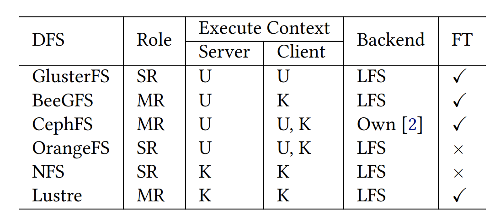

# Monarch: A Fuzzing Framework for Distributed
File Systems

### 2024 USENIX

[www.usenix.org](https://www.usenix.org/system/files/atc24-lyu.pdf)

## 초록

- 기존 연구의 문제점
    - DFS의 여러 구성 요소를 전체적으로 테스트하지 못함
    - DFS의 핵심 테스트 요소(예: 분산 장애)를 놓침
    - 퍼징 피드백으로써 실용적인 상태 표현 방식을 아직 탐색하지 못함
    - DFS에 고유한 의미론적 버그(semantic bug)를 검증할 수 있는 체커가 부족
- Monarch 연구 소개
    - 모든 POSIX 호환 DFS를 하나의 플랫폼에서 테스트
    - 원버튼 테스트를 가능하게함
- Monarch 연구 해결점
    - 다양한 DFS를 전체적인 관점에서 테스트하기 위한 **멀티 노드 퍼징 아키텍처**,
    - 시스템 호출(syscall)과 장애(fault)를 함께 퍼징할 수 있는 **2단계 변이기(mutator)**,
    - 실행 상태를 실용적으로 표현하고 다양한 실행 컨텍스트 간에 범용적으로 커버리지를 수집하는 **통합 커버리지 수집 방식**,
    - DFS 고유의 의미론적 버그를 검증하는 **새로운 DFS 의미론 체커인 SymSC**.

총 48개의 버그 발견. 이중 하나는 DFS의 최초 릴리스 시점까지 거슬러 올라가는 버그였음. 

## 서론

### DFS의 중요성과 파급력

- DFS의 중요성
    - 현대 컴퓨팅 인프라의 backbone.
        - AI모델 학습이나 고성능 컴퓨팅등은 DFS에 의존함.
        - DFS에 신뢰성을 주는 것은 도전적인 과제.
- DFS 연구의 파급력
    - 저수준 컴퓨팅 언어 C/C++로 개발됨. 이는 메모리 버그에 취약함.
    - 분산 환경의 특성상 동시성과 장애허용과 같은 요소들이 추가되어 복잡성이 높아지며, 이로인해 santic 버그가 발생하기도함.
    - information leak, RCE, privilege escalation, data loss or corrupton  가능함.

### 기존 DFS 연구와 문제점

- 기존 DFS testing 연구
    - 모델 검증(model checking)
    - 형식 검증(formal verification)
    - 동적 테스트(dynamic testing)
- 기존 DFS testing 연구 문제점
    - 효과가 수작업의 양에 크게 좌우됨.
    - 예를들어 형식 검증과 모델 검증은 state explosion을 피하기 위한 추상 모델을 구축하는 데 상당한 전문성과 시간이 필요함.
    - 반면, 동적 접근법은 test suite의 품질에 크게 의존하며, 이 역시 수작업으로 구성할 경우, 버그를 유발하는 corner case를 종종 놓치게됨.

### Monarch의 연구 제안, 아이디어

- fuzzing 연구 제안
    - fuzzing은 가장 널리 사용되는 테스트 기법 중 하나로, false alarm(오탐)이 드물다는 점에서 인기가 많음.
    - 실제로 여러 연구들은 퍼징을 통해 수백 개 이상의 파일 시스템 버그를 발견함.
    - 하지만 이런 파일 시스템 퍼저는 로컬 파일 시스템(LFS), 즉 단일 노드에서 동작하는 시스템을 대상으로 설계됐음. 
    ”어떻게 하면, 로컬 파일 시스템 퍼징의 효과를 어떻게 복잡한 분산 파일 시스템(DFS)에 적용할 수 있을까?”

### 기존 연구의 한계

- 기존 LFS fuzzer를 DFS로 directly 옮겼을 때 문제점
    1. 기존 아키텍처 : 단일 실행 컨텍스트내에서 입력전달, 실행 상태 수집, 버그 노출 모니터링.
    DFS 아키텍처 : 다중 노드에 DFS를 구성하고 입력전달. 각 노드의 상태를 모니터링하고, 이를 종합하여 버그를 판별할 수 있는 인프라 필요. 
    2. 전체 DFS 실행 상태를 실용적으로 표현할 수 있어야함. 
        - 계측 용이
        - 런타임 시 오버헤드 적음
        - 상태 공간을 잘 근사
    3. 기존 LSF 퍼저는 DFS의 입력 공간을 충분히 탐색 못함. 
        - LFS : 단일 순차적 syscall 시퀀스로 취급
        - DFS : 동시성 syscall 시퀀스를 처리, 무작위적인 분산 장애를 허용할 수 있도록 해야함.
            - DFS의 상태공간을 효율적으로 탐색하기 위해서...
            syscall과 fault를 함께 생성할 수 있는 mutator 필요.
    4. DFS는 다양한 입력(syscall 및 fault)을 처리하고, 해당 구체적인 실행이 POSIX를 준수하는지 여부를 판별할 수 있는 bug checker가 필요함. 
    ⇒ 메모리 버그 + semantic 버그 까지 찾을 수 있음. 

### Monarch의 기존 연구의 한계 해결점

- VM-based controller-worker model 기반 멀티 노드 DFS 퍼징 방식 제안.
    - controller는 각 DFS 인스턴스를 worker에서 테스트
    - 각 워커는 하나의 DFS 인스턴스를 위해 구성된 여러 개의 VM으로 이루어짐.
    - 각 VM은 executor, coverage 수집기, 버그 checker agent로 구성됨.
- Test case generation
    - non-fault-mode에서 syscall만을 테스트
    - fault mode에서 syscall과 fault를 유연하게 조합하여 테스트
- Execution state representation
    - fault mode, non-fault mode에 따라 구분된, 실용적인 실행 상태 표현 방식을 채택함.
        - 실행 테스트를 일관된 방식으로 수집
        - 퍼징 효율성을 위해 test case reduction
- Bug checker
    - memory bug detection
    - SymSC라는 semantic bug checker

### 평가 결과

총 48개의 버그

26개는 syscall만으로 발생한 메모리 버그 

14개는 syscall과 fault 조합으로 발생한 메모리 버그 

8개는 semantic 버그 

## 본론

### DFS 아키텍처의 다양성

DFS는 다양한 구성 방식으로 구성된 client-server 구조 

client : 파일 시스템 관련 요청을 server로 보냄 

server : 이를 처리하며 서로 간에 통신을 통해 데이터와 메타데이터를 관리 



… 중략

### DFS의 특성과 case study

- memory bug
- semantic bug
    - POSIX 명세에 따라 동작하지 않음.

- DFS의 복잡한 요소
    - 노드 간 상태 공유
    - 동시 접근
    - 장애 허용

메모리버그나 semantic bug를 유발하고 탐지하기 어려움 .

- case study1

```jsx
1 mkdir("./A", 0777);
2 setxattr("./A", "user.attr", "val", 3, 0);
3 // A server crashes or partitioned from the client.
4 removexattr("./A", "user.attr");
5 // Client crashes during executing removexattr.
```

GlusterFS의 userspace client에서 발견된 UAF 버그.

서버 두개 중 하나를 연결해제한 후 removexattr로 진행. 

기존 퍼저들은 여러 노드에 걸친 userspace system을 테스트하도록 설계 X.

node 크래시나 네트워크 분할과 같은 fault injection 기능이 없어서 발견하지 못함. 

- semantic bug study 1

```jsx
1 open("./file1", O_CREAT|O_DIRECTORY|..., 0330)
2 stat("./file1", stat_buf) // Success
3 stat("./file1", stat_buf) // ENODATA (No data available)
```

GluseterFS에서 백엔드로 LFS를 사용하는 상황에서 

1. open을  **`O_DIRECTORY | O_CREAT`** 플래그와 함께 실행
2. 이 플래그 조합은 POSIX 명세에 따르면 비결정적인 결과가 나옴. 
하지만, GlusterFS는 이 동작이 항상 결정적이라고 잘못 가정하고 구현. 
GlusterFS는 잘못된 in-memory  상태를 유지하게 되고 , 연속적으로 stat을 실행하게 되면, 
서로 다른 결과를 반환함. 

- semantic bug study 2

```jsx
1 // Create a directory named B under the mounted client.
2 mkdir("A/B", 0777);
3 // Persist the mount directory and B.
4 int parent_fd = open("A/", O_RDONLY|O_NONBLOCK);
5 fsync(parent_fd);
6 int dir_fd = open("A/B", O_RDONLY|O_NONBLOCK);
7 fsync(dir_fd);
8 // Crash servers immediately.
```

지속 상태에 대한 의미론적 위반 SVP : Semantic Violations on Persistent Statues) 

in-memory-sate를 디스크로 flush하여 데이터를 영구 저장(persist)한다. 

이 작업은 주기적으로, 또는 사용자가 지속성 관련 시스템 호출(fsync, fdatasync, sync 등)을 

실행했을 때 주어진다. 

POSIX는 지속성 시스템 호출에 의해 flush된 데이터와 메타데이터가 크래시 후 복구 상황에서도 일관된 상태를 유지해야한다고 규정한다. 

DFS 또한 다음과 같은 경우에도 POSIX 명세를 지켜야한다. 

- **전체 노드가 크래시되었다가 복구된 경우** (complete crash)
- **일부 노드만 크래시되었다가 복구된 경우** (partial crash)

비록, 해당 DFS가 fault-tolerant하지 않을 수 있어도, POSIX 호환 DFS라면 반드시 크래시 일정성을 보장해야한다. 

이 명세를 어기면 SVP 또는 crash inconsistency 로 간주된다. 

그 결과 데이터 손실 또는 애플리케이션 오작동으로 이어질 수 있다. 

위 그림을 보면  

1. 디렉터리 B를 fsync로 디스크에 명시적으로 flush한 직후 모든 서버를 강제로 crash 시킴. 
2. 이후 시스템을 복구했을 때 디렉터리 B가 사라짐 → 데이터 손실 발생. 

원인 : GlusterFS 서버 구현 상 결함으로 인해, fsync 요청에 대해 디스크에 실제로 기록하지 않았음에도 클라이언트에게 success 반환함. 

… 중략

## Fuzzer 설계


다양한 DFS 종류들 

### Fuzzer 구조 Overview


Monarch는 다양한 DFS를 지원하기 위해 VM 기반 멀티 노드 퍼징 아키텍처를 지원한다. 

Monarch는 컨테이너나 Library OS가 아닌 가상 머신 VM을 사용한다. 

이유 : 

1. 많은 DFS는 커널 모듈과 사용자 공간 모듈을 모두 포함하므로, 컨테이너 기반 노드는 부적합하다.
2. 또한 대부분의 DFS는 다중 프로세스 구조이며, 여러 데몬을 통해 노드간 통신을 수행한다. 
현재 라이브러리 OS는 다중 프로세스 지원이 미성숙하여 사용하기 어렵다. 

[Controller]

중앙 제어 컴퐅넌트로서 다음 기능을 수행한다. 

- Mutator
    - 테스트 케이스를 생성하고 이를 워커에 배포
- Tracker
    - 워커로부터 커버리지 정보를 수신하고 병합
    - 테스트 케이스 축소 수행 (test case reduction)
- Checker
    - DFS 노드들로부터 수집된 상태 정보를 바탕으로 버그 분석 및 판별하는 분산 버그 검사 로직 수행

[Worker]

워커는 테스트 대상이 되는 DFS 인스턴스를 다중 노드 환경에 걸쳐 실행한다. 

각 노드는 다음과 같은 구성 요소를 포함한다. 

DFS 구성 요소 : 서버 또는 클라이언트 역할 수행 

Executor : 시스템 호출 실행 및 fault 유발 

Coverage Agent : 해당 노드의 코드 커버리지를 수집 

Checker Agent : 노드의 DFS 관련 상태 정보 수집 

[Executor의 주요 역할]

- **서버 설정 및 클라이언트 DFS 마운트 수행**
    - 사전에 정의된 구성 스크립트를 사용
- **멀티노드 테스트 케이스에서 해당 노드에 해당하는 슬라이스 추출**
- **해당 슬라이스에 정의된 작업 실행**
    - 예: 서버에서 fault 유발, 클라이언트에서 syscall 실행
- **모든 노드 간 실행을 동기화 및 종료 처리**

### DFS에서의 mutate 메커니즘

1. Explicit state modification 

기존 방식 : 

syscall또는 remounting하는 방식으로 발생함. 두 방식 모두 기존 LFS퍼저에서 테스트 입력으로 사용됨. 

DFS에서는 syscall이 중요하다. 

대부분의 DFS는 LFS를 스토리지 백엔드로 사용하며, 이 LFS 계층이 디스크와 직접 상호작용하면서 디스크 상태는 이미 처리되기 때문이다. 

따라서 Monarch는 syscall만을 명시적 입력으로 사용한다. 

1. Implicit state modification 

서버 크래시, 네트워크 분할 등 이런 fault는 DFS의 내부 상태에 간접적으로 영향을 미친다. 

---

Monarch는 퍼징 범위를 확장하여 다음 두 가지 유형을 포함한다. 

- 명시적(explicit) 입력 : syscall
- 암시적(implicit) 입력 : fault

[Monarch는 2단계 변이 방식]

1. syscall을 우선적으로 변이
2. 그 다음 선택적을오 fault를 변이

Monarch는 두 가지 퍼징 모드를 지원 

1. non-fault mode
    
    ⇒ syscall 변이만 수행  
    
2. fault mode 
    
    ⇒ syscall + fault 모두 변이 
    

### syscall mutation

syscall은 DFS의 사용자 인터페이스 역할을 수행함. 

- 어떤 테스트 케이스 `T`가 **새로운 실행 상태를 발견**했다면,
- Monarch는 그 테스트 케이스의 각 시퀀스 `Ti`에 대해 다음 중 하나의 변이를 수행합니다:
1. **새로운 syscall을 삽입하거나 기존 syscall을 제거**
2. **기존 syscall의 인자를 변이**
3. **다른 시퀀스 `Tj`에서 일부분(`T′j`)을 잘라와**,
    
    이를 `Ti`의 임의 위치에 **붙이는(splice) 방식**으로 조합
    

DFS에서는 **여러 클라이언트 간의 동시 상호작용**이 흔하므로,

**클라이언트로부터의 동시성 syscall 생성**이 매우 중요합니다.

- 기존 연구들은 메모리 접근 수준의 **세밀한 동시성 모델링(fine-grained concurrency)**을 사용했습니다 [31, 64].
- 반면 Monarch는 **의미 기반(semantic)**의 **거친 단위(coarse-grained)** 접근 방식을 사용하여,
    
    → **간단하고 빠르게 동시성 테스트 케이스를 생성**할 수 있게 합니다.
    

### Fault mutation


- 장애 허용 로직은 **메모리 버그**(Figure 1)와
- **의미론적 버그**(SVF: Semantic Violation on Fault states, Figure 4)
    
    에 **모두 취약**합니다.
    

하지만 **시스템 호출(syscall) 변이 전략만으로는**

→ **장애 허용 관련 코드 경로(fault-tolerance code paths)**를 충분히 자극하지 못합니다.

📌 그래서 Monarch는 **장애(fault) 상태를 변화시키고 탐색할 수 있도록**,

**장애 주입 기능(fault injection capability)**을 설계합니다.

- **노드 크래시 (Node Crashes)**
- **네트워크 분할 (Network Partitions)**

Monarch는 위 두 가지 fault를 집중적으로 다룬다. 

### 🔹 노드 크래시 (Node Crash)

- Monarch는 **서버 노드만** 크래시시킵니다.
- 그 이유는 **서버 간 상호작용**이 존재하고,
    
    → 이들이 **클라이언트에게 서비스 제공을 함께 수행**하기 때문입니다.
    
    → 하나의 서버가 크래시될 경우, **다른 노드에 중대한 영향을 미칩니다.**
    

### 🔹 네트워크 분할 (Network Partition)

- 분산 노드 간 **네트워크 연결이 단절되는 상황**을 의미합니다.
- 두 가지 분할 방식이 존재합니다:
    - **완전 분할 (complete partition)**:
        
        → 노드들을 **완전히 단절된 그룹**으로 분리
        
    - **부분 분할 (partial partition)**:
        
        → 노드 간에 **직접 연결되지 않지만, 간접 연결된 상태** 유지
        
- Monarch는 다음 노드들 사이에서 네트워크 분할을 도입합니다:
    - **서버 ↔ 클라이언트 간**
    - **서버 ↔ 서버 간**