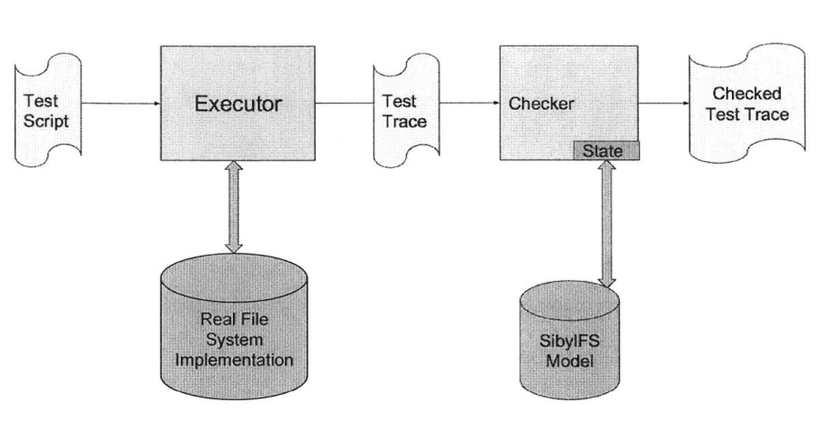

# SibylFuzzer

[SibylFuzzer : stateful fuzzing for file systems](https://dspace.mit.edu/handle/1721.1/113551)

[SibylFuzz.pdf](SibylFuzz.pdf)

2017 MIT학사학위논문

## 1. 서론

### 1.2 Motivation

- 파일 시스템은 데이터가 저장되고 검색되는 방식을 제어, 오늘날 컴퓨팅에서 매우 중요 ⇒ 파급력이 넓다
- 파일 시스템은 **상태 기반(stateful)** 시스템이기 때문에, **상태 기반 퍼징의 좋은 타겟**
⇒ 파일 시스템과 그 안의 내용물은 state로 생각될 수 있으며 syscall은 그 상태를 다음 사앹로 바꾸는 전이역할. 
⇒ 시퀀스가 길어질수록 더 많은 상태 전이가 발생하게 되고, 복잡한 상태에서 깊숙한 버그들이 드러날 가능성이 높다.

## 2. 본론

### 전체 Fuzzer 구조



SibyIFS프로세스에 입력되는 것은 test script 집합이다.

이 스크립트는 파일 시스템 호출 시퀀스와 몇가지 SibyIFS에서 새롭게 정의한 축약 명령어들을 포함한다.

### 2.1 Test Script

SibyIFS는 총 21070개의 테스트 스크립트를 구성된 test suite를 구축했다. 이 test suite는 각 스크립트가 어떤 시스템콜 또는 주제를 다루는지에 따라 14개의 sub-suites로 나뉘어 구성되어 있으며 자세한 내용은 아래와 같다.


예시 스크립트는 아래와 같다.


가장 긴 스크립트는 336개의 시스템 콜을 포함하고 있으며, 가장 짧은 스크립트는 3개의 스크립트를 갖고 있다. 축약 명령어들(shorthand commands)에는 아래와 같다

- dump : 
모든 파일 및 디렉토리에 대해 **타임스탬프, 하드링크 수** 등의 **메타데이터를 반환**합니다.
- open_close :
**Linux의 `touch` 명령어**와 유사하게, 파일을 열었다가 즉시 닫는 동작을 합니다.
- add_user_to_group : 
말 그대로 **사용자를 그룹에 추가**하는 기능을 수행합니다.

### 2.2 Executor

executor는 실제 파일 시스템의 동작 결과를 수집하는 역할을 한다.

이는 테스트 집합을 받아들인 후, 그 안의 시스템 콜을 chroot jail 환경에서 실행한다.

이떄 OCamI의 Unix 인터페이스와 라이브러리를 사용하여 시스템 콜을 실행한다.

- chroot jail에 대해
    
    `chroot jail`  : 
    
    chroot 는 프로세스의 루트 디렉토리를 다른 디렉토리로 변경하는 시스템 콜이다. 
    
    즉, 특정 프로세스에게 / 디텍토리가 실제 시스템의 /가 아니라 지정한 특정 디렉토리가 되도록 한다. 이런 방식으로 격리된 환경을 `chroot jail` 이라고 한다. 
    
    [chroot "jail" - what is it and how do I use it?](https://unix.stackexchange.com/questions/105/chroot-jail-what-is-it-and-how-do-i-use-it)
    
    아이디어 : 프로세스가 실행되는 데 필요한 모든 시스템 파일을 복사하거나 링크하는 디렉토리 트리를 만드는 것. 그런 다음 `chrott()` 시스템 호출을 사용하여 루트 디렉토리를 이 새 트리의 맨 아래에 두고 해당 chroot 환경에서 실행되는 프로세스를 시작한다. 
    
    예를 들어 생각해보자. 보통 리눅스에서는 /는 시스템의 진짜 root 디렉토리다.
    
    여기에는 /bin. /etc, /home 등 중요한 것들이 있다.
    
    그런데 chroot는 이렇게 한다.
    
    “지금부터 이 디렉토리 안이 root,다 진짜 / 처럼 행동해라”
    
    ```cpp
    /home/ppp/chroot-env/
    ├── bin/
    ├── etc/
    └── testfile.txt
    ```
    
    이런 자료구조가 있다고 해보자.
    
    여기서 chroot를 사용하면 아래와 같이 된다.
    
    ```cpp
    sudo chroot /home/ppp/chroot-env /bin/bash
    ```
    
    그럼 bash는 /home/ppp/chroot-env 를 루트(/)처럼 인식한다. 
    
    ```cpp
    # 이제 / 라고 쳐도
    ls /
    # 출력:
    bin  etc  testfile.txt
    ```
    
    사실 `/home/ppp/chroot-env` 안에 있지만 프로세스 입장에서는 그곳이 진짜 루트다.
    
     그리고 `fchdir()`로 복귀할 수 있다.
    

그럼 `chroot jail` 환경에서 실행하는 이유는 아래와 같다.

1.  호스트 파일 시스템 영향 최소화
2.  비어있는 파일 시스템에서 시작하는 것처럼 보이도록 보장

단점 : 루트 디렉토리를 인자로 포함하는 시스템 콜들이 이상하게 동작하는 경우가 있다. 예를 들어 `chroot jail` 에서는 루트 디렉토리의 링크 수가 일반적인 환경보다 보통 1만큼 차이난다. 

**executor의 출력**은 **테스트 트레이스(test traces)의 집합**

### 2.3 SibyIFS Checker

파일 시스템이 비어 있는 상태에서 시스템 콜을 한 줄씩 읽으면서, 내부에 가상의 파일 시스템을 읽는다. 즉, 실제 시스템에서 syscall을 실행하고, 실제로 어떤 일이 있었는지 기록한다.

`chroot jail` 환경에서 시스템 콜을 실행하며, 각 시스템 콜의 실제 반환값을 기록해 test trace를 만든다. 

## 3. Implementation

SibyIFS Checker가 trace를 읽으면서 처리해 나가는 도중에 생성된 state set에서 파일 시스템 정보를 추출한 뒤, 그 정보를 활용하여 새로운 system call을 생성한다. 

Checker가 트레이스를 처리하기 직전에, SibyIIFuzzer는 먼저 test trace에 포함된 system call sequence를 추출한다. 그리고 퍼징된 system call을 삽입할 위치를 고른다. 만약 중간 위치를 선택한 경우, SibyIFuzzer는 그 지점에서 trace를 잘라 Checker에 넘긴다. 이러한 잘라낸 trace가 이후 결과물의 영향을 준다. 


systemcall이 항상 test trace의 마지막 호출이 된다.

즉, 기존 script의 중간에 system call을 하나씩 끼워넣으면서 계속 checker에 돌려본다.

만약 버그가 생긴다면 방금 넣은 system call 때문에 생긴거라고 알 수 있다. 

자르고 나머지는 버린다. 

systemcall은 나온 파일/디렉토리 정보를 기반으로 랜덤하지만 의미있는 systemcall


잘라낸 trace를 checker에 넘기고 checker는 평소처럼 그 trace를 처리한다. 이때 checker가 시스템 콜을 하나씩 검증할 때마다 SibyIFuzzer는 그 결과로 생성된 파일 시스템 상태 집합에서 파일 시스템 상태 정보를 추출해 자신의 로컬 데이터 구조에 저장한다. 

그 결과 Checker가 trace를 모두 처리하고 나면 SibyIFuzzer는 SibyIFS 모델이 추적한 파일 시스템 view에 나타났던 **모든 파일, 디렉토리, 파일 디스크립터, 디렉토리 핸들에 대한 이력을 누적**해서 갖는다.