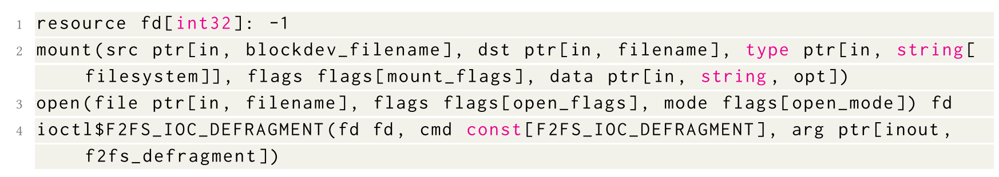

# SnapCC Effective File System Consistency Testing Using Systematic State Exploration

과연 기존 파일 시스템 퍼저(Hydra, B3)는 최신 파일 시스템 기능인 압축/스냅샷/암호화를 반영했는가? 안했다면 어떻게 해야 탐색을 할 수 있을까?

## 서론

[파일 시스템]

다른 일시적 프로그램과 달리 전원을 껐다켜도 데이터가 유지되도록 비휘발성 저장장치의 블록에 데이터를 명시적으로 기록. 

RealWorld에서는 전원 장애, 저장장치 고장 혹은 인적 오류와 같은 사고가 일어날 수 있으며 이러한 사고는 파일 시스템의 영속성(persistence) 작업을 심각하게 중단시킬 수 있음. 

⇒ 정상적인 동작을 위해 유효한 상태로 복구하는 절차 필요

리눅스의 BTRFS, FreeBSD의 OpenZFS는 압축, 암호화, 스냅샷과 같은 고급 기능을 포함하고 있음. 이러한 기능들의 추가는 영속성 연산과 그에 따른 크래시 복구 절차를 구현하는 데 있어 파일 시스템의 복잡도를 크게 증가시킴. 

⇒ 크래시 복구 메커니즘 설계 hard, 충분한 검증이 없을 경우 치명적인 데이터 손실 버그가 실제 배포된 소프트웨어에 남아있을 위협이 큼 

[파일 시스템 크래시 일관성 버그 테스트]

1) 파일 시스템이 탑재된 블록 디바이스를 테스트 대상으로 마운트한다.

(2) 해당 파일 시스템에 대해 수행할 읽기 및 쓰기 호출들로 구성된 호출 리스트를 준비한다.

(3) 마운트된 파일 시스템 상에서 이러한 호출들을 실행한다.

(4) 그 결과 생성된 파일 시스템 상태에 오류가 존재하는지 검사한다.

[일관성 버그 테스트]

- B3
    - 대상 파일 시스템에 대해 길이가 3 이하인 POSIX 파일 시스템 연산 조합 열거, sync 호출과 같은 영속성 연산 이후에 결함을 주입하여 크래시 일관성 버그 유발
- Hydra
    - 피드백 기반 퍼징, 넓은 공간 탐색, 파일 시스템 호출로 구성된 테스트 케이스 생성
- 한계점
    - 크래시 일관성 버그를 발견하는 데 성공했지만, 주로 **POSIX 호환 파일 시스템 연산**과 그 연산 시퀀스에 대한 결함 주입에 초점
    - 그러나 현대 파일 시스템에서는 구현 종속적인 연산, 그리고 이러한 연산이 POSIX 파일 시스템 연산과 상호작용하는 과정에서도 크래시 일관성 버그가 발생 가능
        
        ex) 스냅샷 생성 도중 오류 발생 ⇒ 강력한 테스트 케이스 생성 기법과 크래시 일관성 버그 탐지 메커니즘이 필요 ⇒ 다양한 온디스크 파일 시스템 이미지 생성, 올바른 상태를 효과적 식별
        

[파일 시스템 크래시 일관성 검사 도전과제]

- 파일 시스템 크래시 일관성 검사기
    - 서로 다른 파일 시스템마다 호출 sematics 상이
    - 파일 시스템의 다양한 기능을 유발할 수 있는 파일 시스템 호출 시퀀스 생성은 hard
        - 모든 on-disk-state를 테스트 케이스로 포착하는 것이 상당히 어려움
    - 실행 이후 크래시 일관성 버그 탐지 어려움. 파일 시스템마다 크래시 일관성에 대한 해석과 구현이 다름. 테스트 케이스 수가 방대하기 때문에 수동 분석은 현실적이지 않음.

HOW SOLVE?

1. 모든 온디스크 상태를 체계적으로 탐색하는 문제와 valid 상태를 자동으로 찾는 문제는 사실 같은 문제
    - 영속성 연산 : 메타데이터/데이터 블록을 갱신하기 위한 블록 쓰기의 연속 과정
    - 호출 시퀀스 실행 중
        - 저장장치가 모든 상태를 열거하는 것 = 임의 시점에 장애가 났을 때 가능한 모든 crash state찾기
        - 유효한 상태 = sync와 같은 persistent point 이후 안전 언마운트로 얻을 수 있는 일관된 상태, persistence point마다 안전 상태를 스냅샷으로 확보하면 valid state set을 만들 수 있음
2. 호출 시퀀스 생성/변이는 파일 시스템마다 다르지만 spec-based syscall generation 아이디어 차용 가능함.  
    - Syzkaller의 syscall spec을 기반으로 호출 생성/변이. 파일 시스템 특화 연산을 POSIX 연산보다 우선적으로 포함/가중치 ⇒ 최신 파일 시스템 기능인 압축/스냅샷/암호화 탐색 가능

### SnapCC 개요

**새로운 파일 시스템 크래시 일관성 버그 탐지 도구 =**

**호출 시퀀스 생성(퍼징) + 스냅샷 기반 valid-state oracle 생성 + 실행 중 모든 crash state 체계적 열거**

즉, 커널 퍼징 방식으로 호출 시퀀스를 생성하되 파일 시스템 특화 연산을 우선하도록 설계한다.

실행 중에는 스냅샷을 이용해 

1. valid states를 만들기
2. 가능한 모든 crash state를 만들기

⇒ 이 둘을 비교하여 불일치를 자동 탐지한다. 

SnapCC 구성요소

1. Specification-based Invocation Sequence Generator/Mutator
    - Syzkaller에서 추출한 FS 관련 syscall spec을 활용해 호출을 생성/변이
    - 추가로 FS-s[ecific syscall/operation 보강해서 feature 탐색 강화
2. Automatic Valid State Finder
    - 호출 시퀀스 내부에서 persistence point(예 : sync) 식별
    - 각 persistence point 이후
        - 안전하게 unmount
        - 해당 시점 디스크 상태를 snapshot 상태 저장
3. Systematic On-Disk State Explorer (Crash state 생성기)
    - QEMU의 block device driver를 후킹해 파일 시스템이 발생시키는 각 write operation 관찰
    - write 시작지점/ 진행지점 / 끝난 직후 등에서 block backing file을 스냅샷
    - 결과적으로 호출 실행 중 발생 가능한 다양한 on-disk intermediate states를 대량 생성
    - 장애가 임의 시점에 발생했을 때 가능한 crash stat들 열거
4. Consistency Verifier
    - invocation sequence 종료 후 실행 중 생성된 crash-state snapshot들을 각각 mount 후 상태를 valid-state set과 비교
    - valid state과 매칭되지 않으면 이 상태는 정상 복구가 가능한 범주가 아님을 확인하고 crash consistency bug 리포트

[WHY? SnapCC 스냅샷?]

- 스냅샷으로 동일한 호출 실행에서 디스크 상태를 빠르게 분기/반복
- crash-state 열거와 valid-state 생성이 둘다 현실적인 비용으로 가능해짐

[기여]

Hydra와 B3와 비교 평가한 결과, BTRFS, F2FS, ext4에서 Hydra 대비 16%에서 44%의 커버리지 향상을 달성하였으며, 14일간의 실험 동안 다양한 파일 시스템에서 총 15개의 새로운 버그를 발견하였다(B3: 2개, Hydra: 6개). POSIX 연산만을 사용한 경우에도 22%의 커버리지 향상을 달성

4개의 추가 파일 시스템 확장과 7개의 새로운 크래시 일관성 버그 

## Background

### File System Crash Consistency

파일 시스템에서 일관성 문제 : 전원 장애와 같은 예기치 못한 상황에서도 파일 시스템의 내부 자료구조와 사용자 데이터가 유효하고 손상되지 않도록 유지하는 능력을 의미한다. 

컴퓨터의 발전으로 메모리와 저장장치간의 속도 격차가 발어졌고, 그 결과 파일 시스템은 **메모리상 자료구조와 디스크 상 내용을 분리하여 관리**하게 되었다.

즉, 성능을 위해 파일 시스템 메타데이터 및 캐시된 변경 사항은 우선 메모리에 반영되고, 이후 POSIX의 sync, fysnc와 같은 persistence call 또는 커널의 유지보수 스레드가 디스크와 불일치하게 된 내용을 배킹 스토리지로 플러시하여 변경 사항을 영구 저장한다.

**persistence(영속화) 과정이 전원 장애, 디스크 오작동, 운영체제 크래시 등 중간에 실패할 수 있다.**

파일 시스템은 크래시 이후 복구 과정에서 valid-state (내부 자료구조와 데이터가 서로 모순되지 않고 데이터 손실이나 손상이 발생하지 않는 상태)로 되돌아가야한다.

⇒  영속화 및 복구 루틴의 설계/구현에서 주의가 요구되며 치명적인 결과로 이어질 수 있다.

[일관성 버그를 제거하기 위한 연구]

1. 저널이나 트랜잭션 기반 연산과 같은  매커니즘으로 크래시 복구 시 미완료 연산을 롤백/재실행하여 일관성을 보장하려는 설계 중심 접근
2. 구현 이후 동적 테스트로 실제 버그를 찾아내는 사후 테스트 접근 
    - 동적테스트로 실제 버그 찾기
        - Hydra :
            1. 무작위 생성과 변이를 통해 입력공간 탐색
            2. 피드백 루프를 통해 유의미한 입력을 보존, 확장 
            - SymC3 : 주어진 호출 시퀀스에 대해 파일 시스템 연산을 에뮬레이션 기반으로 시뮬레이션하여 가능한 유효 상태 집합 생성, 크래시 이후 복구된 이미지의 상태를 유효한 상태들과 비교한다.
        - B3 :
            1. 블랙박스 방식으로 길이 3이하의 POSIX 파일 시스템 연산 조합으로 완전탐색하여 호출 시퀀스 생성
            2. 각 시퀀스에 sync를 덧붙여 영속화 연산을 유도한 후 sync 반환 이후 임의 시점에 크래시를 시뮬레이션 
            3. 이미지를 마운트하여 복구 수행하고, sync 호출이 보장해야하는 기대 결과와 실제 디스크 상태를 비교하여 일관성 위반 여부 판단
            - ACE : 호출 조합을 생성
            - CrashMonkey : 트레이스 실행, 크래시 시뮬레이션 검증
            

[Fuzzing]

fuzzing : SW를 테스트하는 데 널리 사용되며 온 효과적인 테스트 기법 ⇒ (내밥줄)

greybox feedback 커버리지 정보 굳굳 

커널 퍼징 : 시스템 콜 / 시스템 콜 시퀀스 / 시스템 콜 명세 기반 호출 생성하거나 기존 호출 변이

ex) Syzkaller ⇒ 시스템 콜 특수화



위 리스트에서 시스템 콜 간에전달되는 객체를 표현하는 리소스 타입 정의가 나타남 

open, mount. 시스템 콜에 대한 ㅁ여세 기술. ioctl 시스템 콜의 특수화된 형태로, F2FS 파일 시스템의 defragmentation 기능을 수행하는ioctl호출을 명시적으로 기술.

Hydra와 같은 파일 시스템 전용 퍼저와 비교하면 일반적인 커널 퍼저는 문법적으로 올바르고 의미적으로 풍부한 시스템 호출 시퀀스를 생성하는 데 최적화 되어 있지않다. 또한 파일 시스템에서 발생 할 수 있는 다양한 오류 유형에 대한 검사기가 부족하여 주로 메모리 오류와 같은 저수준 결함 탐지에 초점화

⇒ memory corruption은 KASAN, ASAN등 많이 있지만

 ⇒ Semantic 탐지는 연구가 덜 되어 있음  

## Motivation

B3, Hydra ⇒ POSIX 표준 파일 시스템 호출과 그에 따른 기능에 기반한 탐지에 맞춰져 있다. 

그러나, 현대 파일 시스템은 초기의 단순한 설계를 넘어 다양한 고급 기능을 포함하고 있으며, 이러한 파일 시스템 구현 종속 코드에 존재하는 버그를 탐지하기 위해서는 추가적인 테스트 역량이 필요하다.

- B3 :
    - 입력 공간을 축소함으로써 파일 시스템 연산 조합을 완전 탐색하는 방식
    - 한계 :
        - 연산 시퀀스의 길이에 제한이 있기 때문에 더 복잡한 호출 시퀀스를 요구하는 일관성 버그를 탐지
        - 구현 종속 기능에 해당하는 상태로 파일 시스템을 유도하기 힘듦
        - 일관성 오라클은 파일 시스템 이미지가 가질 수 있는 모든 유효 상태의 부분 집합만을생성하므로 실제로 일관된 상태임에도 불구하고 오탐하는 경우가 많이 발생
        - 블랙박스이므로 피드백을 활용X, 파일시스템 특화 연산을 호출하는 기능 지원 X
    
- Hydra :
    - 한계 :
        - 파일 시스템 기능 전반을 포괄하지 못함
        - B3보다 고차원의 입력 공간을 탐색 가능하나 여전히 POSIX 파이리 시스템 연산 중심의 접근 유지. 호출 시퀀스 실행 이후에만 크래시를 유발하며, **파일시스템의 영속성 연산이 생성할 수 있는 중간 온디스크 상태**를 충분히 고려X
        - SymC3는 수작업으로 구현, 새로운 파일 시스템에 적응하기 위해 많은 도메인 지식과 수작업 요구됨.


구현 종속 기능을 고려하여 현대 파일 시스템의 크래시 일관성 버그를 보다 철저히 탐지하기 위해서는 다음 도전 과제를 해결해야한다.

1. 파일 시스템을 테스트하기 위한 다양한 페이로드를 생성하기 위해서는 주어진 호출 시퀀스 실행 도중 발생 가능한 모든 온디스크 상태를 체계적으로 탐색할 수 있어야한다.
    
    ⇒ 파일 시스템마다 인터페이스와 호출 의미가 상이하기에 일반화가어렵고 기존 도구에 이러한 기능 추가하려면 깊은 전문 지식과 상당한 수작업이 요구됨 
    
2. 파일 시스템은 비동기적으로 디스크에 데이터를 기록하므로 호출 시퀀스 실행 결과로 생성되는 서로 다른 온디스크 상태들을 해석하고 테스트 케이스를 활용하는 것은 매우 어렵다. 
B3와 Hydra를 포함한 기존 연구들은 무작위적으로 탐색하지만, 이 접근은 일관성 버그를 유발할 수 있는 많은 가능성을 놓친다.
3. 실행 이후 크래시 일관성을 탐지하기 위한 테스트 오라클을 설계하는 것 자체가 매우 어렵다. 파일 시스템이 가질 수 있는 모든 유효 온디스크 상태를 고려해야함. 이러한 상태는 수행된 호출 시퀀스뿐만 아니라 파일 시스템의 구현 세부사항에 의존

[아이디어]

1. 사용자 공간 프로그램은 creta(), chmod(), fruncate()와 같은 POSIX 정의파일 시스템 API를 포함한 시스템 콜을 통해 파일과 상호작용한다. +) ioctl 호출을 광범위하게 활용 
    
    파일 시스템 도구들이 주로 POSIX 호출만을 사요하는 반면, Syzkaller와 같은 명세 기반 커널 퍼저는 파일 시스템 도메인 전문가들이 작성한 시스템 콜 명세를 활용하여 풍부한 입력. 
    ⇒ 비 - POSIX 기능을 보다 효과적으로 트리거 
    
2.  파일 시스템의 영속성 연산은 영속화 호출 이후에 수행되는 일련의 쓰기 연산으로 구성됨. 온디스크 상태 공간을 체계적으로 탐색하는 것이 가능하다.  
mkdir(), creat(), unlink() ⇒ 초기에는 메모리 상 자료구조만 변경. 백킹 블록 디바이스에는 즉시 반영되지 않음.
sync() 호출이나 커널 워커 스레드에 의해 데이터가 플러시될 때에만 메타데이터와 데이터가 디스크에 기록됨. 
파일 내용, 내부 데이터 등 내부 구조를 갱신하기 위한 여러 번의 쓰기 연산으로 이루어짐. 영속 저장장치가 가질 수 있는 모든 중간 상태를 열거하는 문제로 환원될 수 있다. 
3. 파일 시스템의 일관성은 영속성 연산 사이에서는 유지된다고 가정함. **semantic 오류나 memory 버그가 존재할 경우에만 깨지며, 이는 본 논문에서 다루는 일관성 버그**와는 다른 문제다.
    
    ⇒ 크래시 이후 복구 가능한 유효 상태는 각 파일 시스템 변경 연산 직후에 영속성 연산을 강제로 수행한 뒤 안전하게 언마운트함으로써 획득할 수 있다. 모든 변경 연산 이후 이러한 상태를 수집하면, 파일 시스템이 크래시 후 복구할 수 있는 valid state set 구성 
    

## 4. Design


**SnapCC : 파일 시스템 크래시 일관성 버그 퍼저** 

- 피드백 퍼징 루프(feedback-guided fuzzing loop) 기반, 온디스크 상태 생성은 호출 시퀀스 생성기/변이기와 체계적인 온디스크 상태 탐색기를 통해 수집한다.
- 테스트 오라클은 자동 유효 상태 탐색기 (Automated Valid State Finder)를 통해 수집
- 일관성 검증기(Consistency Verifier)가 탐색된 모든 온디스크 상태를 유효 상태 지합과 비교하여 크래시 일관성 버그 여부 판단

1. 시드 호출 시퀀스를 변이하거나 명세 기반 생성 기법을 이용해 새로운 파일 시스템 호출 시퀀스를 생성 
2. 생성된 호출 시퀀스는 **Systematic On-Disk State Explorer**에 전달, 장애가 발생한 경우 모든 생성될 수 있는 온디스크 상태를 산출하며, 이는 파일 시스템에 대해 테스트 입력 페이로드들의 집합을 구성 
3. 동일한 호출 시퀀스는 Automated Valiod State Finder에도 전달되어 해당 시퀀스에 대해 valid states를 생성하며, 이후 테스트 오라클로 사용된다.
Consistency Verifier는 실행 중 생성된 모든 온디스크 상태를 하나씩 파일 시스템에 마운트한 뒤, 복구가 완료되어 안정된 상태에 도달할 때까지 대기하고, 그 결과를 유효한 상태 집합과 비교한다.  

### 4.1 파일 시스템 호출 시퀀스 생성

명세 기반 생성 : 


- 기본 파일 시스템 관련 시스템 콜을 선택. 시스템 콜 인자간의 의존성이나 시스템 콜 간의 관계를 고려하여 전문가가 작성한 시스템 콜 명세를 바탕으로 연속적인 호출 시퀀스 구성 ⇒ Syzkaller처럼 ioctl 형태
- 시드 기반 변이의 경우 SnapCC는 먼저 시드 풀에서 하나의 기존 호출 시퀀스를 선택한 뒤 무작위 변이 연산 수행
    - 자원 제약을 고려하여 새로운 시스템 콜을 시퀀스 끝에 추가
    - 기존 시스템 콜의 인자 값을 변이
    - 시퀀스를 부분적으로 truncate하고 해당 시점까지 실행 결과를 새로운 시작 이미지로 반영한 뒤, 이후 호출들을 제거하고 재생성
    
    ⇒ Syzkaller형태
    

### 파일 시스템 이미지 생성

Linux의 디스크 관리 도구 활용. 온디스크 데이터가 표준적이고 정식적인 파일 시스템 연산을 통해 생성하도록 보장.

입력 변이가 선택된 경우에는 시퀀스 실행 중 생성된 중간 온디스크 상태를 새로운 시작 이미지로 사용하여 이후 호출 시퀀스를 이어서 생성. 

### 4.2 Systematic On-Disk State Explorer

파일 시스템 호출 시퀀스 생성 ⇒ fault가 발생할 수 있는 모든 온디스크 상태를 광범위하게 대표하는 파일 시스템 이미지들을 테스트 케이스로 생성

파일 시스템의 일관성 유지및 복구 루틴 검증, 복구 결과 분석 ⇒ 잠재적인 버그 노출 

**Systematic On-Disk State Explorer** ⇒ 호출 시퀀스 실행 도중 장애가 발생했을 때 파일 시스템 이미지가 가질 수 있는 모든 가능한 상태 열거 


[Systematic On-Disk State Explorer]

- 디스크로의 영속성 연산은 단일 동작이 이니라, 여러 개의 블록 디바이스 쓰기 연산으로 구성되며, 각 연산은 블록 단위의 쓰기 시퀀스로 구성 ⇒ 각 수정 연산을 기준으로 반복적으로 상태를 관찰하면 가능한 모든 온디스크 상태에 도달가능.
    - 게스트 머신의 블록 디바이스 드라이버에서 쓰기 연산 루틴을 후킹
    - 쓰기 명령 수행 시 2개의 스냅샷 생성
        - 쓰기 연산 진행 시점 스냅샷
            - 각각 영속성 연산의 끝부분에서 크래시가 발생한 경우
        - 쓰기 연산 진행 후 시점 스냅샷
            - 하나의 블록 쓰기도중 크래시가 발생한 경우
    - 전체 호출 시퀀스 실행 종료시 스냅샷을 통해 파일 시스템이 가질 수 있는 모든 가능한 온디스크 상태 집합을 얻게되고 이후 Consistency Verifier로 전달되어 일관성 검증을 위한 테스트 케이스 사용

### 4.3. Automatic Valid State Finder

- valid state
    - 수행된 호출 시퀀스에 따라 달라짐
    - SnapCC는 주어진 시퀀스에 대해 가능한 모든 유효 상태 적응적으로 식별. ⇒ 유효 상태 집합 기준으로 생성된 온디스크 상태들중 유효하지 않은 상태 판별
- 동일한 파일 시스템 호출 시퀀스
    - 크래시 이후에도 파일 시스템이 정상적으로 복구될 수 있는 상태들 탐색
    - 모든 쓰기 관련 연산을 잠재적인 영속성 연산 트리거로 간주 ⇒ 유효 상태 집합 생성
1. 파일 시스템을 수정하는 모든 호출 뒤에 sync() 추가 
    
    ⇒ write와 같은 데이터 수정 연산 + chmod와 같이 메타데이터 변경 연산 포함 
    
2. 호출 시퀀스 분리
    - 연속된 비수정 연산 ex) read()
    - 단일 수정 연산
    - 하나 이상의 동기화 연산 ex) sync(), fsync()
3. 영속성 연산 기준으로 분리하여 Persistence Operation Sequence 생성
4. 각 시퀀스들은 각각 실행이 완료되면 변경 사항이 디스크에 명시적으로 기록되므로, 파일 시스템이 가질 수 있는 유효한 상태를 대표 ⇒ 호출 시퀀스를 실행하는 동안 파일 시스템이 도달할 수 있는 모든 유효 상태는 영속성 연산 시퀀스들을 순차적으로 실행했을 때 생성되는 상태들의 집합 

### 4.3.2 Enumerating All Possible Valid States


모든 Persistence Operation Sequence(영속성 연산 시퀀스)를 도출한 뒤 유효 상태 집합 완성

1. 원래 호출 시퀀스의 초기 파일 시스템 이미지를 마운트한다.
2. 생성된 Persistence Operation Sequence들을 **순서대로 실행**한다.
3. 각 시퀀스 실행 후, 파일 시스템을 **안전하게 언마운트(safe unmount)**한다.
4. 그 결과로 생성된 파일 시스템 이미지를 **스냅샷**으로 저장한다.

얻은 모든 스냅샤들은 대상 파일 시스템에서 정상적으로 복구 가능한 모든 유효 상태를 포괄하며, 주어진 호출 시퀀스에 대한 valid state set으로 간주한다. 이후 이 집합은 Consistency Verifier에 전달되어, 실행 주 ㅇ생성된 온디스크 상태들과 비교함으로써 크래시 일관성 버그 탐지에 사용 

### 4.4 Consistency Verifier

- Consistency Verifier
    - 파일 시스템 호출 시퀀스 실행으로 생성된 온디스크 상태들이 크래시 일관성 버그를 드러내기 위한 여부를 검증
    1. Verifier는 깨긋한 운영체제 스냅샷을 로드한 뒤, 각 온디스크 상태 이미지를 하나씩 연결
    2. 대상 파일 시스템에 맞는 파일 시스템 전용 일관성 검사 도구 실행 
        
        ex) fsck.ext4
        
    3. 파일 시스템 복구 과정이 완료되면, 온디스크 상태 마운트 
    4. 모든 valid state를 순차적으로 마운트하여 현재와 비교
        1. 디렉터리 트리 구조 비교
        2. 개별 파일의 메타데이터 비교
        3. 파일 내용 비교

### 4.5 Fuzzing Loop

파일 시스템 크래시 일관성 퍼징 도구로 동작하는 실행 루프 구성 

1. Syzkaller와 같은 커널 퍼저에서 사용되는 구성 요소 차용
    
    ⇒ 시스템 콜 명세 + 입력 실행기
    

2. 온디스크 상태를 효율적으로 생성하고 재사용하기 위해 중앙 집중형 파일 시스템 이미지 풀을 사용, 필요할 때마다 이미지를 실행 환경에 연결 
⇒ 각 반복 실행마다 호출 시퀀스와 이미지 전송 비용 줄임 

1. 호출 시퀀스 생성되면 가상머신의 블록 디바이스 드라이버를 후킹하여 대상 이미지에 대한 write 연산 가로챔
2. 호출 시퀀스를 실행하며 시퀀스의 끝에 있는 umount 호출 추가하여 남아있는 영속성 연산이 모두 수행되도록함
    
    ⇒ 발생하는 모든 블록 디바이스 쓰기 명령은 온디스크 상태 생성
    
    ⇒ 4.3과 4.4 모두 수행 
    
    ⇒ **대상 파일 시스템 모듈에 한정된 커널 코드 커버리지**를 피드백사용 커버리지 증가 시드는 다음 퍼징 반복에 활용 
    

## 5. Implementation

SnapCC를 구현하면서 Syzkaller로부터 시스템 콜명세, 시드 저장소, 가상 머신 관리, 실행 피드백의 수집 및 처리와 같은 구성요소를 차용했다. 이전 절에서 설명한 SnapCC의 핵심 구성 요소들은 모두 처음부터 구현되었다. 

### 5.1 Copy-on-Write-Based State Iteration

모든 가능한 상태를 반복 탐색하는 것은 SnapCC에 있어 성능 측면에서 큰 도전이다. 

따라서 업데이트 시 전체 파일을 복사하는대신 변경된 부분만 기록하는 스냅샷 기법을 사용한다.

on-disk 상태를 열거하고, 복구 가능한 유효 상태(valid state)를 찾기 위한 효율적인 탐색을 위해 QEMU의 qcow2 이미지 포맷이 제공하는 Copy-on-Write 매커니즘과 BTRFS의 서브볼륨 스냅샷 기능을 결합하여 파일 시스템 이미지를 구성한다.   

- QEMU의qcow2이미지 Copy-on-Write 매커니즘
    - 파일 시스템 이미지와 가상 머신 사이에 매핑 계층을 삽입
    - 블록 디바이스에 대한 모든 수정 사항이 원본 이미지에는 영향을 주지 않고 qcow2 파일에만 저장
- BTFS의 서브볼륨 스냅샷 기능
    - 동일한 파일에 대한 이전 스냅샷들을 빠르게 접근 가능

⇒ 일관성 버그를 테스트 하는 과정에서 파일 시스템 이미지의 모든 가능한 상태에 대해 효율적 접근


1. **초기 파일 시스템 이미지** 위에, 수정된 데이터 정보를 저장하기 위한 **qcow2 레이어 파일**을 얹어 마운트하고, 이를 **BTRFS 서브볼륨** 내부에 배치한다.
2. 이후 SnapCC는 **QEMU의 qcow2 블록 디바이스 드라이버의 write 연산을 후킹**하여, 필요 시 스냅샷을 수행할 수 있도록 준비한다.
3. 해당 블록 디바이스는 **에이전트 프로그램을 통해 가상 머신 인스턴스에 연결**되며, 가상 머신은 이를 파일 시스템으로 마운트하여 사용한다.
4. 준비가 완료되면 SnapCC는 **테스트 실행을 시작**하고, 에이전트 프로그램에 **사전에 정의된 시스템 콜 호출 시퀀스**를 수행하도록 지시한다.
5. **모든 가능한 크래시 지점을 탐색하는 경우**, 각 쓰기 연산은 SnapCC에 신호를 전달하여 해당 시점의 상태를 기록하기 위한 **스냅샷을 트리거**한다.
    
    반면, **유효한 일관 상태(valid consistent state)를 탐색하는 경우**, 에이전트 프로그램이 각 영속적(persistent) 연산 시퀀스를 마친 뒤 이미지를 안전하게 언마운트할 때 SnapCC가 즉시 스냅샷을 수행한다.
    
6. 호출 시퀀스 실행이 종료된 이후, SnapCC는 **해당 서브볼륨 스냅샷에 저장된 qcow2 레이어 파일과 베이스 이미지를 결합**하여, 원하는 파일 시스템 이미지를 복원한다.

### 5.2 Runtime Image Snapshot Caching

P:  스냅샷 기반 퍼징의 오버헤드 문제

- 파일 시스템 수정 이후의 **동기화·영속화 연산은 I/O 비용이 매우 큼**
- 스냅샷 생성·관리가 **매 퍼징 iteration마다 반복**

⇒ 실행 시간 증가, 테스트 효과성 저하, execution throughput 감소

S:  중복 연산 제거를 위한 캐싱 직관

- 퍼징 입력의 대부분은 이전 시드에서 시스템 콜 일부 추가, 인자만 소폭 변경된 형태
- 즉, **파일 시스템 상태는 거의 동일하므로** 매번 처음부터 이미지 생성·동기화하는 것은 불필요

SnapCC의 스냅샷 캐싱 설계 : 시드 단위로 파일 시스템 스냅샷을 함께 저장 

- 정상 상태 이미지와 잠재적 버그 지점 이미지를 함께 저장
    - persistence operation과 연결
- qcow2를 활용하여 변경된 블록만 기록
    - 원본 이미지 전체 복사 없으며 저장,로드 비용을 최소화 한다

1. 첫 시스템 콜 실행 후 변이가 발생 전까지는 기존 스냅샷 사용 
2. 만약 변이가 발생하면 해당 시스템 콜 직전의 스냅샷에서 재시작, 그 다음 시스템 콜부터 실행 재개 

 

### 6.3.3 Adaptability


Linux의 UFS, XFS, BCacheFS, OpenZFS

- SnapCC의 대부분의 구성 요소가 서로 다른 파일 시스템 구현 전반에 걸쳐 일반화ㄷ함
- 파일 시스템별 일관성 검사 도구(fsck 등)를 활용함으로써 커스텀 일관성 검사 로직을 별도로 구현해야 하는 부담을 제거

### 6.3.4 Case Study

```cpp
mkdir("d1"); mkdir("d2");
ioctl@BCH_IOCTL_SUBVOLUME_CREATE("d1");
fd1 = open("./d1/f1"); fd2 = open("./d2/f2");
rename("./d1", "./d2/rd1");
write(fd1, ...); write(fd2, ...); unlink("./d2/rd1/f1");
ioctl@BCH_IOCTL_SUBVOLUME_DESTROY("./d2/rd1");
sync();

```

동기화 과정에서 SnapCC가 영속화 연산을 가로채어 해당 파일 시스템 이미지를 리눅스에 마운트하면 lingering inode 문제 발생 .

3개의 연산으로 인해 제거되었어야 할 서브 볼륨이 삭제된 이후에도  ./d1/rd1/f1의 inode가 디스크 상에 남아 있는 현상 관찰됨.
BCacheFS의 `fsck_write_inode()` 함수에 존재하는 버그로 인해 발생하며, 해당 함수가 복구 과정에서 제거되어야 할 inode를 잘못하여 다시 파일 시스템에 기록하는 것이 원인.
B3와 Hydra는 이 버그를 탐지 X ⇒ 이는 두 도구 모두 서브볼륨 생성 및 삭제를 수행하는 `ioctl()` 호출을 생성할 수 없기 때문.  설령 `ioctl()` 호출 생성 기능을 추가하더라도, fault injection을 위해 수행되는 연산의 수가 많고, 이 버그를 탐지하기 위해 자동으로 판별해야 하는 유효 상태의 수가 많아 실제로 버그를 발견하기는 매우 어려움.
