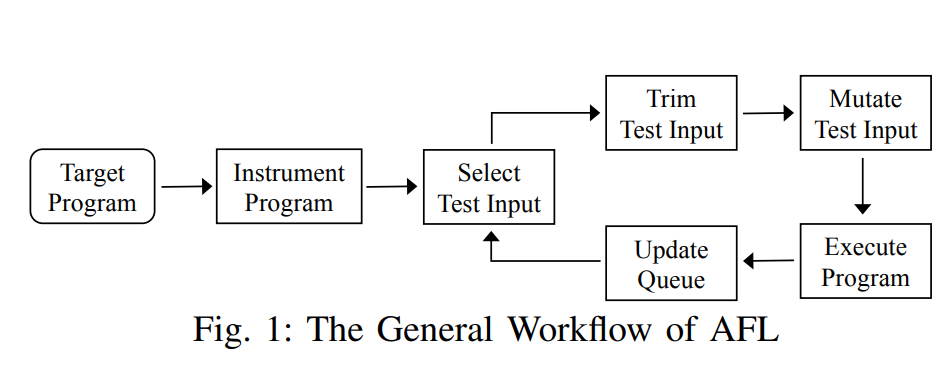

# Superion Grammar-Aware Greybox Fuzzing

[GitHub - zhunki/Superion: Superion is a fuzzer which extends the famous AFL to support structured inputs such as JavaScript and XML.](https://github.com/zhunki/Superion)

## 1. 서론

가장 성공한 mutation based greybox fuzzer중 하나는 coverage based greybox fuzzing이다.

대표적으로 AFL이 있다. AFL의 단계는 아래와 같다



하지만 이런 coverage-based greybox fuzzer들은 이미지처럼 압축되고 비구조적인 입력을 처리하는 프로그램에서는 효과적이지만 구조적입력(structured input)을 처리하는 프로그램에서는 한계가 존재한다.

ex) XML, JS

[문제점] 

1. AFL trimming 전략은 문법을 고려하지 않는다. 따라서 문법을 깨드려 입력 구조가 파괴되어 syntax-valid 유지가 불가하다. 특히 입력의 일부는 coverage를 증가시키지만 나머지 부분에서 parsing error가 발생한다면 AFL은 계속해서 낭비할 수 밖에 없다.
2. AFL mutation 전략들 (bit flip등) 또한 문법을 고려하지 않는다. 이는 trimming 문법 비고려 문제와 같은 영향을 야기한다.

따라서 

Grammar-aware Coverage-based Greybox Fuzzing 기법을 제안한다.

[아이디어]

1. AFL Trimming 문제
- Superion은 Target Program을 Grammar 기반으로 파싱하여 AST를 생성
    - 기존 : AFL은 바이트 단위로 문법을 고려하지 않고 삭제
    - Superion : AST의 subtree 단위 제거를 시행
        - 이는 AST의 각 subtree를 하나씩 제거하여 coverage 변화를 관찰하기에 구조를 유지하면서 trim과정을 진행할 수 있다.

⇒ syntax valid 유지 가능

1. AFL mutation 문제
- Grammar-aware Dictionary Mutation
    - 기존 AFL dictionary mutation을 확장하여 token 삽입/덮어쓰기
    - grammar-aware 방식으로 수행
- Tree based Mutation
    - AST 기반 subtree를 교체하여 자기 자신 또는다른 입력의 sutbree로 교체

[Target]

- XML engine: libplist
- JS engines:
    - WebKit
    - Jerryscript
    - ChakraCore

[장점]

1. Coverage 개선
    
    Superion vs AFL:
    
    - +16.7% line coverage
    - +8.8% function coverage
2. Bug 찾기
    - 총 34개 신규 버그 발견
    - 그 중 22개 신규 취약점
    - 19개 CVE 할당
    - $3.2K bug bounty 획득
    
    ⇒ 나도 줘라…
    

## 2. 접근법


구조화된 입력을 처리하는 프로그램을 위한  grammar-aware coverage-based greybox fuzzing

입력 : 대상 프로그램과 테스트 입력에 대한 문법


1.  각 테스트 입력을 **추상 구문 트리로 파싱**
2. Grammar-aware trimming 
    1. AST를 활용하여 **입력 구조를 유지하면서 효과적으로 테스트 입력을 줄일 수 있는 grammar-aware trimming 전략**
        
        ⇒ 테스트 입력의 AST에서 각 subtree를 반복적으로 제거하고, 그에 따른 coverage 변화를 관찰
        
3. grammar-aware mutation 
    1. AFL의 dictionary 기반 mutation 전략을 확장하여, 문법을 고려한 방식으로 토큰을 삽입하거나 덮어쓰는 방식
    2. 테스트 입력의 AST에서 하나의 subtree를 자기 자신 또는 큐에 있는 다른 테스트 입력의 subtree로 교체

### Grammar-aware trimming Strategy

- 기존 AFL의 Trimming전략
    - trim하려는 테스트 입력을len/n 바이트 단위 조각으로 나눔
    - len은 입력의 전체 바이트 길이, 이후 각 chunk를 순차적으로 제거
    - n은 16에서 2의 거듭제곱단위로 증가하며 최대 1024까지 증가
    - 하지만, 구조적 입력에 대해서 문법 유효성을 유지하면서 효과적으로 입력을 줄이지 못함
- 입력을 AST로 파싱
    - 만약 mutation 등으로인해 입력 구조가 파괴되어 파싱 오류가 발생하면, 해당 입력을 폐기하지 않고 AFL의 기본 trimming진행
    - 파싱이 정상적으로 된 경우 AST의 각 subtree를 하나씩 제거. 만약 특정 subtree를 제거한 뒤에도 coverage 동일하면 해당 subtree는 제거된 상태로 유지됨. 제거 후에는 다시 AST로 구성하고, 동일한 과정을 반복함
        
        ⇒ 더 이상 제거 가능한 subtree가 없을 때까지 반복
        
    - tree 기반 trimming이 적용 불가능한 경우에만 AFL의 기본 trimming 전략을 사용

 


```jsx
try {
    eval("/*for..in*/for(var x in ... ) ...");
} catch(ex) {}
```

trimming의 예시다 위 그림처럼 한개의 try-catch 블록이 제거되었다. 이는 AST subtree가 제거된 것이다.

AFL은 입력을 바이트 chunk단위로 나눠서 제거하는데 그렇게 되면 try만 삭제되거나 catch의 조건문 일부만 남게 된다. 이로 인해 문법 오류가 발생하고 대부분 파싱에서 걸러진다.

### A. Grammar-Aware Mutation Strategies (Enhanced Dictionary-Based Mutation)

- AFL의 기본 mutation 전략은 너무 세밀한 단위이며 문법 고려 X
    - 입력 구조가 기본 문법을 따르도록 유지하기 어려움
    - 각 토큰을 입력의 모든 바이트 사이에 삽입하거나, 토큰 길이와 동일한 바이트 시퀀스를 덮어씀


- 구조적 테스트 입력에서 토큰은 일반적으로 알파벳 또는 숫자로만 구성됨.
    1. 현재 바이트와 다음 바이트가 모두 알파벳 또는 숫자인지를 반복적으로 검사하여 토큰의 경계를 찾음  
    2. dictionary의 각 토큰을 이렇게 찾은 경계 위치에 삽입함. 연속된 알파벳/숫자 시퀀스 사이에 토큰을 삽입하는 것을 방지하며, 그 결과 토큰 삽입 횟수를 크게 줄임
    3. 찾은 두 경계 사이의 내용 전체를 dictionary의 토큰으로 덮어쓴다. 이 또한 토큰 덮어쓰기 횟수를 크게 줄임.
    
    ⇒ 변이된 테스트 입력의 구조를 유지할 뿐만 아니라, 변이된 입력의 개수를 감소
    

- 기존 방식에서는 01을 하나의 전체적 단위로 취급하지 않기 때문에 1이 +로 덮어 쓸수 있고, 0과 1 사이에삽입될 수도 있음. 이는 구조를 파괴하면서   coverage에 도움이 되지 못함
- 반면 Enhanced Dictionary-Based Mutationd은 01을 하나의 전체적인 단위로 인식함. 변이된 테스트 입력들은 새로운 커버리지를 새롭게 발견할 수 있게 됨.

### B. Grammar-Aware Mutation Strategies (Tree-Based Mutation)

- Dictionary-based mutation은 암묵적인 방식으로 기본 문법을 고려함
- 문법을 명시적으로 고려하여 syntax-valid한 테스트 입력을 생성하기 위해, 우리는 문법 지식을 활용하여 AST 수준에서 동작하는 tree-based mutation을 설계함
- AST는테스트 입력을 이름이 있는 속성을 가진 객체들의 구조로 모델링하여 입력에 대한 모든 정보를 표현하도록 설계함.
    
    ⇒ AST는 퍼저가 테스트 입력을 변이하기에 적절한 수준을 제공함