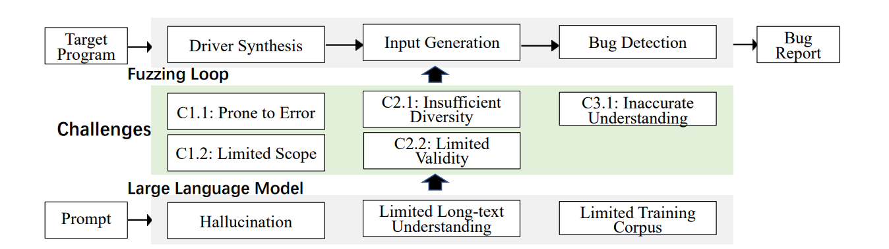

# When Fuzzing Meets LLMs: Challenge and Opportunities

## Abstract

퍼징은 버그탐지에 널리 쓰이고 LLM의 등장으로 새로운 발전을 이루고 있다. 

하지만 LLM은 퍼징에 적용할 때 여러 도전 과제를 직면한다.

본 논문은 퍼징에서 발생하는 5가지 주요 문제점을 식별했고 퍼징에 LLM을 적용할 때 실질적으로 활용 가능한 권고 사항을 제시하고 DBMS 퍼징을 대상으로 권고가 효과적임을 확인했다.

## Introduction

퍼징에서 LLM 사용 예시는 아래와 같다.

1. 드라이버 합성
    - Prompt Fuzzing for Fuzz Driver Generation
    - Understanding large language model based fuzz driver generation
2. 입력 생성
    - Effective test generation using pre-trained large
    language models and mutation testing
    - Large Language Model Powered Test Case Generation for
    Software Applications
3. 버그 탐지
    - Large language models are zero-shot fuzzers: Fuzzing deep-learning
    libraries via large language models
    - Automated Bug Generation in the era of Large Language Models

하지만 LLM은 제한된 컨텍스트 길이, 환각 문제 등의 여러 한계를 갖고 있다. 이러한 특성으로 인해 높은 오탐, 낮은 커버리지, 제한된 확장성과 같은 성능 저하로 이어질 수 있다. 

공통적인 LLM 기반 퍼징 기술을 사용할 때 나타나는 5가지 문제점은 아래와 같다.

1. 드라이버 합성 과정에서 낮은 품질의 결과물 생성 ⇒ 효과적인 버그 탐지에 필요한 정밀성 부족
2. LLM의 이해 및 처리 범위 제한적 ⇒ 다양한 시나리오에 폭넓게 적응 힘듦
3. 충분히 다양한 입력을 생성하지 못함
4. 입력의 유효성을 유지하는 데 어려움
5. 버그 탐지 메커니즘에 부정확한 이해로 높은 오탐 

## Challenges and Opportunities

### Driver Synthesis

- 드라이버 합성 관련 선행연구 ⇒ API  문서를 프롬프트로 제공한 뒤, LLM에게 API 호출 시퀀스 생성
    - Large language models are zero-shot fuzzers: Fuzzing deep-learning
    libraries via large language models.
    - Prompt Fuzzing for Fuzz Driver Generation
    - KernelGPT: Enhanced Kernel Fuzzing via Large Language Models.
    - Understanding large language model
    based fuzz driver generation.
- 문제점
    - 환각을 생성하는 경향이 존재. 학습 데이터에 포함되지 않은 프로그램에서는 성능이 크게 저하
        - 오류를 포함할 가능성이 높음. (OSS-Fuzz에서는 GPT4가 40%만 정확한 생성, 나머지는 다 오류)
    - 적용 범위가 제한적임
        - OSS-Fuzz개발자가 LLM을 활용해 드라이버를 합성하려 했지만 31개중 14개만 성공함. (krb5, rtpproxy와 같이 비교적 덜 알려져 있는 것은 실패)
- 권고사항
    - GPT4가 이미 학습한 유몋한 라이브러리 생성
    - 학습 코퍼스가 부족하면 함수 프롬프트타입, 예제 코드, 함수 간 연결 규칙 등 추가 자료를 수집하여 프롬프트에 포함
    - Linux 커널과 같이 복잡한 대상에서는 LLM에 의존하기보다 기존의 전통적 기법 활용

### Input Generation

- 입력 생성을 향상시키기위한 LLM연구 ⇒ 입력 명세와 입력 예제를 프롬프트 컨텍스트로 제공한뒤 LLM에게 새로운 입력을 생성하도록 요청
    - Large Language Models for Fuzzing
    Parsers (Registered Report
    - Utilizing Large Language Models for Fuzzing: A Novel Deep Learning Approach
    to Seed Generation
    - Universal fuzzing via large language models
    - White-box compiler fuzzing empowered by
    large language models
- 문제점 ⇒ LLM이 학습 코퍼스에 크게 의존, 긴 컨텍스트에 대한 이해 부족
    - 생성된 입력의 다양성이 부족, 유사응답 반복 경향
        - ChatAFL은 RTPS 프로토콜 퍼징에 LLM을 직접 적용했을 때 한계를 보여줌
        제공되는 프로토콜 정보가 제한적인 경우 10개 상태중 단 4개 상태만 커버하는 입력만 생성, (커버리지 떨어짐)
        - 생성된 입력의 유효성이 낮음, 장문의 구조적 제약을 완전히 이해못함. (BGP는 2800단어 이상, TLV 구조가 문서상에서 멀리 있기에 TLV 구조으 ㅣlength 필드 생성 X)
- 권고사항 ⇒ LLM을 직접사용하여 테스트 케이스를 새성하되, 다양성강화 기법 결합
    - 다양한 기능 사용을 요구하는 프롬프트 설계, 커버리지기반 유전 알고리즘과 같은 기존 퍼징 기법과 결함
        - (HTTP, FTP과 같은 텍스트 기반 프로토콜은 LLM이 매우 큰 강점. 여기서 다양성을 높이기 위해 GET, POST, PUT과 같은 다양한 HTTP 메서드와 서로 다른 헤더, 쿼리 파라미터 등 이용)
    - LLM이 최종 입력 생성하는 대신 입력 명세를 도출하거나 초기 테스트 케이스를 생성하는용도로 사용한다.
        - (이미 학습한 기존 프로토콜 지식과 기록된 메시지 시퀀스를 활용하여 문법을 전이한다. 혹은 시스템 테스트 케이스를 대상 데이터베이스 시스템의 초기 시드로 변환한다.)

### 버그탐지

- 버그 탐지를 강화하기 위해 LLM활용. 기능적으로 동등한 두 프로그램의 실행 결과를 비교함으로써 논리 오류탐지.
    - Oracle-based Protocol Testing
    with Eywa
    - Nuances are the Key: Unlocking ChatGPT to Find FailureInducing Tests with Differential Prompting
- 문제점 ⇒ 긴 코드에 대한 이해 능력이 제한적
    - 최장 공통 부분 문자열, 최장 공통 부분 수열 혼동
    - Differential Prompting [25]의 실험 결과에 따르면, Codeforces에서 수집한 프로그램을 대상으로 **66.7%의 성공률**로 참조 구현(reference implementation)을 생성
- 권고사항
    - LLM을 사용해 실행 결과를 직접 분석하는 방식으 피하는 것이 바람직. 대신 LLM을 호라용해 특정 버그 유형과 연관된 특징이나 패턴을 추출하고 패턴 기반으로 시스템 모니터링
        - IoTDB와 같은 시계열 DB는 예외를 내부적 처리, 명확X 크래시 많음.
        - LLM을 활용해 로그 분석, 오류 패턴 식별, 논리 오류 탐지
    - RFC와 같이 기대 동작이 명확히 정의된 문서 포함하는 경우기대 동작을 추출하고 이를 테스트 오라클로 사용.

## 방안

실용성을 보이기 위해, LLM-assisted fuzzing 대상으로 DBMS 사용. (LLM 데이터베이스 커넥터용 퍼징 드라이버 문제점)

- 드라이버 합성 ⇒ 상태 인식 드라이버 합성
- 입력 생성 ⇒ DBMS간 SQL 전이
- 버그 탐지 ⇒ 로그 기반 오라클 정의

[사전지식]

데이터베이스 커넥터 : 응용프로그램과 데이터베이스 사이의 통신을 가능하게 하는 중간 계층 구성 요소. 함수와 파라미터로 구성된 표준 인터페이스 집합으로 정의. 데이터베이스 퍼징 드라이버 ⇒ 호출 시퀀스로 구성

[문제점]

1. 오류 발생 가능성
    - 커넥터의 상태에 내재된 의미 정보 포함. 상태 고려X ⇒ 오류 발생
2. 제한된 범위
    - 커넥터의 상태 전이지식을 충분히 학습X ⇒ 데이터 부족 문제

[해결책]

상태인식 (context-aware) 데이터 베이스 커넥터 합성 

1. JDBC 함수 프로토타입과 JDBC 사용 예제 수집
2. JDBC 함수들 연관관계를 상태 전이 규칙으로 모델링
3. 함수 프로토타입, 예제 프로그램, 연결 규칙을 LLM입력으로 제공 

ex) 상태 전이 규칙과 함수 상태 설명을 바탕으로, 길이 15 이내의 API 시퀀스를 생성하라. 이전과 다른 상태 전이 조합을 커버해야 한다

## 결과

**Wingfuzz_conn**에 구현하고, LLM을 그대로 이용해 드라이버를 직접 생성하는 **LLM_conn**과 비교
대상 : MySQL, MariaDB, AWS MySQL

Wingfuzz_conn은 세 DBMS 모두에서 드라이버 정확도와 커버리지 측면에서 항상 우수

합성 정확도가 94%보다 높고 56% 평균적으로 더 많은 브랜치 커버.

- MariaDB: correctness 0.142 → 0.331, coverage 583 → 843
- MySQL: correctness 0.216 → 0.367, coverage 1256 → 1982
- AWS MySQL JDBC: correctness 0.203 → 0.394, coverage 1382 → 2293

### Cross-DBMS SQL Transfer

[문제]

SQL 쿼리는 DBMS입력으로 DBMS퍼징에 매우 중요함. 그러나 LLM을 사용하면 문제점 발생

1. semantic correctness 확보 어려움
2. 다양한 쿼리 확보 어려움

⇒ cross-DBMS SQL transfer 제안함. SQL을 직접 생성하는대신 다른 DBMS 테스트 케이스를 LLM으로 변환하여 대상 DBMS퍼징 시드로 사용함  

[해결책]

- 원래 DBMS에서 기존 SQL 테스트를 실행하여, 실행 과정에서 스키마(schema) 정보를 수집한다.
- 수집한 스키마 정보와 함께 LLM을 사용하여 대상 DBMS에 맞는 새로운 테스트 케이스 생성을 유도한다.
- 파서가 처리하지 못하는 부분은 일시적으로 주석 처리하여 파싱을 보장하고, 변이 후 다시 주석을 해제한다.

[결과]

DBMS는 MonetDB [6], DuckDB [13], ClickHouse [18]

생성한 테스트케이스 

- MonetDB에서 **159.35%**
- DuckDB에서 **36.65%**
- ClickHouse에서 **112.14%**

올바른(semantic-correct) SQL을 포함했으며, 커버리지는 각각

- **55.96%**, **21.83%**, **16.41%**

### Monitor-Based DBMS Bug Detection

[문제]

테스트 오라클을 구성하여 DBMS의 논리/성능 버그 식별

LLM을 사용하여 테스트 오라클을 직접 구성

[해결책]

실행 중 수집되는 정보를 분석하여 이상징후를 탐지하는  Runtime Monitor-Based DBMS Bug Detection